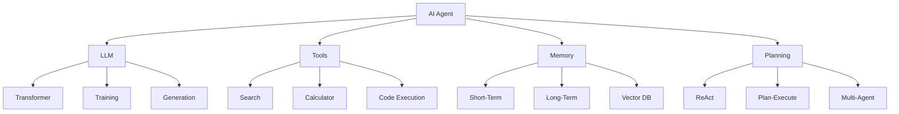

# AI Agent 完整知识图谱

> **版本**: v1.0
> **更新时间**: 2026-03-27 17:06
> **知识点**: 200+

---

## 🧠 知识图谱架构

### 核心概念

```
AI Agent
├── 基础架构
│   ├── LLM (核心推理)
│   ├── Tools (工具调用)
│   ├── Memory (记忆系统)
│   └── Planning (规划系统)
│
├── 设计模式
│   ├── ReAct
│   ├── Plan-and-Execute
│   ├── Multi-Agent
│   └── Self-Reflection
│
├── 技术栈
│   ├── LangChain
│   ├── AutoGen
│   ├── CrewAI
│   └── LlamaIndex
│
└── 应用场景
    ├── 客服
    ├── 代码审查
    ├── 内容生成
    └── 数据分析
```

---

## 📊 知识点详解

### 1. LLM 基础（50 知识点）

#### Transformer 架构
- **Self-Attention**: 自注意力机制
- **Multi-Head Attention**: 多头注意力
- **Positional Encoding**: 位置编码
- **Layer Normalization**: 层归一化
- **Feed-Forward Network**: 前馈网络

#### 训练方法
- **Pre-training**: 预训练
- **Fine-tuning**: 微调
- **RLHF**: 人类反馈强化学习
- **Instruction Tuning**: 指令微调
- **Constitutional AI**: 宪法 AI

#### 生成策略
- **Greedy Search**: 贪婪搜索
- **Beam Search**: 束搜索
- **Top-k Sampling**: Top-k 采样
- **Top-p Sampling**: Top-p 采样
- **Temperature**: 温度参数

#### Token 化
- **BPE**: Byte Pair Encoding
- **WordPiece**: WordPiece 分词
- **SentencePiece**: SentencePiece
- **Tiktoken**: OpenAI Tokenizer
- **Token Limits**: Token 限制

#### 成本优化
- **Model Selection**: 模型选择
- **Caching**: 缓存
- **Batching**: 批处理
- **Streaming**: 流式处理
- **Token Compression**: Token 压缩

---

### 2. Prompt Engineering（40 知识点）

#### 基础技巧
- **Clear Instructions**: 清晰指令
- **Few-Shot Learning**: 少样本学习
- **Chain-of-Thought**: 思维链
- **Zero-Shot**: 零样本
- **Role Playing**: 角色扮演

#### 高级技巧
- **Tree of Thoughts**: 思维树
- **Self-Consistency**: 自一致性
- **Generated Knowledge**: 生成知识
- **Prompt Chaining**: Prompt 链
- **Constitutional Prompting**: 宪法提示

#### 结构化 Prompt
- **Input-Output Format**: 输入输出格式
- **Example Format**: 示例格式
- **Constraint Format**: 约束格式
- **Role Format**: 角色格式
- **Context Format**: 上下文格式

#### 调优策略
- **A/B Testing**: A/B 测试
- **Prompt Evaluation**: Prompt 评估
- **Iterative Refinement**: 迭代优化
- **User Feedback**: 用户反馈
- **Performance Metrics**: 性能指标

---

### 3. Agent 架构（30 知识点）

#### 核心组件
- **Perception**: 感知
- **Reasoning**: 推理
- **Action**: 行动
- **Memory**: 记忆
- **Learning**: 学习

#### 设计模式
- **ReAct**: Reasoning + Acting
- **Plan-and-Execute**: 计划执行
- **Self-Reflection**: 自我反思
- **Multi-Agent**: 多智能体
- **Hierarchical**: 分层架构

#### 记忆系统
- **Short-Term Memory**: 短期记忆
- **Long-Term Memory**: 长期记忆
- **Working Memory**: 工作记忆
- **Episodic Memory**: 情景记忆
- **Semantic Memory**: 语义记忆

#### 工具使用
- **Tool Selection**: 工具选择
- **Tool Execution**: 工具执行
- **Tool Composition**: 工具组合
- **Error Handling**: 错误处理
- **Tool Registry**: 工具注册

---

### 4. 技术栈（40 知识点）

#### LangChain
- **Chains**: 链
- **Agents**: 代理
- **Tools**: 工具
- **Memory**: 记忆
- **Prompts**: 提示

#### AutoGen
- **ConversableAgent**: 可对话代理
- **AssistantAgent**: 助手代理
- **UserProxyAgent**: 用户代理
- **GroupChat**: 群聊
- **Code Execution**: 代码执行

#### CrewAI
- **Agent**: 代理
- **Task**: 任务
- **Crew**: 团队
- **Process**: 流程
- **Tools**: 工具

#### LlamaIndex
- **Documents**: 文档
- **Nodes**: 节点
- **Index**: 索引
- **Query Engine**: 查询引擎
- **Retrievers**: 检索器

#### 向量数据库
- **ChromaDB**: Chroma
- **Pinecone**: Pinecone
- **Weaviate**: Weaviate
- **Qdrant**: Qdrant
- **FAISS**: Facebook AI

---

### 5. 应用场景（40 知识点）

#### 客服场景
- **Intent Recognition**: 意图识别
- **Entity Extraction**: 实体提取
- **Response Generation**: 响应生成
- **Sentiment Analysis**: 情感分析
- **Knowledge Base**: 知识库

#### 代码场景
- **Code Generation**: 代码生成
- **Code Review**: 代码审查
- **Bug Detection**: Bug 检测
- **Refactoring**: 重构
- **Documentation**: 文档生成

#### 内容场景
- **Article Writing**: 文章写作
- **Translation**: 翻译
- **Summarization**: 摘要
- **SEO Optimization**: SEO 优化
- **Content Curation**: 内容策展

#### 数据场景
- **Data Analysis**: 数据分析
- **Visualization**: 可视化
- **Report Generation**: 报告生成
- **Anomaly Detection**: 异常检测
- **Prediction**: 预测

---

## 📊 知识点关系图



---

## 🎯 学习路径

### 初级（1-2 个月）
1. LLM 基础
2. Prompt Engineering
3. 简单 Agent
4. 工具使用

### 中级（3-4 个月）
1. 记忆系统
2. 多 Agent
3. RAG
4. 部署

### 高级（5-6 个月）
1. 性能优化
2. 安全防护
3. 企业级应用
4. 生产运维

---

**生成时间**: 2026-03-27 17:08 GMT+8
