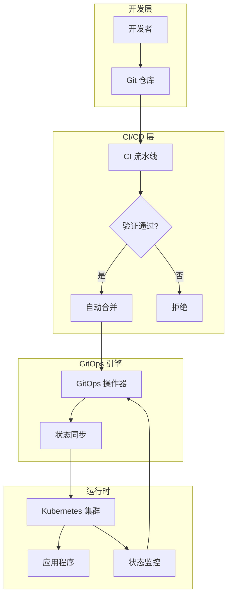

# 企业级 DevOps 实践完全指南

## 目录

1. [概述](#概述)
2. [GitOps](#gitops)
3. [基础设施即代码 (IaC)]#基础设施即代码-iac)
4. [容器编排](#容器编排)
5. [服务网格](#服务网格)
6. [可观测性](#可观测性)
7. [最佳实践](#最佳实践)
8. [工具选型](#工具选型)
9. [实施路线图](#实施路线图)

---

## 概述

### 什么是企业级 DevOps？

企业级 DevOps 是一套文化、工具和实践的集合，旨在通过自动化和协作，显著缩短软件开发生命周期，在保持高质量的同时，以高频率部署和发布软件。

### 核心价值

- **速度**: 快速交付功能和修复
- **稳定性**: 确保系统可靠运行
- **安全性**: 内置安全而非事后添加
- **可扩展性**: 支持业务增长
- **成本效益**: 资源优化和自动化

### DevOps vs SRE vs 平台工程

| 维度 | DevOps | SRE (Site Reliability Engineering) | 平台工程 |
|------|--------|-----------------------------------|----------|
| **核心目标** | 开发运维协作 | 系统可靠性 | 开发者体验 |
| **关注点** | 文化、流程、工具 | SLA、SLO、SLI、错误预算 | 自助服务、抽象复杂性 |
| **关键指标** | 部署频率、变更失败率 | MTTR、可用性、错误率 | 开发者生产力、部署时间 |
| **典型角色** | DevOps 工程师 | SRE 工程师 | 平台工程师 |

### 三支柱模型

```
┌─────────────────────────────────────────────────────────┐
│                    企业级 DevOps                          │
├─────────────────────────────────────────────────────────┤
│                                                         │
│  ┌─────────────┐    ┌─────────────┐    ┌─────────────┐ │
│  │   文化支柱   │    │   流程支柱   │    │   技术支柱   │ │
│  ├─────────────┤    ├─────────────┤    ├─────────────┤ │
│  │ • 协作文化   │    │ • CI/CD     │    │ • 容器化     │ │
│  │ • 责任共担   │    │ • GitOps    │    │ • 微服务     │ │
│  │ • 持续改进   │    │ • 监控告警   │    │ • 云原生     │ │
│  │ • 实验精神   │    │ • 事件响应   │    │ • 自动化     │ │
│  └─────────────┘    └─────────────┘    └─────────────┘ │
│                                                         │
└─────────────────────────────────────────────────────────┘
```

---

## GitOps

### 什么是 GitOps？

GitOps 是一种用于云原生应用程序和基础设施的连续交付方法。它将 Git 仓库作为系统状态的"单一事实来源"。

### 核心原则

1. **声明式**: 系统的期望状态声明在 Git 中
2. **版本化**: 所有配置和基础设施都进行版本控制
3. **自动化**: 自动化工具确保 Git 中的状态与实际状态一致
4. **持续协调**: 软件代理持续监控和纠正系统状态

### GitOps 工作流程

```
开发人员 → Git 仓库 (PR/MR) → CI 验证 → 自动合并 → 
GitOps 操作器 → Kubernetes 集群 → 应用部署
     ↑                                                    │
     └──────────────────────── 状态漂移检测 ←─────────────┘
```

### GitOps 架构



### GitOps 工具对比

| 工具 | 语言 | 架构 | 适用场景 | 学习曲线 |
|------|------|------|---------|----------|
| **Argo CD** | Go | Pull | Kubernetes 原生应用 | 中等 |
| **Flux** | Go | Pull | 多集群、混合云 | 中等 |
| **Jenkins X** | Java | Push/混合 | 传统企业 | 高 |
| **Tekton** | Go | Push | 云原生流水线 | 高 |
| **Spinnaker** | Java | Push | 多云部署 | 高 |

### Argo CD 深度实践

#### 核心概念

1. **Application**: 代表一个部署单元
2. **ApplicationSet**: 批量管理多个应用
3. **Repository**: Git 仓库配置
4. **Sync**: 同步操作
5. **Rollback**: 回滚操作

#### 配置示例

```yaml
apiVersion: argoproj.io/v1alpha1
kind: Application
metadata:
  name: my-app
  namespace: argocd
spec:
  project: default
  source:
    repoURL: https://github.com/example/app.git
    targetRevision: HEAD
    path: k8s
  destination:
    server: https://kubernetes.default.svc
    namespace: production
  syncPolicy:
    automated:
      prune: true
      selfHeal: true
    syncOptions:
    - CreateNamespace=true
```

#### 最佳实践

1. **分支策略**
   - `main`: 生产环境配置
   - `staging`: 预生产环境
   - `develop`: 开发环境
   - `feature/*`: 功能分支

2. **目录结构**
   ```
   apps/
   ├── production/
   │   ├── app1/
   │   │   ├── deployment.yaml
   │   │   ├── service.yaml
   │   │   └── configmap.yaml
   │   └── app2/
   ├── staging/
   └── develop/
   ```

3. **密钥管理**
   - 使用 Sealed Secrets
   - 使用 External Secrets Operator
   - 使用 Vault

4. **多集群管理**
   - 使用 ApplicationSet
   - 使用 Cluster Secrets
   - 独立的 Argo CD 实例

### Flux 深度实践

#### 核心组件

1. **Source Controller**: 管理 Git/Helm 仓库
2. **Kustomize Controller**: 应用 Kustomization
3. **Helm Controller**: 管理 Helm Releases
4. **Notification Controller**: 发送通知

#### 配置示例

```yaml
apiVersion: source.toolkit.fluxcd.io/v1beta1
kind: GitRepository
metadata:
  name: my-app
  namespace: flux-system
spec:
  interval: 1m
  url: https://github.com/example/app.git
  ref:
    branch: main
---
apiVersion: kustomize.toolkit.fluxcd.io/v1beta1
kind: Kustomization
metadata:
  name: my-app
  namespace: flux-system
spec:
  interval: 10m
  sourceRef:
    kind: GitRepository
    name: my-app
  path: ./k8s
  prune: true
  validation: client
```

### GitOps 与传统 CI/CD 的对比

| 维度 | 传统 CI/CD | GitOps |
|------|-----------|--------|
| **部署方式** | Push (触发式) | Pull (持续同步) |
| **配置管理** | 分散在多个地方 | 统一在 Git 仓库 |
| **权限控制** | 需要集群访问权限 | 只需 Git 权限 |
| **审计追踪** | 不完整 | Git 日志完整 |
| **灾难恢复** | 需要手动操作 | 自动恢复 |
| **状态可见性** | 低 | 高 |

---

## 基础设施即代码 (IaC)

### 什么是 IaC？

基础设施即代码是一种管理基础设施（服务器、网络、数据库等）的方法，通过代码来定义、部署和更新基础设施，而不是通过手动配置。

### IaC 的优势

1. **一致性**: 消除配置漂移
2. **可重复性**: 轻松复制环境
3. **可测试性**: 在部署前验证配置
4. **版本控制**: 追踪所有变更
5. **协作效率**: 团队协作更加高效

### 声明式 vs 命令式 IaC

| 特性 | 声明式 | 命令式 |
|------|--------|--------|
| **定义方式** | 描述目标状态 | 描述执行步骤 |
| **执行方式** | 自动计算路径 | 按顺序执行 |
| **状态管理** | 自动处理 | 手动管理 |
| **可读性** | 更易理解 | 流程清晰 |
| **示例工具** | Terraform, Pulumi | Ansible, Chef |

### Terraform 深度实践

#### 核心概念

1. **Provider**: 云服务提供商
2. **Resource**: 基础设施资源
3. **Module**: 可复用的配置单元
4. **State**: 基础设施状态
5. **Variable**: 输入变量
6. **Output**: 输出值

#### 基础配置

```hcl
# main.tf
terraform {
  required_providers {
    aws = {
      source  = "hashicorp/aws"
      version = "~> 5.0"
    }
  }
  
  backend "s3" {
    bucket = "terraform-state"
    key    = "prod/terraform.tfstate"
    region = "us-east-1"
    encrypt = true
    dynamodb_table = "terraform-locks"
  }
}

provider "aws" {
  region = var.aws_region
}

# variables.tf
variable "aws_region" {
  description = "AWS region"
  type        = string
  default     = "us-east-1"
}

variable "app_name" {
  description = "Application name"
  type        = string
}

# outputs.tf
output "vpc_id" {
  description = "VPC ID"
  value       = aws_vpc.main.id
}
```

#### 模块化设计

```
terraform/
├── modules/
│   ├── vpc/
│   │   ├── main.tf
│   │   ├── variables.tf
│   │   └── outputs.tf
│   ├── ecs/
│   ├── rds/
│   └── alb/
├── environments/
│   ├── dev/
│   │   ├── main.tf
│   │   ├── terraform.tfvars
│   │   └── backend.tf
│   ├── staging/
│   └── prod/
└── shared/
    ├── data/
    └── security/
```

#### 最佳实践

1. **状态管理**
   ```hcl
   # 使用远程后端
   terraform {
     backend "s3" {
       bucket         = "terraform-state"
       key            = "env/terraform.tfstate"
       region         = "us-east-1"
       encrypt        = true
       dynamodb_table = "terraform-locks"
     }
   }
   ```

2. **模块化**
   - 创建可复用的模块
   - 使用输入/输出接口
   - 版本化模块

3. **安全**
   - 不在代码中硬编码密钥
   - 使用 Variables 和 Secrets
   - 启用加密状态

4. **验证**
   ```bash
   terraform fmt -check
   terraform validate
   terraform plan -out=tfplan
   terraform show tfplan
   tflint
   ```

5. **CI/CD 集成**
   ```yaml
   # GitHub Actions
   name: Terraform
   on: [push]
   jobs:
     terraform:
       runs-on: ubuntu-latest
       steps:
         - uses: actions/checkout@v3
         - uses: hashicorp/setup-terraform@v2
         - run: terraform init
         - run: terraform fmt -check
         - run: terraform validate
         - run: terraform plan
         - run: terraform apply -auto-approve
   ```

### Pulumi 深度实践

#### 为什么选择 Pulumi？

- 使用通用编程语言 (Python, TypeScript, Go, etc.)
- 更好的抽象能力
- 原生支持循环、条件、函数
- 类型安全
- 测试友好

#### 配置示例

```python
import pulumi
import pulumi_aws as aws

# 创建 VPC
vpc = aws.ec2.Vpc("my-vpc",
    cidr_block="10.0.0.0/16",
    enable_dns_hostnames=True,
    tags={"Name": "my-vpc"}
)

# 创建子网
public_subnet = aws.ec2.Subnet("public-subnet",
    vpc_id=vpc.id,
    cidr_block="10.0.1.0/24",
    availability_zone="us-east-1a",
    map_public_ip_on_launch=True
)

# 输出
pulumi.export("vpc_id", vpc.id)
pulumi.export("subnet_id", public_subnet.id)
```

#### 高级特性

```python
# 组件化 (Component Resource)
class MyComponent(pulumi.ComponentResource):
    def __init__(self, name, opts=None):
        super().__init__("my:component:MyComponent", name, opts)
        self.vpc = aws.ec2.Vpc(f"{name}-vpc", ...)
        self.subnet = aws.ec2.Subnet(f"{name}-subnet", ...)

# 使用
comp = MyComponent("my-component")
```

### Ansible 深度实践

#### 核心概念

1. **Playbook**: 任务配置文件
2. **Role**: 可复用的角色
3. **Inventory**: 主机清单
4. **Module**: 功能模块
5. **Task**: 原子任务

#### Playbook 示例

```yaml
---
- name: Configure web server
  hosts: webservers
  become: yes
  vars:
    app_port: 8080
    
  tasks:
    - name: Install Nginx
      apt:
        name: nginx
        state: present
        update_cache: yes
        
    - name: Start Nginx
      service:
        name: nginx
        state: started
        enabled: yes
        
    - name: Deploy application
      copy:
        src: ./app/
        dest: /var/www/html/
        
    - name: Configure firewall
      ufw:
        rule: allow
        port: "{{ app_port }}"
        proto: tcp
```

#### Role 结构

```
roles/
├── webserver/
│   ├── defaults/
│   │   └── main.yml
│   ├── files/
│   ├── handlers/
│   │   └── main.yml
│   ├── meta/
│   │   └── main.yml
│   ├── tasks/
│   │   └── main.yml
│   ├── templates/
│   └── vars/
│       └── main.yml
```

### IaC 安全最佳实践

1. **密钥管理**
   - 使用 Secrets Manager (AWS Secrets Manager, Vault)
   - 不在代码中硬编码
   - 环境变量注入

2. **权限最小化**
   - IAM 角色和策略
   - 最小权限原则
   - 临时凭证

3. **审计和合规**
   - CloudTrail / Audit Log
   - 策略即代码 (OPA, Sentinel)
   - 合性检查

4. **状态安全**
   - 加密状态文件
   - 版本化状态
   - 定期备份

---

## 容器编排

### 什么是容器编排？

容器编排是自动化管理、部署、扩展和联网容器的过程。它解决了在分布式环境中管理大量容器化应用的复杂性。

### Kubernetes 核心概念

#### 1. Pod

- 最小部署单元
- 一个或多个容器
- 共享存储和网络
- 生命周期短暂

```yaml
apiVersion: v1
kind: Pod
metadata:
  name: my-pod
spec:
  containers:
  - name: my-container
    image: nginx:1.21
    ports:
    - containerPort: 80
```

#### 2. Deployment

- 管理 Pod 的生命周期
- 声明式更新
- 滚动更新和回滚

```yaml
apiVersion: apps/v1
kind: Deployment
metadata:
  name: my-app
spec:
  replicas: 3
  selector:
    matchLabels:
      app: my-app
  template:
    metadata:
      labels:
        app: my-app
    spec:
      containers:
      - name: my-container
        image: my-app:1.0
        ports:
        - containerPort: 8080
        resources:
          requests:
            memory: "128Mi"
            cpu: "250m"
          limits:
            memory: "256Mi"
            cpu: "500m"
```

#### 3. Service

- 稳定的网络端点
- 负载均衡
- 服务发现

```yaml
apiVersion: v1
kind: Service
metadata:
  name: my-service
spec:
  selector:
    app: my-app
  ports:
  - protocol: TCP
    port: 80
    targetPort: 8080
  type: LoadBalancer
```

#### 4. ConfigMap & Secret

- 配置管理
- 敏感数据管理

```yaml
apiVersion: v1
kind: ConfigMap
metadata:
  name: my-config
data:
  database.url: "postgres://localhost:5432/mydb"
  cache.ttl: "3600"
---
apiVersion: v1
kind: Secret
metadata:
  name: my-secret
type: Opaque
data:
  username: YWRtaW4=
  password: cGFzc3dvcmQ=
```

#### 5. Ingress

- HTTP/HTTPS 路由
- 域名和路径映射
- TLS 终止

```yaml
apiVersion: networking.k8s.io/v1
kind: Ingress
metadata:
  name: my-ingress
  annotations:
    nginx.ingress.kubernetes.io/rewrite-target: /
spec:
  tls:
  - hosts:
    - example.com
    secretName: tls-secret
  rules:
  - host: example.com
    http:
      paths:
      - path: /
        pathType: Prefix
        backend:
          service:
            name: my-service
            port:
              number: 80
```

### Kubernetes 高级特性

#### 1. 水平自动扩缩容 (HPA)

```yaml
apiVersion: autoscaling/v2
kind: HorizontalPodAutoscaler
metadata:
  name: my-app-hpa
spec:
  scaleTargetRef:
    apiVersion: apps/v1
    kind: Deployment
    name: my-app
  minReplicas: 2
  maxReplicas: 10
  metrics:
  - type: Resource
    resource:
      name: cpu
      target:
        type: Utilization
        averageUtilization: 50
  - type: Resource
    resource:
      name: memory
      target:
        type: Utilization
        averageUtilization: 70
```

#### 2. 垂直自动扩缩容 (VPA)

```yaml
apiVersion: autoscaling.k8s.io/v1
kind: VerticalPodAutoscaler
metadata:
  name: my-app-vpa
spec:
  targetRef:
    apiVersion: apps/v1
    kind: Deployment
    name: my-app
  updatePolicy:
    updateMode: Auto
  resourcePolicy:
    containerPolicies:
    - containerName: my-container
      maxAllowed:
        cpu: "1"
        memory: "1Gi"
```

#### 3. 自定义资源 (CRD)

```yaml
apiVersion: apiextensions.k8s.io/v1
kind: CustomResourceDefinition
metadata:
  name: databases.example.com
spec:
  group: example.com
  versions:
  - name: v1alpha1
    served: true
    storage: true
    schema:
      openAPIV3Schema:
        type: object
        properties:
          spec:
            type: object
            properties:
              size:
                type: string
  scope: Namespaced
  names:
    plural: databases
    singular: database
    kind: Database
```

#### 4. Operator 模式

Operator 是扩展 Kubernetes 的自定义控制器，使用自定义资源管理应用。

```go
// Operator 逻辑示例
func (r *MyAppReconciler) Reconcile(ctx context.Context, req ctrl.Request) (ctrl.Result, error) {
    log := log.FromContext(ctx)
    
    // 获取资源
    app := &myappsv1alpha1.MyApp{}
    if err := r.Get(ctx, req.NamespacedName, app); err != nil {
        return ctrl.Result{}, client.IgnoreNotFound(err)
    }
    
    // 调谐状态
    if err := r.reconcileDeployment(ctx, app); err != nil {
        return ctrl.Result{}, err
    }
    
    // 更新状态
    app.Status.ReadyReplicas = 3
    if err := r.Status().Update(ctx, app); err != nil {
        return ctrl.Result{}, err
    }
    
    return ctrl.Result{RequeueAfter: time.Minute * 5}, nil
}
```

### Kubernetes 集群管理

#### 1. 多集群管理

**工具选项**:
- **Rancher**: 统一多集群管理平台
- **Anthos**: Google 多云管理
- **OCM (OpenShift Cluster Manager)**: Red Hat 方案
- **Karmada**: CNCF 开源项目

```yaml
# Karmada 配置示例
apiVersion: cluster.karmada.io/v1alpha1
kind: Cluster
metadata:
  name: cluster-1
spec:
  syncMode: Push
  apiEndpoint: https://cluster-1.karmada.io
  secretRef:
    name: cluster-1-secret
---
apiVersion: policy.karmada.io/v1alpha1
kind: PropagationPolicy
metadata:
  name: my-app-policy
spec:
  resourceSelectors:
  - apiVersion: apps/v1
    kind: Deployment
    name: my-app
  placement:
    clusterAffinity:
      clusterNames:
      - cluster-1
      - cluster-2
```

#### 2. 集群升级

```bash
# 使用 kubeadm 升级
kubeadm upgrade plan
kubeadm upgrade apply v1.28.0

# 升级节点
kubectl drain node-1 --ignore-daemonsets
kubeadm upgrade node
kubectl uncordon node-1

# 升级控制平面
kubectl apply -f https://dl.k8s.io/release/v1.28.0/manifests/kube-controller-manager.yaml
```

### Kubernetes 安全

#### 1. Pod 安全策略

```yaml
apiVersion: v1
kind: Namespace
metadata:
  name: my-namespace
  labels:
    pod-security.kubernetes.io/enforce: restricted
    pod-security.kubernetes.io/audit: restricted
    pod-security.kubernetes.io/warn: restricted
```

#### 2. 网络策略

```yaml
apiVersion: networking.k8s.io/v1
kind: NetworkPolicy
metadata:
  name: deny-all
spec:
  podSelector: {}
  policyTypes:
  - Ingress
  - Egress
---
apiVersion: networking.k8s.io/v1
kind: NetworkPolicy
metadata:
  name: allow-web
spec:
  podSelector:
    matchLabels:
      app: web
  policyTypes:
  - Ingress
  ingress:
  - from:
    - podSelector:
        matchLabels:
          app: frontend
    ports:
    - protocol: TCP
      port: 80
```

#### 3. RBAC

```yaml
apiVersion: v1
kind: ServiceAccount
metadata:
  name: my-service-account
---
apiVersion: rbac.authorization.k8s.io/v1
kind: Role
metadata:
  name: my-role
rules:
- apiGroups: [""]
  resources: ["pods"]
  verbs: ["get", "list", "watch"]
---
apiVersion: rbac.authorization.k8s.io/v1
kind: RoleBinding
metadata:
  name: my-role-binding
subjects:
- kind: ServiceAccount
  name: my-service-account
roleRef:
  kind: Role
  name: my-role
  apiGroup: rbac.authorization.k8s.io
```

### Kubernetes 监控和调试

#### 1. 常用命令

```bash
# 查看 Pod 状态
kubectl get pods -n <namespace>

# 查看 Pod 日志
kubectl logs <pod-name> -n <namespace>

# 查看事件
kubectl get events -n <namespace>

# 进入 Pod
kubectl exec -it <pod-name> -n <namespace> -- /bin/bash

# 查看 Pod 资源使用
kubectl top pods -n <namespace>

# 描述资源
kubectl describe pod <pod-name> -n <namespace>
```

#### 2. 调试技巧

```bash
# 临时容器调试
kubectl debug -it <pod-name> --image=busybox

# 端口转发
kubectl port-forward svc/<service-name> 8080:80

# 复制文件
kubectl cp /local/file <pod-name>:/remote/path

# 查看资源 YAML
kubectl get pod <pod-name> -o yaml
```

### 容器运行时

#### 1. containerd (推荐)

```bash
# 配置 containerd
sudo systemctl enable containerd
sudo systemctl start containerd

# 配置 CRI 插件
sudo vim /etc/containerd/config.toml

# 验证
sudo ctr version
sudo crictl version
```

#### 2. CRI-O

```bash
# 安装 CRI-O
sudo apt-get install cri-o

# 配置
sudo vim /etc/crio/crio.conf

# 启动
sudo systemctl enable --now crio
```

---

## 服务网格

### 什么是服务网格？

服务网格是专门处理服务到服务通信的基础设施层。它提供了一种可靠、安全地连接微服务的方法，同时管理流量、执行策略和收集遥测数据。

### 服务网格的核心价值

1. **流量管理**: 智能路由、负载均衡、故障注入
2. **安全**: mTLS 加密、身份验证、授权
3. **可观测性**: 指标、日志、追踪
4. **策略**: 速率限制、断路器、重试

### Istio 架构

```
┌─────────────────────────────────────────────────────────┐
│                   控制平面 (Control Plane)                 │
│                                                         │
│  ┌──────────────┐  ┌──────────────┐  ┌──────────────┐  │
│  │   Istiod     │  │   Galley     │  │   Citadel    │  │
│  │ (Pilot API)  │  │ (Validation) │  │ (Security)   │  │
│  └──────────────┘  └──────────────┘  └──────────────┘  │
└─────────────────────────────────────────────────────────┘
                          ↕
┌─────────────────────────────────────────────────────────┐
│                   数据平面 (Data Plane)                  │
│                                                         │
│  ┌──────────────┐      ┌──────────────┐                │
│  │  Service A   │ ───→ │  Service B   │                │
│  │   + Envoy    │      │   + Envoy    │                │
│  └──────────────┘      └──────────────┘                │
│                                                         │
│  ┌──────────────┐      ┌──────────────┐                │
│  │  Service C   │ ───→ │  Service D   │                │
│  │   + Envoy    │      │   + Envoy    │                │
│  └──────────────┘      └──────────────┘                │
└─────────────────────────────────────────────────────────┘
```

### Istio 核心组件

#### 1. 控制平面

- **Istiod**: 统一控制平面组件
  - Pilot: 服务发现和流量管理
  - Citadel: 证书管理
  - Galley: 配置验证

#### 2. 数据平面

- **Envoy Proxy**: 高性能代理
  - 代理所有网络流量
  - 执行策略
  - 收集遥测数据

### Istio 配置示例

#### 1. VirtualService (流量路由)

```yaml
apiVersion: networking.istio.io/v1alpha3
kind: VirtualService
metadata:
  name: reviews
spec:
  hosts:
  - reviews
  http:
  - match:
    - headers:
        end-user:
          exact: jason
    route:
    - destination:
        host: reviews
        subset: v2
  - route:
    - destination:
        host: reviews
        subset: v1
```

#### 2. DestinationRule (子集)

```yaml
apiVersion: networking.istio.io/v1alpha3
kind: DestinationRule
metadata:
  name: reviews
spec:
  host: reviews
  subsets:
  - name: v1
    labels:
      version: v1
  - name: v2
    labels:
      version: v2
```

#### 3. Gateway (入口网关)

```yaml
apiVersion: networking.istio.io/v1alpha3
kind: Gateway
metadata:
  name: my-gateway
spec:
  selector:
    istio: ingressgateway
  servers:
  - port:
      number: 80
      name: http
      protocol: HTTP
    hosts:
    - "*"
---
apiVersion: networking.istio.io/v1alpha3
kind: VirtualService
metadata:
  name: my-app
spec:
  hosts:
  - "*"
  gateways:
  - my-gateway
  http:
  - route:
    - destination:
        host: my-app
        port:
          number: 8080
```

#### 4. ServiceEntry (外部服务)

```yaml
apiVersion: networking.istio.io/v1alpha3
kind: ServiceEntry
metadata:
  name: external-api
spec:
  hosts:
  - api.external.com
  ports:
  - number: 443
    name: https
    protocol: HTTPS
  location: MESH_EXTERNAL
  resolution: DNS
```

#### 5. AuthorizationPolicy (安全策略)

```yaml
apiVersion: security.istio.io/v1beta1
kind: AuthorizationPolicy
metadata:
  name: deny-list
  namespace: default
spec:
  selector:
    matchLabels:
      app: productpage
  action: DENY
  rules:
  - from:
    - source:
        notIpBlocks:
        - 1.2.3.4
  - to:
    - operation:
        methods: ["GET"]
```

### Istio 流量管理

#### 1. 金丝雀部署

```yaml
apiVersion: networking.istio.io/v1alpha3
kind: VirtualService
metadata:
  name: my-app
spec:
  hosts:
  - my-app
  http:
  - route:
    - destination:
        host: my-app
        subset: v1
      weight: 90
    - destination:
        host: my-app
        subset: v2
      weight: 10
```

#### 2. 故障注入

```yaml
apiVersion: networking.istio.io/v1alpha3
kind: VirtualService
metadata:
  name: my-app
spec:
  hosts:
  - my-app
  http:
  - fault:
      delay:
        percentage:
          value: 10
        fixedDelay: 5s
    route:
    - destination:
        host: my-app
  - fault:
      abort:
        percentage:
          value: 1
        httpStatus: 503
    route:
    - destination:
        host: my-app
```

#### 3. 超时和重试

```yaml
apiVersion: networking.istio.io/v1alpha3
kind: VirtualService
metadata:
  name: my-app
spec:
  hosts:
  - my-app
  http:
  - timeout: 10s
    retries:
      attempts: 3
      perTryTimeout: 2s
      retryOn: 5xx,connect-failure,refused-stream
    route:
    - destination:
        host: my-app
```

#### 4. 流量镜像

```yaml
apiVersion: networking.istio.io/v1alpha3
kind: VirtualService
metadata:
  name: my-app
spec:
  hosts:
  - my-app
  http:
  - route:
    - destination:
        host: my-app
        subset: v1
    mirror:
      host: my-app
        subset: v2
    mirrorPercentage:
      value: 10
```

### Istio 安全

#### 1. mTLS 配置

```yaml
apiVersion: security.istio.io/v1beta1
kind: PeerAuthentication
metadata:
  name: default
  namespace: istio-system
spec:
  mtls:
    mode: STRICT
```

#### 2. 请求认证

```yaml
apiVersion: security.istio.io/v1beta1
kind: RequestAuthentication
metadata:
  name: jwt-example
  namespace: istio-system
spec:
  selector:
    matchLabels:
      app: httpbin
  jwtRules:
  - issuer: "testing@secure.istio.io"
    jwks: "https://raw.githubusercontent.com/istio/istio/release-1.19/security/tools/jwt/samples/jwks.json"
```

### Linkerd (轻量级替代方案)

#### Linkerd vs Istio

| 特性 | Linkerd | Istio |
|------|---------|-------|
| **性能** | 更快，更低延迟 | 较重 |
| **复杂性** | 简单，易维护 | 复杂 |
| **功能** | 核心功能 | 丰富功能 |
| **资源占用** | 更低 | 更高 |
| **学习曲线** | 平缓 | 陡峭 |

#### Linkerd 安装

```bash
# 安装 CLI
curl -sL https://run.linkerd.io/install | sh

# 验证集群
linkerd check --pre

# 安装控制平面
linkerd install | kubectl apply -f -

# 验证安装
linkerd check

# 注入网格
kubectl get deploy -n <namespace> -o yaml | linkerd inject - | kubectl apply -f -
```

### 服务网格最佳实践

1. **渐进式采用**
   - 从关键服务开始
   - 逐步扩展到全网格
   - 持续监控和调整

2. **性能优化**
   - 调整资源限制
   - 优化 Envoy 配置
   - 使用合适的超时值

3. **可观测性集成**
   - 配置 Prometheus
   - 集成分布式追踪
   - 可视化指标

4. **安全加固**
   - 启用 mTLS
   - 配置策略
   - 定期审计

---

## 可观测性

### 可观测性三大支柱

```
┌─────────────────────────────────────────────────────────┐
│                    可观测性平台                          │
├─────────────────────────────────────────────────────────┤
│                                                         │
│  ┌─────────────┐    ┌─────────────┐    ┌─────────────┐ │
│  │    指标     │    │    日志     │    │    追踪     │ │
│  │  Metrics   │    │   Logs     │    │  Tracing    │ │
│  ├─────────────┤    ├─────────────┤    ├─────────────┤ │
│  │ • 数值数据   │    │ • 文本记录   │    │ • 请求路径   │ │
│  │ • 时间序列   │    │ • 事件信息   │    │ • 调用链路   │ │
│  │ • 聚合分析   │    │ • 上下文     │    │ • 性能分析   │ │
│  │ • 告警       │    │ • 调试       │    │ • 故障定位   │ │
│  └─────────────┘    └─────────────┘    └─────────────┘ │
│                                                         │
└─────────────────────────────────────────────────────────┘
```

### 指标 (Metrics)

#### 指标类型

1. **Counter**: 只增不减的计数器
   - 示例: 请求数、错误数
   - 用途: 累计统计、速率计算

2. **Gauge**: 可增可减的瞬时值
   - 示例: 内存使用、连接数
   - 用途: 当前状态监控

3. **Histogram**: 直方图（分布）
   - 示例: 请求延迟、响应大小
   - 用途: 百分位数统计

4. **Summary**: 摘要（统计值）
   - 示例: P95、P99 延迟
   - 用途: 关键指标统计

#### Prometheus 配置

```yaml
# prometheus.yml
global:
  scrape_interval: 15s
  evaluation_interval: 15s

scrape_configs:
  - job_name: 'kubernetes-pods'
    kubernetes_sd_configs:
    - role: pod
    relabel_configs:
    - source_labels: [__meta_kubernetes_pod_annotation_prometheus_io_scrape]
      action: keep
      regex: true
    - source_labels: [__meta_kubernetes_pod_annotation_prometheus_io_path]
      action: replace
      target_label: __metrics_path__
      regex: (.+)

  - job_name: 'node-exporter'
    static_configs:
    - targets: ['node-exporter:9100']
```

#### Exporter 示例

**Node Exporter** (主机指标)

```yaml
apiVersion: apps/v1
kind: DaemonSet
metadata:
  name: node-exporter
  namespace: monitoring
spec:
  selector:
    matchLabels:
      app: node-exporter
  template:
    metadata:
      labels:
        app: node-exporter
    spec:
      containers:
      - name: node-exporter
        image: prom/node-exporter:latest
        ports:
        - containerPort: 9100
        args:
        - --path.procfs=/host/proc
        - --path.sysfs=/host/sys
        volumeMounts:
        - name: proc
          mountPath: /host/proc
        - name: sys
          mountPath: /host/sys
      volumes:
      - name: proc
        hostPath:
          path: /proc
      - name: sys
        hostPath:
          path: /sys
```

**Kube State Metrics** (Kubernetes 资源指标)

```yaml
apiVersion: apps/v1
kind: Deployment
metadata:
  name: kube-state-metrics
  namespace: monitoring
spec:
  replicas: 1
  selector:
    matchLabels:
      app: kube-state-metrics
  template:
    metadata:
      labels:
        app: kube-state-metrics
    spec:
      containers:
      - name: kube-state-metrics
        image: quay.io/coreos/kube-state-metrics:latest
        ports:
        - containerPort: 8080
```

#### 应用指标埋点

**Go (Prometheus 客户端)**

```go
import (
    "github.com/prometheus/client_golang/prometheus"
    "github.com/prometheus/client_golang/prometheus/promhttp"
    "net/http"
)

var (
    requestCount = prometheus.NewCounterVec(
        prometheus.CounterOpts{
            Name: "http_requests_total",
            Help: "Total number of HTTP requests",
        },
        []string{"method", "path", "status"},
    )
    
    requestDuration = prometheus.NewHistogramVec(
        prometheus.HistogramOpts{
            Name:    "http_request_duration_seconds",
            Help:    "HTTP request duration in seconds",
            Buckets: prometheus.DefBuckets,
        },
        []string{"method", "path"},
    )
)

func init() {
    prometheus.MustRegister(requestCount)
    prometheus.MustRegister(requestDuration)
}

func main() {
    http.Handle("/metrics", promhttp.Handler())
    http.HandleFunc("/", handler)
    http.ListenAndServe(":8080", nil)
}

func handler(w http.ResponseWriter, r *http.Request) {
    start := time.Now()
    
    // 业务逻辑
    w.WriteHeader(http.StatusOK)
    w.Write([]byte("Hello"))
    
    // 记录指标
    duration := time.Since(start).Seconds()
    requestCount.WithLabelValues(r.Method, r.URL.Path, "200").Inc()
    requestDuration.WithLabelValues(r.Method, r.URL.Path).Observe(duration)
}
```

**Java (Micrometer)**

```java
import io.micrometer.core.instrument.Counter;
import io.micrometer.core.instrument.Timer;
import io.micrometer.prometheus.PrometheusConfig;
import io.micrometer.prometheus.PrometheusMeterRegistry;

public class Metrics {
    private static final PrometheusMeterRegistry registry = 
        new PrometheusMeterRegistry(PrometheusConfig.DEFAULT);
    
    private static final Counter requestCounter = Counter.builder("http.requests.total")
        .tag("method", "GET")
        .tag("path", "/api/users")
        .register(registry);
    
    private static final Timer requestTimer = Timer.builder("http.request.duration")
        .tag("method", "GET")
        .tag("path", "/api/users")
        .register(registry);
    
    public static void recordRequest() {
        requestCounter.increment();
    }
    
    public static Timer.Sample startTimer() {
        return Timer.start(registry);
    }
    
    public static void stopTimer(Timer.Sample sample) {
        sample.stop(requestTimer);
    }
    
    public static String scrape() {
        return registry.scrape();
    }
}
```

#### Prometheus 告警规则

```yaml
# alerting-rules.yml
groups:
- name: application
  interval: 30s
  rules:
  - alert: HighErrorRate
    expr: rate(http_requests_total{status=~"5.."}[5m]) > 0.1
    for: 5m
    labels:
      severity: critical
    annotations:
      summary: "High error rate detected"
      description: "Error rate is {{ $value }} req/s"
      
  - alert: HighLatency
    expr: histogram_quantile(0.95, rate(http_request_duration_seconds_bucket[5m])) > 1
    for: 5m
    labels:
      severity: warning
    annotations:
      summary: "High latency detected"
      description: "P95 latency is {{ $value }}s"
      
- name: kubernetes
  interval: 30s
  rules:
  - alert: PodCrashLooping
    expr: rate(kube_pod_container_status_restarts_total[15m]) > 0
    for: 5m
    labels:
      severity: warning
    annotations:
      summary: "Pod is crash looping"
      
  - alert: HighCPUUsage
    expr: rate(process_cpu_seconds_total[5m]) > 0.8
    for: 5m
    labels:
      severity: warning
    annotations:
      summary: "High CPU usage detected"
```

### 日志 (Logs)

#### 日志最佳实践

1. **结构化日志**
   - 使用 JSON 格式
   - 包含上下文信息
   - 便于查询和分析

2. **日志级别**
   - DEBUG: 调试信息
   - INFO: 关键事件
   - WARN: 警告信息
   - ERROR: 错误信息
   - FATAL: 致命错误

3. **上下文信息**
   - Request ID
   - User ID
   - 时间戳
   - 服务名称

#### ELK Stack (Elasticsearch, Logstash, Kibana)

**Elasticsearch 配置**

```yaml
# elasticsearch.yml
cluster.name: my-cluster
node.name: node-1
network.host: 0.0.0.0
http.port: 9200
discovery.type: single-node
```

**Filebeat 配置**

```yaml
# filebeat.yml
filebeat.inputs:
- type: container
  paths:
  - '/var/log/containers/*.log'
  processors:
  - add_kubernetes_metadata:
      host: ${NODE_NAME}
      matchers:
      - logs_path:
          logs_path: "/var/log/containers/"

output.elasticsearch:
  hosts: ["elasticsearch:9200"]
  indices:
    - index: "filebeat-%{+yyyy.MM.dd}"
      when.contains:
        kubernetes.container.name: "my-app"
```

**Logstash 配置**

```conf
# logstash.conf
input {
  beats {
    port => 5044
  }
}

filter {
  grok {
    match => { "message" => "%{TIMESTAMP_ISO8601:timestamp} %{LOGLEVEL:level} %{GREEDYDATA:message}" }
  }
  
  date {
    match => ["timestamp", "ISO8601"]
  }
}

output {
  elasticsearch {
    hosts => ["elasticsearch:9200"]
    index => "logs-%{+YYYY.MM.dd}"
  }
}
```

#### Loki (轻量级日志聚合)

```yaml
# loki-config.yaml
server:
  http_listen_port: 3100

positions:
  filename: /tmp/positions.yaml

clients:
  - url: http://loki:3100/loki/api/v1/push

scrape_configs:
- job_name: containers
  static_configs:
  - targets:
      - localhost
    labels:
      job: containerlogs
      __path__: /var/log/containers/*.log
  pipeline_stages:
  - json:
      expressions:
        output: log
        stream: stream
        tag: kubernetes.container_name
        pod: kubernetes.pod_name
        namespace: kubernetes.namespace_name
  - regex:
      expression: '(?P<host_name>[^/]+)/(?P<container_name>[^\s]+)'
  - labels:
      output:
      stream:
      tag:
      pod:
      namespace:
```

**Promtail (日志采集)**

```yaml
# promtail-config.yaml
server:
  http_listen_port: 9080

clients:
  - url: http://loki:3100/loki/api/v1/push

scrape_configs:
- job_name: kubernetes-pods
  kubernetes_sd_configs:
  - role: pod
  relabel_configs:
  - source_labels: [__meta_kubernetes_pod_annotation_prometheus_io_scrape]
    action: keep
    regex: true
```

#### Fluent Bit (轻量级日志采集)

```ini
[SERVICE]
    Flush         1
    Daemon        Off
    Log_Level     info

[INPUT]
    Name              tail
    Path              /var/log/containers/*.log
    Parser            docker
    Tag               kube.*
    Refresh_Interval  5

[FILTER]
    Name                kubernetes
    Match               kube.*
    Kube_URL            https://kubernetes.default.svc:443
    Kube_CA_File        /var/run/secrets/kubernetes.io/serviceaccount/ca.crt
    Kube_Token_File     /var/run/secrets/kubernetes.io/serviceaccount/token
    Merge_Log           On
    Keep_Log            Off
    K8S-Logging.Parser  On
    K8S-Logging.Exclude On

[OUTPUT]
    Name  loki
    Match *
    Url   http://loki:3100/loki/api/v1/push
    Labels job=fluentbit
```

### 追踪 (Tracing)

#### 分布式追踪概念

分布式追踪跟踪一个请求在分布式系统中的完整路径，帮助理解服务之间的依赖关系和性能瓶颈。

#### OpenTelemetry (标准)

**Go 集成**

```go
import (
    "go.opentelemetry.io/otel"
    "go.opentelemetry.io/otel/exporters/jaeger"
    "go.opentelemetry.io/otel/sdk/resource"
    sdktrace "go.opentelemetry.io/otel/sdk/trace"
    semconv "go.opentelemetry.io/otel/semconv/v1.4.0"
)

func initTracer(serviceName string) (func(), error) {
    // 创建 Jaeger exporter
    exp, err := jaeger.New(jaeger.WithCollectorEndpoint(
        jaeger.WithEndpoint("http://jaeger:14268/api/traces"),
    ))
    if err != nil {
        return nil, err
    }
    
    // 创建 tracer provider
    tp := sdktrace.NewTracerProvider(
        sdktrace.WithBatcher(exp),
        sdktrace.WithResource(resource.NewWithAttributes(
            semconv.SchemaURL,
            semconv.ServiceNameKey.String(serviceName),
        )),
    )
    
    // 设置全局 tracer provider
    otel.SetTracerProvider(tp)
    
    return func() {
        _ = tp.Shutdown(context.Background())
    }, nil
}

func main() {
    shutdown, err := initTracer("my-service")
    if err != nil {
        log.Fatal(err)
    }
    defer shutdown()
    
    tracer := otel.Tracer("my-service")
    
    ctx, span := tracer.Start(context.Background(), "handleRequest")
    defer span.End()
    
    // 处理请求
    handleRequest(ctx)
}

func handleRequest(ctx context.Context) {
    tracer := otel.Tracer("my-service")
    _, span := tracer.Start(ctx, "databaseQuery")
    defer span.End()
    
    // 数据库查询
    queryDatabase()
}
```

**Python 集成**

```python
from opentelemetry import trace
from opentelemetry.exporter.jaeger import JaegerExporter
from opentelemetry.sdk.trace import TracerProvider
from opentelemetry.sdk.trace.export import BatchSpanProcessor

# 配置 Jaeger exporter
jaeger_exporter = JaegerExporter(
    agent_host_name="jaeger",
    agent_port=6831,
)

# 创建 tracer provider
trace.set_tracer_provider(TracerProvider())
trace.get_tracer_provider().add_span_processor(
    BatchSpanProcessor(jaeger_exporter)
)

# 使用 tracer
tracer = trace.get_tracer(__name__)

with tracer.start_as_current_span("parent-span"):
    with tracer.start_as_current_span("child-span"):
        # 业务逻辑
        pass
```

#### Jaeger 部署

```yaml
# jaeger-deployment.yaml
apiVersion: apps/v1
kind: Deployment
metadata:
  name: jaeger
  namespace: observability
spec:
  replicas: 1
  selector:
    matchLabels:
      app: jaeger
  template:
    metadata:
      labels:
        app: jaeger
    spec:
      containers:
      - name: jaeger
        image: jaegertracing/all-in-one:latest
        ports:
        - containerPort: 5775
          protocol: UDP
        - containerPort: 6831
          protocol: UDP
        - containerPort: 6832
          protocol: UDP
        - containerPort: 5778
          protocol: TCP
        - containerPort: 16686
          protocol: TCP
        - containerPort: 14268
          protocol: TCP
---
apiVersion: v1
kind: Service
metadata:
  name: jaeger
  namespace: observability
spec:
  selector:
    app: jaeger
  ports:
  - name: query
    port: 16686
    targetPort: 16686
  - name: collector
    port: 14268
    targetPort: 14268
```

#### Tempo (Grafana 追踪后端)

```yaml
# tempo-config.yaml
server:
  http_listen_port: 3100

distributor:
  receivers:
    otlp:
      protocols:
        grpc:
          endpoint: 0.0.0.0:4317

ingester:
  lifecycler:
    address: 127.0.0.1
    ring:
      kvstore:
        store: memberlist
      replication_factor: 1
    final_sleep: 0s
  max_block_bytes: 10485760
  max_block_duration: 5m

compactor:
  working_directory: /tmp/tempo
  compacted_block_retention: 24h

storage:
  trace:
    backend: s3
    s3:
      bucket: tempo
      endpoint: s3.amazonaws.com
      region: us-east-1
```

### 可观测性集成

#### Grafana 仪表板

```json
{
  "dashboard": {
    "title": "Application Overview",
    "panels": [
      {
        "title": "Request Rate",
        "targets": [
          {
            "expr": "rate(http_requests_total[5m])",
            "legendFormat": "{{method}} {{path}}"
          }
        ],
        "type": "graph"
      },
      {
        "title": "Error Rate",
        "targets": [
          {
            "expr": "rate(http_requests_total{status=~\"5..\"}[5m])",
            "legendFormat": "Errors"
          }
        ],
        "type": "graph"
      },
      {
        "title": "P95 Latency",
        "targets": [
          {
            "expr": "histogram_quantile(0.95, rate(http_request_duration_seconds_bucket[5m]))",
            "legendFormat": "P95"
          }
        ],
        "type": "graph"
      }
    ]
  }
}
```

#### Prometheus + Grafana 集成

```yaml
# grafana-datasources.yml
apiVersion: 1

datasources:
  - name: Prometheus
    type: prometheus
    access: proxy
    url: http://prometheus:9090
    isDefault: true
  - name: Loki
    type: loki
    access: proxy
    url: http://loki:3100
  - name: Tempo
    type: tempo
    access: proxy
    url: http://tempo:3100
```

---

## 最佳实践

### 1. CI/CD 流水线

#### 完整的 DevOps 流水线

```
┌─────────────────────────────────────────────────────────┐
│                    CI/CD 流水线                          │
├─────────────────────────────────────────────────────────┤
│                                                         │
│  ┌─────────┐  ┌─────────┐  ┌─────────┐  ┌─────────┐  │
│  │  代码    │  │  构建    │  │  测试    │  │  部署    │  │
│  │ 提交     │  │  镜像    │  │  验证    │  │  发布    │  │
│  └────┬────┘  └────┬────┘  └────┬────┘  └────┬────┘  │
│       │            │            │            │         │
│       ▼            ▼            ▼            ▼         │
│  ┌─────────┐  ┌─────────┐  ┌─────────┐  ┌─────────┐  │
│  │  代码    │  │  安全    │  │  集成    │  │  监控    │  │
│  │  检查    │  │  扫描    │  │  测试    │  │  告警    │  │
│  └─────────┘  └─────────┘  └─────────┘  └─────────┘  │
│                                                         │
└─────────────────────────────────────────────────────────┘
```

#### GitHub Actions 示例

```yaml
name: CI/CD Pipeline

on:
  push:
    branches: [ main, develop ]
  pull_request:
    branches: [ main ]

env:
  REGISTRY: ghcr.io
  IMAGE_NAME: ${{ github.repository }}

jobs:
  test:
    runs-on: ubuntu-latest
    steps:
    - uses: actions/checkout@v3
    
    - name: Set up Go
      uses: actions/setup-go@v4
      with:
        go-version: '1.21'
    
    - name: Run tests
      run: |
        go test -v ./...
        go test -race -coverprofile=coverage.txt ./...
    
    - name: Upload coverage
      uses: codecov/codecov-action@v3
      with:
        files: ./coverage.txt

  security:
    runs-on: ubuntu-latest
    steps:
    - uses: actions/checkout@v3
    
    - name: Run Trivy vulnerability scanner
      uses: aquasecurity/trivy-action@master
      with:
        scan-type: 'fs'
        scan-ref: '.'
        format: 'sarif'
        output: 'trivy-results.sarif'
    
    - name: Upload Trivy results
      uses: github/codeql-action/upload-sarif@v2
      with:
        sarif_file: 'trivy-results.sarif'

  build:
    needs: [test, security]
    runs-on: ubuntu-latest
    permissions:
      contents: read
      packages: write
    steps:
    - uses: actions/checkout@v3
    
    - name: Log in to Container Registry
      uses: docker/login-action@v2
      with:
        registry: ${{ env.REGISTRY }}
        username: ${{ github.actor }}
        password: ${{ secrets.GITHUB_TOKEN }}
    
    - name: Extract metadata
      id: meta
      uses: docker/metadata-action@v4
      with:
        images: ${{ env.REGISTRY }}/${{ env.IMAGE_NAME }}
    
    - name: Build and push Docker image
      uses: docker/build-push-action@v4
      with:
        context: .
        push: true
        tags: ${{ steps.meta.outputs.tags }}
        labels: ${{ steps.meta.outputs.labels }}
        cache-from: type=gha
        cache-to: type=gha,mode=max

  deploy-dev:
    needs: build
    runs-on: ubuntu-latest
    if: github.ref == 'refs/heads/develop'
    environment: development
    steps:
    - uses: actions/checkout@v3
    
    - name: Deploy to dev
      run: |
        kubectl set image deployment/my-app my-app=${{ env.IMAGE_NAME }} -n dev
        kubectl rollout status deployment/my-app -n dev

  deploy-prod:
    needs: build
    runs-on: ubuntu-latest
    if: github.ref == 'refs/heads/main'
    environment: production
    steps:
    - uses: actions/checkout@v3
    
    - name: Deploy to production
      run: |
        kubectl set image deployment/my-app my-app=${{ env.IMAGE_NAME }} -n prod
        kubectl rollout status deployment/my-app -n prod
```

### 2. 灾难恢复

#### 备份策略

1. **数据备份**
   - 数据库定期备份
   - 对象存储版本控制
   - 配置备份

2. **基础设施备份**
   - Terraform 状态备份
   - Kubernetes 资源备份
   - 镜像仓库备份

3. **备份自动化**

```yaml
# Velero 备份配置
apiVersion: velero.io/v1
kind: Schedule
metadata:
  name: daily-backup
  namespace: velero
spec:
  schedule: "0 2 * * *"
  template:
    includedNamespaces:
    - production
    - database
    excludedResources:
    - events
    storageLocation: aws-backup
    volumeSnapshotLocations:
    - aws-snapshots
    ttl: 720h
```

#### 故障恢复演练

```yaml
# Chaos Mesh 故障注入实验
apiVersion: chaos-mesh.org/v1alpha1
kind: PodChaos
metadata:
  name: pod-failure-test
  namespace: chaos-testing
spec:
  action: pod-failure
  mode: one
  selector:
    namespaces:
    - production
    labelSelectors:
      app: my-app
  duration: "30s"
```

### 3. 成本优化

#### 资源优化

1. **资源请求和限制**
   ```yaml
   resources:
     requests:
       cpu: "100m"
       memory: "128Mi"
     limits:
       cpu: "500m"
       memory: "256Mi"
   ```

2. **自动扩缩容**
   - HPA: 根据负载自动扩缩
   - Cluster Autoscaler: 自动扩缩节点
   - 垂直自动扩缩: 调整资源分配

3. **闲置资源清理**
   - 定期清理未使用的资源
   - 监控资源利用率
   - 优化配置

#### 成本监控

```yaml
# Kubecost 配置
apiVersion: v1
kind: Namespace
metadata:
  name: kubecost
---
apiVersion: v1
kind: Service
metadata:
  name: kubecost-cost-analyzer
  namespace: kubecost
spec:
  selector:
    app: cost-analyzer
  ports:
  - name: tcp
    port: 9003
    targetPort: 9003
```

### 4. 安全最佳实践

#### 镜像安全

```yaml
# Trivy 扫描
apiVersion: aquasecurity.github.io/v1alpha1
kind: VulnerabilityReport
metadata:
  name: my-app-scan
spec:
  image: my-app:latest
  scanner:
    image: aquasec/trivy:latest
```

#### 策略即代码

```yaml
# OPA Gatekeeper 策略
apiVersion: templates.gatekeeper.sh/v1
kind: ConstraintTemplate
metadata:
  name: k8srequiredlabels
spec:
  crd:
    spec:
      names:
        kind: K8sRequiredLabels
      validation:
        openAPIV3Schema:
          properties:
            labels:
              type: array
              items:
                type: string
  targets:
    - target: admission.k8s.gatekeeper.sh
      rego: |
        package k8srequiredlabels
        violation[{"msg": msg}] {
          required := input.parameters.labels
          provided := input.review.object.metadata.labels
          missing := required[_]
          not provided[missing]
          msg := sprintf("missing label: %v", [missing])
        }
---
apiVersion: constraints.gatekeeper.sh/v1beta1
kind: K8sRequiredLabels
metadata:
  name: must-have-env
spec:
  match:
    kinds:
      - apiGroups: [""]
        kinds: ["Pod"]
  parameters:
    labels: ["env"]
```

---

## 工具选型

### GitOps 工具对比

| 工具 | 优势 | 劣势 | 适用场景 |
|------|------|------|---------|
| **Argo CD** | UI 优秀、功能丰富 | 资源占用较高 | Kubernetes 原生应用 |
| **Flux** | 轻量级、灵活 | UI 较简单 | 多集群、混合云 |
| **Jenkins X** | 企业级 | 复杂度高 | 传统企业 |

### IaC 工具对比

| 工具 | 语言 | 风格 | 适用场景 |
|------|------|------|---------|
| **Terraform** | HCL | 声明式 | 通用云资源 |
| **Pulumi** | Go/Python/TS | 声明式 | 需要编程灵活性 |
| **Ansible** | YAML | 命令式 | 配置管理 |

### 容器编排

| 工具 | 特点 | 适用场景 |
|------|------|---------|
| **Kubernetes** | 业界标准 | 生产环境 |
| **OpenShift** | 企业级 | 需要 GUI 和企业支持 |
| **K3s** | 轻量级 | 边缘计算 |

### 服务网格

| 工具 | 特点 | 适用场景 |
|------|------|---------|
| **Istio** | 功能丰富 | 复杂微服务架构 |
| **Linkerd** | 轻量级 | 简单微服务 |
| **Consul Connect** | 简单集成 | 已有 Consul 环境 |

### 可观测性工具

| 类别 | 工具 | 特点 |
|------|------|------|
| **指标** | Prometheus | 标准、生态丰富 |
| **日志** | Loki | 轻量级、成本友好 |
| **追踪** | Jaeger | 成熟、易用 |
| **可视化** | Grafana | 统一平台 |

---

## 实施路线图

### 阶段 1: 基础设施准备 (1-3 个月)

- [ ] 搭建 Kubernetes 集群
- [ ] 配置 CI/CD 流水线
- [ ] 建立代码仓库结构
- [ ] 配置容器镜像仓库
- [ ] 实施基础监控

### 阶段 2: GitOps 实施 (3-6 个月)

- [ ] 选择和配置 GitOps 工具
- [ ] 迁移应用到 GitOps
- [ ] 建立分支策略
- [ ] 配置自动部署
- [ ] 实施密钥管理

### 阶段 3: 服务网格 (6-9 个月)

- [ ] 评估和选择工具
- [ ] 部署服务网格
- [ ] 配置流量管理
- [ ] 启用安全功能
- [ ] 集成可观测性

### 阶段 4: 可观测性完善 (持续)

- [ ] 实施三大支柱
- [ ] 配置告警规则
- [ ] 建立仪表板
- [ ] 优化性能
- [ ] 持续改进

### 阶段 5: 优化和成熟 (持续)

- [ ] 成本优化
- [ ] 安全加固
- [ ] 自动化扩展
- [ ] 团队培训
- [ ] 最佳实践总结

---

## 总结

企业级 DevOps 是一个持续演进的过程，需要:

1. **文化先行**: 建立协作、自动化、持续改进的文化
2. **技术支撑**: 选择合适的工具链，建立稳健的架构
3. **渐进实施**: 从小规模开始，逐步扩展
4. **持续优化**: 根据反馈和指标不断改进
5. **团队能力**: 培训团队，提升 DevOps 技能

成功的关键在于理解 DevOps 不仅仅是工具，更是组织文化、流程和技术的综合变革。

---

**参考资源**:

- [Argo CD 官方文档](https://argo-cd.readthedocs.io/)
- [Terraform 官方文档](https://www.terraform.io/docs)
- [Kubernetes 官方文档](https://kubernetes.io/docs/)
- [Istio 官方文档](https://istio.io/latest/docs/)
- [Prometheus 官方文档](https://prometheus.io/docs/)
- [CNCF DevOps Landscape](https://landscape.cncf.io/)

---

**文档版本**: 1.0  
**最后更新**: 2026-03-25  
**维护者**: DevOps Team
