# AI 产品设计完整指南

> 为产品经理和设计师提供 AI 产品设计的完整指南，从用户研究到产品迭代

---

## 目录

1. [AI 产品设计原则](#1-ai-产品设计原则)
2. [用户研究与需求分析](#2-用户研究与需求分析)
3. [交互设计模式](#3-交互设计模式)
4. [AI 功能优先级规划](#4-ai-功能优先级规划)
5. [数据策略设计](#5-数据策略设计)
6. [模型选择与集成](#6-模型选择与集成)
7. [用户信任设计](#7-用户信任设计)
8. [性能与体验优化](#8-性能与体验优化)
9. [评估与迭代](#9-评估与迭代)
10. [案例分析与实践](#10-案例分析与实践)

---

## 1. AI 产品设计原则

### 1.1 以用户为中心（User-Centric）

**核心理念**

AI 产品设计的首要原则是始终以用户为中心。AI 技术的复杂性不应掩盖产品解决用户问题的本质。

**具体实施方法**

#### 1.1.1 用户需求驱动，而非技术驱动

```
❌ 错误做法：
"我们有一个强大的深度学习模型，看看能用它做什么"

✅ 正确做法：
"用户在 X 场景下需要解决 Y 问题，AI 是否是最佳解决方案？"
```

**实施清单**：
- [ ] 产品需求文档（PRD）从用户问题开始，而非技术方案
- [ ] 用户研究阶段明确目标用户的核心任务
- [ ] AI 功能的引入必须能显著改善用户体验
- [ ] 定期回顾：如果去掉 AI，用户价值是否还存在？

#### 1.1.2 降低认知负荷

AI 产品常常面临"黑盒"问题，用户难以理解系统如何工作。设计时需要：

- **渐进式披露**：先展示结果，需要时再展示细节
- **可视化解释**：用图形化方式展示 AI 决策过程
- **上下文提示**：在合适的时机提供解释信息

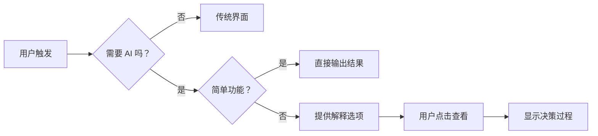

**案例：Netflix 推荐算法**
- 用户看到的是"你可能喜欢"，而非复杂算法
- 鼠标悬停时显示"因为你看了 X，所以推荐 Y"
- 提供"我为什么看到这个"的解释按钮

#### 1.1.3 尊重用户控制权

用户应该能够：
- 调整 AI 行为参数
- 选择是否启用 AI 功能
- 撤销或修正 AI 的决策

**设计模板：AI 设置面板**

```
AI 助手设置
├── 功能开关
│   ├── 启用自动补全
│   ├── 启用智能推荐
│   └── 启用语音交互
├── 行为调节
│   ├── 创新度：保守 ⬛━━━━━━━━ 激进
│   ├── 响应速度：快速 ⬛━━━━━━━━ 准确
│   └── 输出长度：简洁 ⬛━━━━━━━━ 详细
└── 隐私控制
    ├── 允许数据用于改进
    ├── 本地处理优先
    └── 删除历史记录
```

---

### 1.2 可解释性优先（Explainability First）

**核心理念**

AI 系统的决策过程对用户应该是可理解的，而不是神秘的黑盒。

**具体实施方法**

#### 1.2.1 决策透明化

**三层解释模型**：

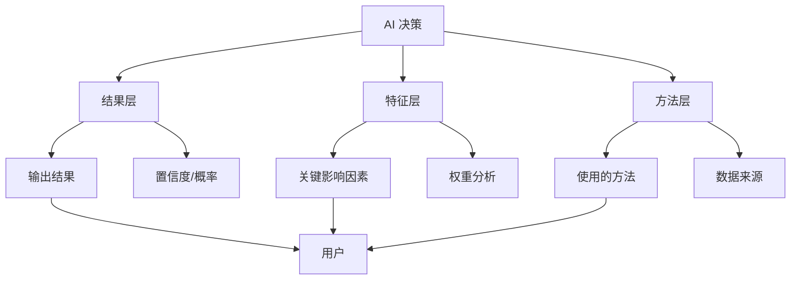

**实施策略**：

**层级 1：结果层（默认展示）**
- 给出明确的推荐结果
- 显示置信度或概率（如 85% 匹配）
- 提供替代选项

**层级 2：特征层（按需展开）**
- "因为"机制：解释主要影响因素
- 可视化特征贡献度
- 与用户历史行为的关联

**层级 3：方法层（进阶用户）**
- 使用的算法类型
- 训练数据概述
- 模型版本信息

#### 1.2.2 反事实解释

反事实解释（Counterfactual Explanations）是可解释 AI 的有效方法：

```
场景：贷款申请被拒绝

❌ 单纯拒绝：
"您的申请已被拒绝"

✅ 反事实解释：
"您的申请被拒绝，是因为收入低于 5000 元。
如果您的收入达到 6000 元，您的申请可能会被批准。"
```

**优势**：
- 用户理解"为什么"
- 提供改进行动方向
- 公平性可验证

#### 1.2.3 可视化可解释性

**案例：医疗 AI 诊断系统**

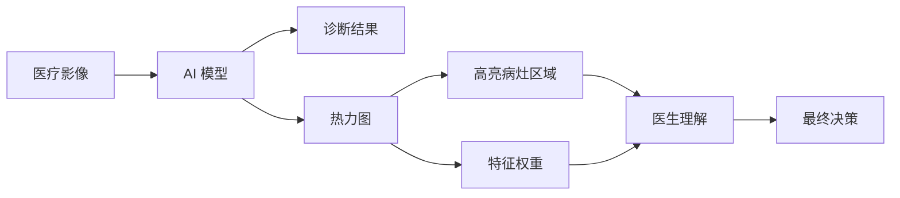

**可视化形式**：
- 热力图：高亮关键区域
- 桑基图：展示决策流程
- 特征重要性条形图
- 对比前后效果

---

### 1.3 渐进式增强（Progressive Enhancement）

**核心理念**

从基础功能开始，逐步添加 AI 能力。确保即使在 AI 失效时，产品仍能提供核心价值。

**实施框架**

#### 1.3.1 功能分层架构

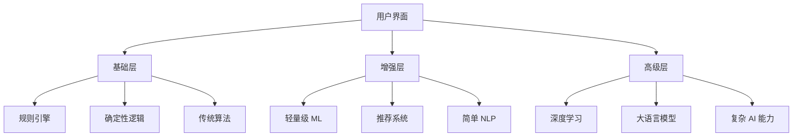

**分层实施原则**：

| 层级 | 技术手段 | 可靠性 | 可解释性 | 实施成本 |
|------|---------|--------|---------|---------|
| 基础层 | 规则引擎 | 高 | 高 | 低 |
| 增强层 | 传统 ML | 中 | 中 | 中 |
| 高级层 | 深度学习 | 低 | 低 | 高 |

#### 1.3.2 MVP 定义模板

**产品功能分层示例：智能写作助手**

```markdown
# MVP - 基础版（无 AI）
- 文本编辑器
- 格式化工具
- 拼写检查（基于规则）
- 字数统计
- 基础保存功能

# v1.0 - 增强版（引入简单 AI）
- 文本编辑器
- 格式化工具
- 拼写检查（ML 模型）
- 语法建议
- 风格一致性检查
- AI 功能开关

# v2.0 - 高级版（深度 AI）
- 所有基础功能
- 内容生成
- 智能改写
- 情感分析
- 个性化建议
- 多语言支持
```

#### 1.3.3 降级策略

**降级决策树**：

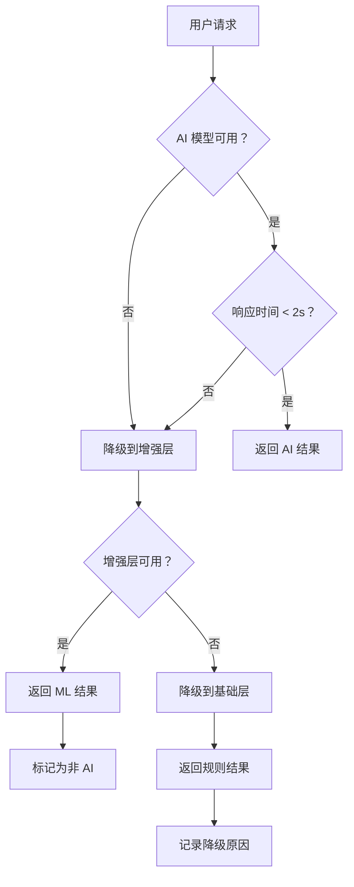

**降级触发条件**：
1. AI 服务超时（> 3秒）
2. API 调用失败
3. AI 置信度过低（< 60%）
4. 用户离线
5. 成本限制（配额用尽）

---

### 1.4 失败优雅（Graceful Degradation）

**核心理念**

AI 系统必然失败。设计时必须预设失败场景，确保用户不会因此遭受重大损失。

**实施策略**

#### 1.4.1 失败场景分析

**常见 AI 失败类型**：

| 失败类型 | 频率 | 影响程度 | 缓解策略 |
|---------|------|---------|---------|
| 模型错误输出 | 高 | 中 | 置信度阈值 + 人工审核 |
| 响应超时 | 中 | 中 | 超时降级 + 缓存 |
| 偏见与歧视 | 低 | 高 | 公平性测试 + 多样性数据 |
| 幻觉（LLM） | 高 | 高 | 事实核查 + 引用来源 |
| 过拟合 | 中 | 中 | 交叉验证 + 定期重训 |

#### 1.4.2 安全机制设计

**安全检查清单**：

```markdown
## AI 输出安全检查

### 前置检查（生成前）
- [ ] 用户输入合规性检查
- [ ] 敏感话题识别
- [ ] 恶意输入检测

### 生成中检查
- [ ] 实时内容过滤
- [ ] 长度限制控制
- [ ] 格式约束验证

### 后置检查（生成后）
- [ ] 毒性内容检测
- [ ] 事实准确性验证
- [ ] 法律合规审查
- [ ] 隐私信息脱敏
```

**案例：医疗咨询 AI 的安全设计**

```
用户输入："我胸口很痛，应该怎么办？"

AI 回复生成流程：

步骤 1：紧急情况识别
- 触发关键词检测："胸痛" → 高风险
- 立即显示："如果您感到严重的胸痛，请立即拨打 120"

步骤 2：生成初步回复
- 提供："胸痛可能的原因包括：心肌梗塞、胃食管反流、肌肉拉伤等"

步骤 3：安全免责声明
- "以上信息仅供参考，不能替代专业医疗诊断"

步骤 4：行动建议
- "建议：如果疼痛持续超过 5 分钟，或伴有呼吸困难，请立即就医"
- 提供附近医院查询链接

步骤 5：用户反馈
- "这个回答有帮助吗？"

步骤 6：记录与审计
- 保存对话用于质量分析
```

#### 1.4.3 错误恢复设计

**错误恢复用户旅程**：

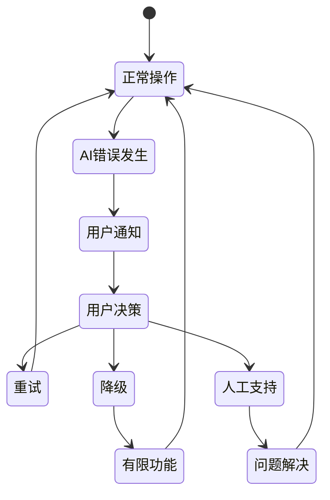

**设计原则**：
1. **透明沟通**：清楚告知发生了什么
2. **提供选项**：给用户选择如何继续
3. **保护数据**：错误发生时不要丢失用户输入
4. **学习改进**：记录错误用于系统优化

---

### 1.5 信任建立（Trust Building）

**核心理念**

用户信任是 AI 产品成功的基石。信任需要通过一致性、可靠性和透明度逐步建立，但一次严重的失误就可能破坏。

**实施方法**

#### 1.5.1 一致性体验

**一致性维度**：

| 维度 | 说明 | 实施方法 |
|------|------|---------|
| 功能一致性 | 同样的输入产生类似的输出 | 温度参数控制、种子固定 |
| 性能一致性 | 响应时间和质量稳定 | SLA 监控、缓存策略 |
| 界面一致性 | 交互模式保持统一 | 设计系统、组件库 |
| 解释一致性 | 解释逻辑前后一致 | 规则化的解释框架 |

**案例：ChatGPT 的一致性设计**

```
场景：连续三次问同样的问题

第一次回答：
"人工智能是计算机科学的一个分支..."

第二次回答（如果有变化）：
"人工智能是计算机科学的一个分支..."
[标注：已生成类似回答]

第三次回答：
"人工智能是计算机科学的一个分支..."
[提示：与之前的回答类似，是否需要不同角度的解释？]
```

#### 1.5.2 透明度设计

**透明度三要素**：

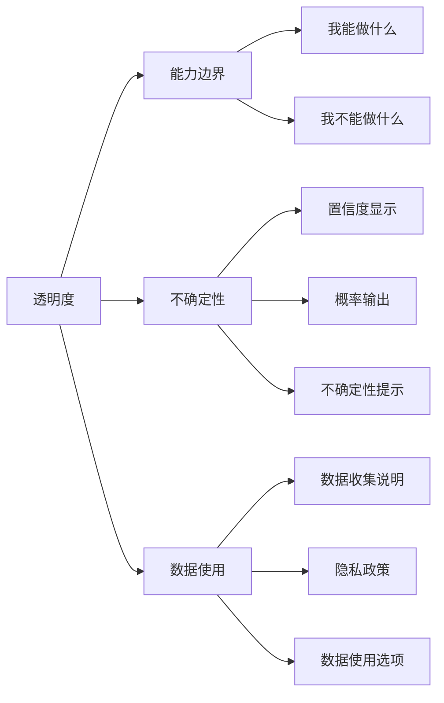

**能力边界设计模板**：

```markdown
# AI 能力说明

## 我能做什么 ✅
- 回答知识类问题（截止到训练数据）
- 协助写作和编辑
- 代码辅助
- 数据分析和可视化
- 语言翻译

## 我不能做什么 ❌
- 实时信息获取（需要联网）
- 访问您的私人文件（除非您上传）
- 执行系统操作
- 替代专业判断（医疗、法律等）
- 保证 100% 准确性

## 我的局限性 ⚠️
- 知识截止时间
- 可能产生幻觉
- 可能存在偏见
- 需要您的反馈来改进
```

#### 1.5.3 可验证性设计

**验证机制**：

1. **来源引用**：对事实性声明提供来源
2. **可编辑性**：允许用户修改 AI 输出
3. **对比模式**：提供 AI 版本与用户版本对比
4. **版本历史**：追踪修改记录
5. **专家审核**：对高风险内容提供专家验证

**案例：GitHub Copilot 的可验证设计**

```
场景：AI 生成代码

# AI 建议的代码
def calculate_sum(numbers):
    return sum(numbers)

# 用户可以：
1. 直接接受（Tab 键）
2. 查看多个建议（Ctrl+Enter）
3. 部分接受（手动修改）
4. 拒绝并继续编写
5. 报告问题（反馈按钮）

# 可信度提示：
- "这些建议基于开源代码"
- "请始终审查 AI 生成的代码"
- "如果发现漏洞，请报告"
```

#### 1.5.4 信任修复机制

当 AI 失败时，如何修复信任：

```
信任修复框架

1. 快速响应
   └── 立即承认问题，不推卸责任

2. 透明说明
   └── 解释发生了什么，为什么发生

3. 真诚道歉
   └── 对造成的不便表示歉意

4. 提供补救
   └── 提供解决方案或补偿

5. 改进承诺
   └── 说明如何防止再次发生

6. 持续跟进
   └── 更新改进进展
```

**案例：当 ChatGPT 产生错误时**

```
[AI 回答]
"法国的首都是柏林。"

[用户纠正]
"不对，法国首都是巴黎。"

[AI 响应]
"您说得对，我犯了个错误。法国的首都是巴黎，不是柏林。
感谢您的纠正。我会记住这一点，避免再犯同样的错误。"

[系统内部]
- 记录错误案例
- 更新知识库
- 标注需要改进的场景
```

---

## 2. 用户研究与需求分析

### 2.1 AI 产品特有的用户研究方法

传统用户研究方法在 AI 产品中需要调整和扩展。

#### 2.1.1 用户期望研究

**期望错配分析**：

用户对 AI 的期望往往与实际能力存在差距：

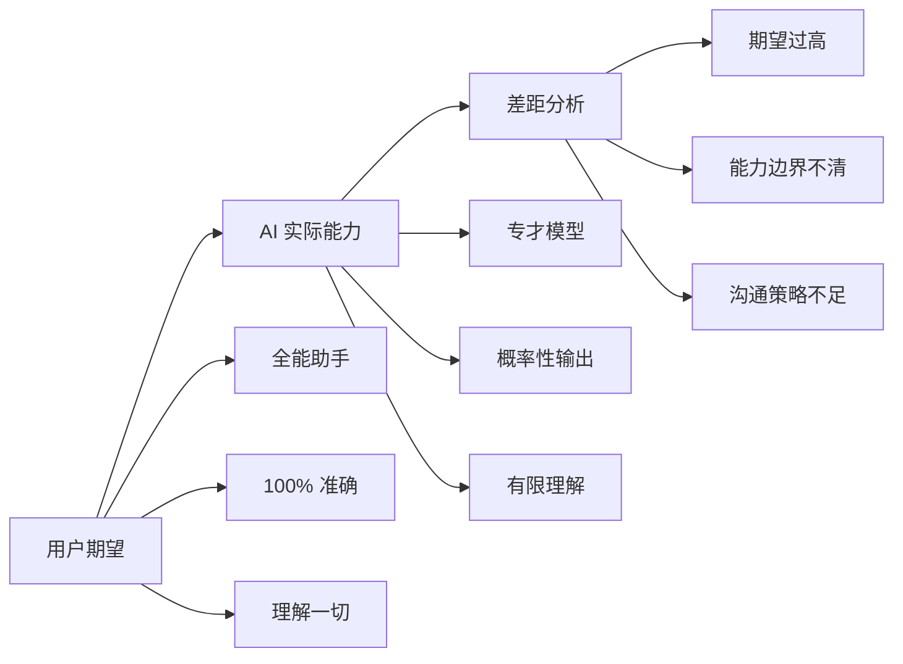

**研究方法**：

**方法 1：期望映射访谈**

```
访谈问题示例：

1. "你希望这个 AI 助手能帮你完成什么？"
   → 收集功能期望

2. "你认为它有多聪明？用 1-10 分评价"
   → 量化期望水平

3. "它犯错误你会怎么看？"
   → 了解容错度

4. "你会信任它处理什么类型的信息？"
   → 了解信任边界

5. "你最担心它犯什么类型的错误？"
   → 识别关键风险点
```

**方法 2：Wizard of Oz 测试**

模拟 AI 系统，由真人或规则系统扮演 AI，测试用户反应。

```
实验设计：

场景：智能客服 AI

操作流程：
1. 用户与"AI"对话
2. 隐藏后的真人或脚本响应
3. 记录用户行为和反应
4. 测试不同表现：
   - 完美回答
   - 部分错误
   - 完全错误
   - 拒绝回答

分析维度：
- 用户信任变化
- 继续使用意愿
- 错误容忍度
- 沟通方式偏好
```

#### 2.1.2 心智模型研究

**用户 AI 心智模型类型**：

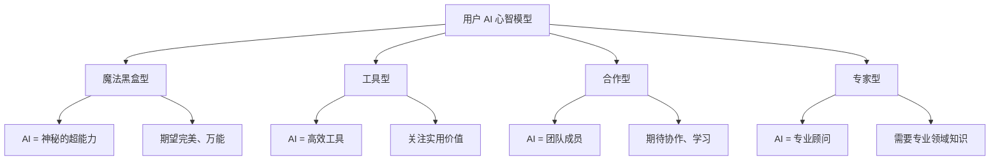

**研究方法：心智模型访谈**

```markdown
# 访谈提纲示例

## 开场
"我们正在了解人们对 AI 的理解。请用你自己的话描述什么是 AI。"

## 核心问题

1. 类比测试
   "如果 AI 是一个东西，你觉得它像什么？为什么？"
   → 期望获得：像搜索引擎、像助手、像魔术师...

2. 能力边界
   "你觉得 AI 什么时候会做不到？"
   → 测试对局限性的认知

3. 学习方式
   "你觉得 AI 是怎么学会这些东西的？"
   → 理解训练过程认知

4. 与人类比较
   "AI 和人类相比，有什么不同？"
   → 识别关键差异认知

5. 信任因素
   "什么情况下你会信任 AI 的建议？什么情况下不会？"
   → 信任边界

## 场景测试
提供具体场景，询问期望行为

场景："你想安排一个会议，AI 帮你找时间"
- "你觉得 AI 应该怎么做？"
- "如果它安排错了，你会怎么反应？"
```

#### 2.1.3 任务分析框架

**AI 任务分析矩阵**：

| 任务类型 | AI 适合度 | 人工干预需求 | 失败后果 | 推荐策略 |
|---------|-----------|-------------|---------|---------|
| 信息检索 | 高 | 低 | 低 | AI 主导 |
| 内容生成 | 中 | 中 | 中 | AI + 人工审核 |
| 决策支持 | 中 | 高 | 高 | AI 辅助 |
| 危险操作 | 低 | 极高 | 极高 | 人工主导 |
| 创意工作 | 中 | 高 | 低 | AI 灵感 + 人工 |

**任务分析方法：AI 任务分层**

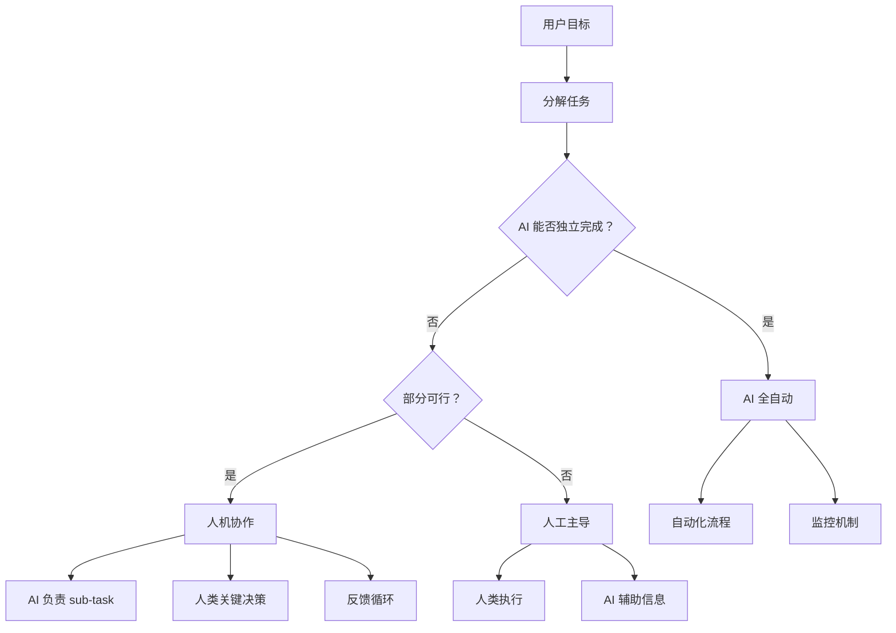

**案例：邮件分类系统**

```
任务：自动分类邮件

任务分解：
1. 读取邮件内容
   → AI 可以完成 ✅

2. 识别邮件类型（工作、个人、垃圾）
   → AI 可以完成，准确率 85-90% ✅

3. 识别紧急程度
   → AI 可以完成，但需要学习 ✅

4. 自动回复
   → AI 可以完成，但风险较高 ⚠️
   → 策略：仅对简单邮件（如订阅）自动回复
       重要邮件提醒用户处理

5. 归档到文件夹
   → AI 可以完成 ✅

最终设计：
- AI 自动分类（高置信度）
- AI 推荐分类（中等置信度，用户确认）
- 不确定的邮件标记，人工处理
- 仅低风险邮件自动回复
```

---

### 2.2 用户期望管理（Expectation Management）

#### 2.2.1 期望设定策略

**期望曲线管理**：

```
期望 vs 现实管理

理想路径：
期望线 ──────────── (平稳，略低于能力)
现实线 ──────────── (持续提升)

避免路径：
期望线 ╱╲ (过度宣传后失望)
现实线 ────────

策略：
1. 宣传时保守承诺
2. 交付时超额满足
3. 逐步揭示能力
4. 明确局限性
```

**实施方法**：

**方法 1：能力边界展示**

```markdown
# 产品介绍文案对比

❌ 过度承诺：
"我们的 AI 完美解决所有翻译问题！"

✅ 合理设定：
"我们的 AI 助手能处理 90% 以上的日常翻译场景，
准确率超过 95%。对于专业术语、俚语等特殊情况，
可能需要人工校对。"

✅ 透明展示：
## 能力范围
- 支持 50+ 语言互译
- 日用对话准确率 98%
- 商业文档准确率 95%
- 技术文档准确率 85%

## 局限性
- 不支持实时语音翻译
- 特定领域专业术语需校对
- 超长文档（>10万词）分段处理

## 持续改进
"我们正在持续训练模型，准确率每月提升。"
```

**方法 2：渐进式能力解锁**

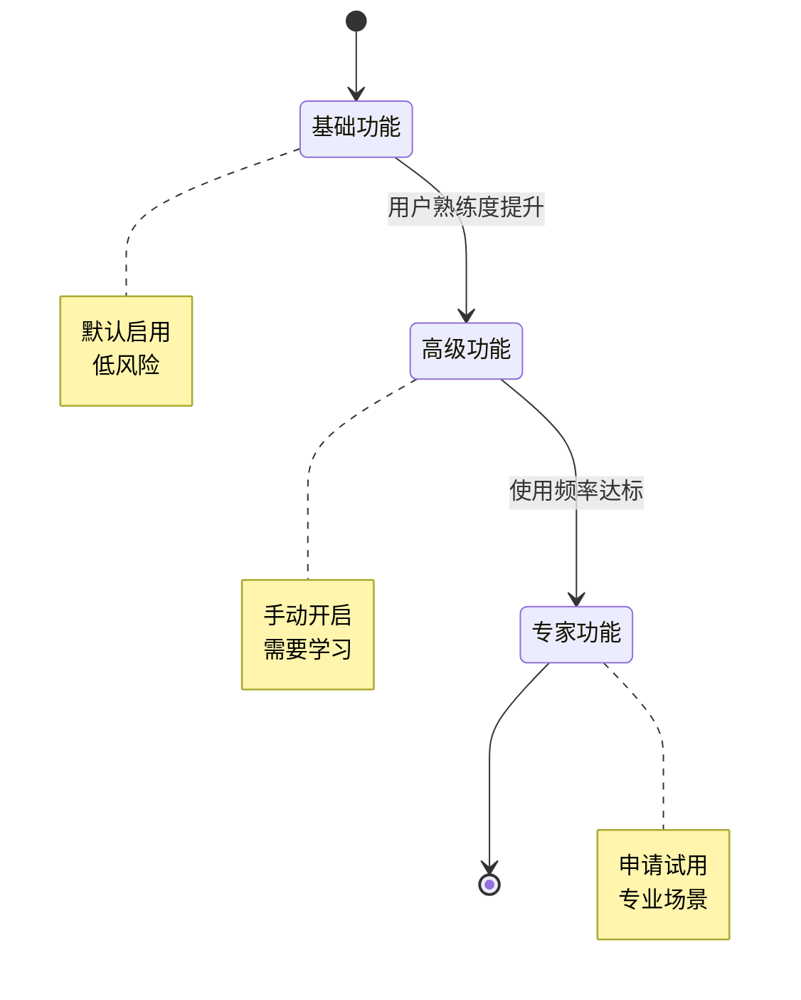

#### 2.2.2 失败预期管理

**预设失败场景**：

```markdown
# AI 错误沟通策略

## 错误分类

1. 可接受错误
   - 拼写建议不准确
   - 推荐内容不合口味
   沟通方式："没关系，我再试试"

2. 需纠正错误
   - 事实性错误
   - 数据计算错误
   沟通方式："抱歉，让我重新算一下"

3. 严重错误
   - 安全/隐私问题
   - 偏见/歧视
   沟通方式：立即道歉 + 紧急修复 + 透明报告

## 错误率透明

"我们的 AI 在以下场景的错误率：
- 日常对话：< 1%
- 专业领域：3-5%
- 极端场景：10-20%

持续改进中，感谢您的反馈帮助我们做得更好。"
```

#### 2.2.3 教育型设计

**产品内教育机制**：

```
首次使用引导：
- 快速教程（< 2 分钟）
- 交互式演示
- 能力说明卡片

持续教育：
- 每周 AI 小贴士
- 成功案例展示
- 功能更新说明

错误时教育：
- 为什么错了？
- 如何避免？
- 学习资源链接
```

---

### 2.3 场景建模（Scenario Modeling）

#### 2.3.1 场景分析框架

**AI 场景分析矩阵**：

| 场景特征 | 高价值场景 | 低价值场景 |
|---------|-----------|-----------|
| 频率 | 高频 | 低频 |
| 复杂度 | 中等 | 极高或极低 |
| 结构化 | 半结构化 | 完全非结构化 |
| 数据可用性 | 充足 | 缺乏 |
| 错误容忍度 | 中等 | 极低 |
| ROI | 高 | 低 |

#### 2.3.2 场景建模工具

**场景模板**：

```markdown
# AI 场景建模模板

## 场景基本信息
- 场景名称：
- 目标用户：
- 核心任务：
- 使用频率：

## 场景流程

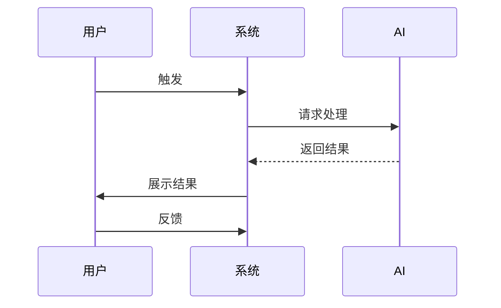

## AI 角色分析
- AI 负责什么？
- 人类负责什么？
- 决策点在哪里？

## 成功标准
- 用户满意度目标
- 任务完成率目标
- 错误率容忍度

## 风险评估
- 技术风险
- 用户体验风险
- 伦理风险
- 合规风险

## 降级方案
- AI 失败时如何处理？
- 置信度低时如何处理？
```

**案例：智能日程安排**

```markdown
# 场景：智能日程安排

## 基本信息
- 目标用户：知识工作者
- 核心任务：安排会议时间
- 使用频率：每周 3-5 次

## 流程

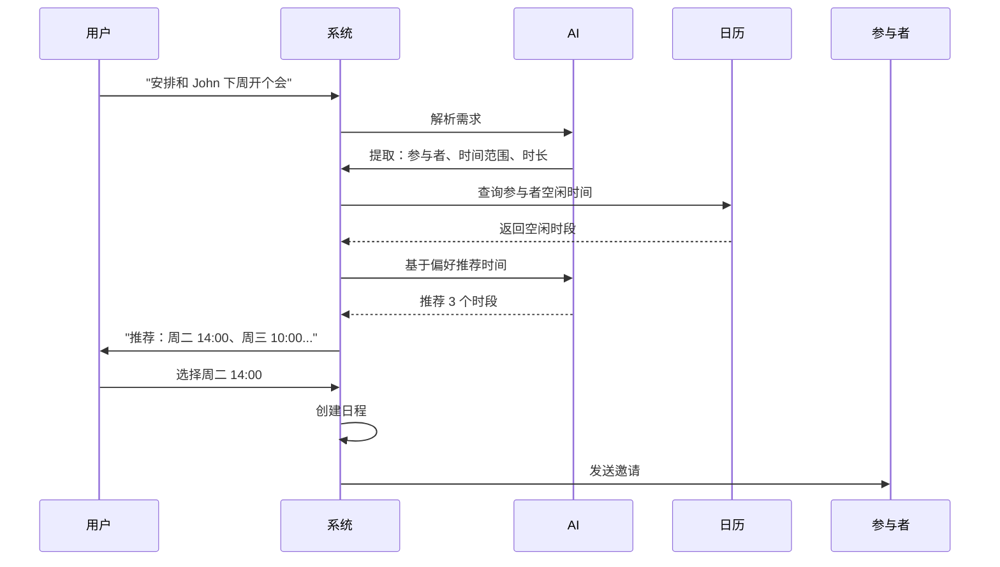

## AI 角色
- 负责：解析自然语言、查询日历、推荐时间
- 人类负责：最终选择、确认重要会议

## 成功标准
- 安排一次会议 < 30 秒
- 用户满意度 > 85%
- 安排冲突率 < 5%

## 风险
- AI 误解需求
- 时间安排不合理
- 忽略重要细节

## 降级
- AI 不确定 → 询问更多细节
- 推荐不满意 → 手动选择时间
- 参与者不同意 → 重新安排
```

---

### 2.4 用户旅程地图（User Journey Mapping）

#### 2.4.1 AI 产品用户旅程地图框架

```markdown
# AI 产品用户旅程地图模板

## 阶段划分
1. 发现（Discovery）
2. 首次使用（First Use）
3. 持续使用（Ongoing Use）
4. 高级使用（Advanced Use）
5. 推荐传播（Advocacy）

## 每个阶段分析
- 用户目标
- 用户行为
- 触发的 AI 功能
- 用户情绪
- 痛点
- 机会点

## AI 触点分析
- 哪些阶段依赖 AI？
- 哪些 AI 功能最关键？
- 失败后果是什么？
```

**案例：AI 写作助手用户旅程**

```markdown
# AI 写作助手用户旅程地图

## 阶段 1：发现
- 用户目标：找到写作辅助工具
- 行为：搜索、看评价、试用
- AI 触点：演示对话、案例展示
- 情绪：好奇、怀疑
- 痛点：不确定是否适合自己
- 机会点：真实案例展示、免费试用

## 阶段 2：首次使用
- 用户目标：理解如何使用
- 行为：完成引导教程、尝试简单任务
- AI 触点：教程对话、建议生成
- 情绪：兴奋、困惑
- 痛点：不知道从哪开始
- 机会点：智能引导、场景化任务

## 阶段 3：持续使用
- 用户目标：提高写作效率
- 行为：日常写作、AI 建议
- AI 触点：内容生成、改写、优化
- 情绪：满意、偶尔失望
- 痛点：AI 建议偶尔不准
- 机会点：学习用户偏好、个性化提升

## 阶段 4：高级使用
- 用户目标：深度定制
- 行为：训练自己的模型、自定义指令
- AI 触点：微调、风格学习
- 情绪：掌控、依赖
- 痛点：需要时间学习
- 机会点：高级教程、社区分享

## 阶段 5：推荐传播
- 用户目标：分享好工具
- 行为：推荐给同事、写评价
- AI 触点：分享案例
- 情绪：自豪、归属感
- 痛点：需要展示价值
- 机会点：生成对比报告、成效可视化
```

#### 2.4.2 信任旅程地图

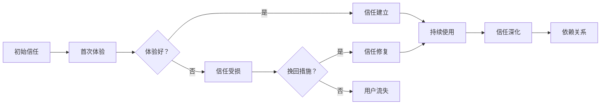

**信任旅程管理**：

| 信任阶段 | 特征 | 关键指标 | 提升策略 |
|---------|------|---------|---------|
| 初始信任 | 基于品牌和宣传 | 试用转化率 | 品牌背书、真实案例 |
| 信任建立 | 基于首次体验 | 首次使用满意度 | 降低门槛、快速成功 |
| 信任深化 | 基于持续价值 | 留存率 | 个性化、持续改进 |
| 信任危机 | 失败后 | 流失率 | 快速响应、真诚道歉 |
| 信任恢复 | 危机后 | 恢复使用率 | 透明沟通、实际改进 |

---

## 3. 交互设计模式

### 3.1 对话式 AI 设计（Conversational AI）

#### 3.1.1 对话设计原则

**核心原则**：

1. **自然对话**：模拟人类对话方式，而非命令式交互
2. **上下文保持**：记住对话历史，避免重复询问
3. **灵活输入**：理解多种表达方式
4. **明确引导**：在合适时机提供选项和提示
5. **渐进式提问**：从简单到复杂，避免信息过载

#### 3.1.2 对话状态管理

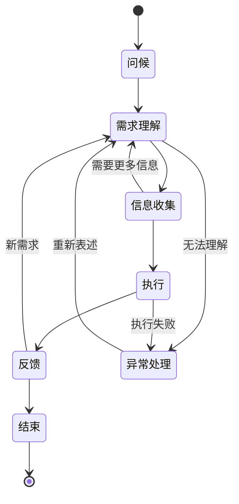

**状态管理实施**：

```markdown
# 对话状态数据结构

session = {
  session_id: "uuid",
  user_id: "user_123",
  
  // 对话历史
  conversation_history: [
    {role: "user", content: "...", timestamp: "..."},
    {role: "assistant", content: "...", timestamp: "..."}
  ],
  
  // 当前状态
  current_state: "信息收集",
  
  // 上下文信息
  context: {
    intent: "订票",
    entities: {
      destination: "北京",
      date: null,
      passengers: null
    },
    collected_slots: ["destination"],
    required_slots: ["destination", "date", "passengers"]
  },
  
  // 用户偏好
  preferences: {
    language: "zh-CN",
    style: "简洁"
  }
}
```

#### 3.1.3 对话设计模式

**模式 1：澄清式对话**

```
用户："我要去北京"

AI："好的，去北京。请问您什么时候出发？"
     (识别到缺少时间信息)

用户："下周五"

AI："下周五去北京，一个人还是多人？"

用户："两个人"

AI："好的，帮您预订下周五去北京的两人行程。
     预算大概多少？"

用户："不超过 5000"

AI："明白了。下周五出发，两人去北京，预算 5000 元以内。
     我帮您查找方案..."
```

**模式 2：确认式对话**

```
用户："把这张照片发给我妈妈"

AI："好的，是指 [显示照片预览] 这张照片吗？
     发送到妈妈的手机还是邮箱？"

用户："手机"

AI："收到，正在发送...
     已成功发送到妈妈的手机。"
```

**模式 3：建议式对话**

```
用户："我想学编程"

AI："太好了！编程是一项很有用的技能。
     我可以帮您：
     
     1. 推荐适合初学者的编程语言
     2. 制定学习计划
     3. 找在线课程资源
     4. 练习项目推荐
     
     您想从哪个开始？"

用户："推荐编程语言"

AI："对于初学者，我推荐：
     
     🎯 Python：简单易学，应用广泛
        • 数据分析、AI、Web 开发都能用
        • 语法接近自然语言
        
     💻 JavaScript：Web 开发必备
        • 立即能看到网页效果
        • 资源丰富
        
     🎮 Java：企业级开发
        • 就业机会多
        • 稳定可靠
     
     您对哪个方向感兴趣？"
```

#### 3.1.4 错误处理与恢复

**对话错误类型与处理**：

```markdown
# 对话错误处理策略

## 1. 理解错误

**场景**：AI 无法理解用户输入

**处理方法**：
- 转述理解："您是说...吗？"
- 请求澄清："能换个说法吗？"
- 提供选项："您是想...还是...？"
- 降级到菜单："您需要以下哪个服务？"

**示例**：
用户："那个什么怎么弄？"
AI："我不太确定您指的是什么。您是想：
    A. 设置账号
    B. 重置密码
    C. 其他功能
    请选择一个，或者描述得更详细一些。"

## 2. 执行错误

**场景**：AI 理解了意图但执行失败

**处理方法**：
- 诚实说明："抱歉，我无法..."
- 解释原因："因为..."
- 提供替代："您可以..."
- 请求帮助："能否告诉我..."

**示例**：
AI："抱歉，我无法删除这个文件，因为它正在被其他程序使用。
    您可以先关闭使用它的程序，然后再试一次。
    或者我可以帮您查看是哪个程序在使用它。"

## 3. 超时错误

**场景**：AI 响应时间过长

**处理方法**：
- 立即反馈："正在处理中..."
- 设置超时：3-5 秒
- 降级方案：提供简化结果
- 允许取消："需要取消吗？"

## 4. 连续错误

**场景**：多次交互失败

**处理方法**：
- 识别模式："我发现我们好像沟通不太顺畅"
- 转换方式："要不我们换个方式？"
- 人工介入："让我为您连接人工客服"
- 记录日志："已记录问题，我们会改进"
```

#### 3.1.5 对话设计最佳实践

**实践清单**：

```markdown
✅ DO:
- [ ] 保持对话简短（每条 < 100 字）
- [ ] 使用友好的语气
- [ ] 提供明确的选择
- [ ] 记住之前的上下文
- [ ] 主动提供帮助
- [ ] 承认不知道的时候
- [ ] 允许用户纠正
- [ ] 在合适的时候提供视觉辅助

❌ DON'T:
- [ ] 重复问同样的问题
- [ ] 用术语或过于技术的语言
- [ ] 假设用户知道所有信息
- [ ] 隐藏 AI 的局限性
- [ ] 强行推销功能
- [ ] 打断用户的思路
- [ ] 给出过多信息
- [ ] 忽略用户的情绪
```

---

### 3.2 推荐系统界面设计

#### 3.2.1 推荐系统 UX 原则

**核心原则**：

1. **相关性优先**：推荐内容必须与用户相关
2. **多样性平衡**：避免信息茧房
3. **透明度**：解释为什么推荐
4. **可控性**：允许用户调整
5. **尊重隐私**：不让人感觉被窥探

#### 3.2.2 推荐界面模式

**模式 1：Feed 流推荐**

```
┌─────────────────────────────┐
│  你可能喜欢                 │
├─────────────────────────────┤
│  ┌───────────────────────┐ │
│  │ [图片]               │ │
│  │ 标题                 │ │
│  │ 因为看了 "设计原则"  │ │
│  │ 👍 234 · ❤️ 56        │ │
│  └───────────────────────┘ │
│  ┌───────────────────────┐ │
│  │ [图片]               │ │
│  │ 标题                 │ │
│  │ 相似主题推荐         │ │
│  └───────────────────────┘ │
└─────────────────────────────┘
```

**模式 2：侧边栏推荐**

```
┌──────────────┬────────────────┐
│              │  推荐阅读      │
│   主内容     ├────────────────┤
│              │  • 文章 A      │
│              │    (看了 A)    │
│              │  • 文章 B      │
│              │    (相似主题)  │
│              │  • 文章 C      │
│              │    (热门)      │
└──────────────┴────────────────┘
```

**模式 3：插入式推荐**

```
文章内容...

─────────────────────────────
推荐阅读
─────────────────────────────
[相关文章 1] - 因为您阅读了本文
[相关文章 2] - 相似主题
─────────────────────────────

继续阅读文章...
```

#### 3.2.3 推荐解释设计

**解释类型**：

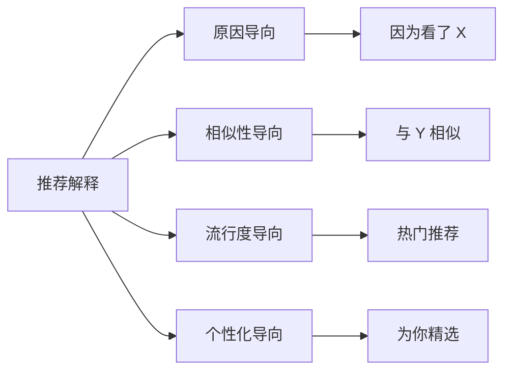

**实施示例**：

```markdown
# 推荐解释文案库

## 原因导向
- "因为您看了《产品设计基础》"
- "基于您最近浏览的内容"
- "根据您的阅读历史"

## 相似性导向
- "与您刚看的文章相似"
- "同一作者的其他作品"
- "相同主题的深度内容"

## 流行度导向
- "本周热门推荐"
- "大家都在看"
- "编辑精选"

## 个性化导向
- "为您定制"
- "根据您的兴趣"
- "猜你喜欢"

## 组合型
- "因为您喜欢设计，加上今天的热门推荐"
- "基于您的阅读记录 + 相似用户也喜欢"
```

#### 3.2.4 推荐控制设计

**用户控制界面**：

```
推荐设置
├── 推荐内容
│   ├── 类型选择（新闻、视频、文章...）
│   └── 主题偏好（设计、技术、生活...）
├── 推荐来源
│   ├── 基于历史
│   ├── 相似用户
│   └── 热门内容
├── 推荐频率
│   └── 数量：5/10/20
└── 反馈机制
    ├── 👍 想看更多这种
    ├── 👎 不感兴趣
    ├── 🚫 屏蔽该来源
    └── ✏️ 调整偏好
```

---

### 3.3 预测性 UI（Predictive UI）

#### 3.3.1 预测性 UI 设计原则

**核心原则**：

1. **时机恰当**：在用户需要时预测，不要打扰
2. **准确性优先**：错误的预测比不预测更糟
3. **可取消**：随时可以让用户拒绝预测
4. **学习优化**：持续学习用户习惯

#### 3.3.2 预测性 UI 模式

**模式 1：智能补全**

```
场景：文本编辑器

用户输入："AI 产..."
系统预测："AI 产品设计"

显示：
AI 产[AI 产品设计] ← 灰色预览
       └─ 按 Tab 接受

如果用户继续输入其他内容，预测自动消失
```

**模式 2：智能搜索**

```
用户输入："AI"
系统预测下拉：

┌──────────────────┐
│ AI 人工智能      │
│ AI 产品设计      │ ← 你最近搜索
│ AI 伦理          │
│ AI 应用案例      │
└──────────────────┘
```

**模式 3：智能操作建议**

```
场景：邮件应用

AI 分析邮件内容，预测用户可能需要的操作：

[邮件内容...]
─────────────────────────
AI 建议：
• 回复："好的，我明白了"
• 转发给：项目组
• 添加到待办事项
• 设置提醒：明天
─────────────────────────
```

**模式 4：智能下一步**

```
场景：在线购物

用户浏览商品页面 → AI 预测下一步操作

[商品详情...]
─────────────────────────
你可能还想：
• 查看同类商品
• 加入购物车
• 查看评价
• 联系客服
─────────────────────────
```

#### 3.3.3 预测置信度处理

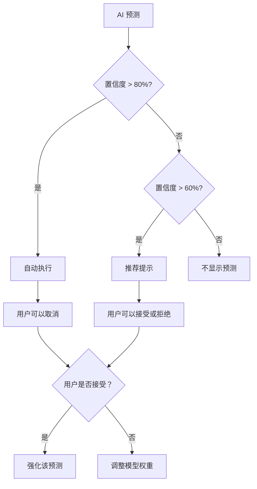

**实施示例**：

```markdown
# 预测置信度处理

## 高置信度（> 80%）
- 行为：默认执行，但可取消
- 示例：智能标点、自动格式化
- 用户体验：流畅、高效

## 中置信度（60-80%）
- 行为：显示建议，等待确认
- 示例：文本补全、下一步操作
- 用户体验：有帮助，不会打扰

## 低置信度（< 60%）
- 行为：不预测
- 原因：避免错误预测降低信任
- 用户体验：正常操作
```

---

### 3.4 自适应界面（Adaptive Interface）

#### 3.4.1 自适应维度

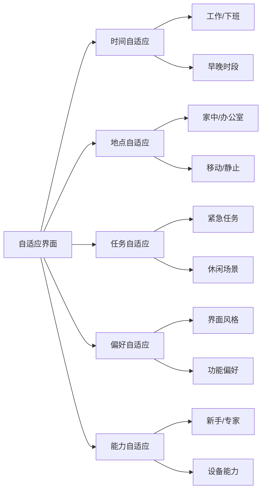

#### 3.4.2 自适应策略

**策略 1：时间自适应**

```
工作时间（9:00-18:00）：
- 功能完整
- 专业界面
- 工作相关推荐

下班时间（18:00-9:00）：
- 简化功能
- 轻松界面
- 生活娱乐推荐

深夜（23:00-7:00）：
- 暗色主题
- 减少通知
- 阅读模式
```

**策略 2：地点自适应**

```
办公室：
- 工作工具优先
- 协作功能突出
- 会议提醒

家中：
- 娱乐内容优先
- 购物推荐
- 生活助手

外出：
- 导航功能
- 本地服务
- 紧急联系
```

**策略 3：任务自适应**

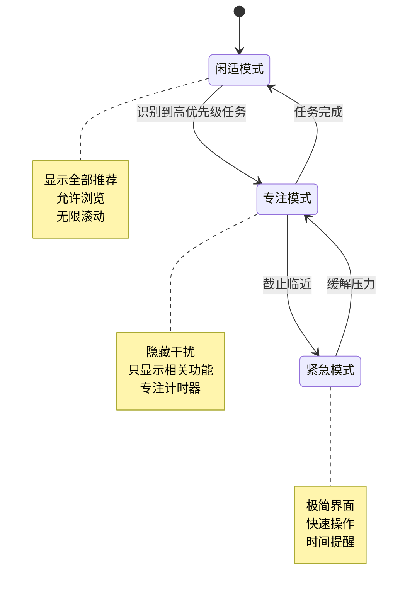

**策略 4：能力自适应（渐进式揭示）**

```
新手阶段（第 1 周）：
- 只显示核心功能
- 简化的界面
- 引导提示
- 默认设置

进阶阶段（第 1 月）：
- 显示常用功能
- 部分高级选项
- 快捷键提示
- 自定义开始

专家阶段（3 个月后）：
- 全部功能可见
- 高级配置
- 自动化工具
- API 访问
```

---

### 3.5 反馈机制（Feedback Mechanisms）

#### 3.5.1 反馈类型

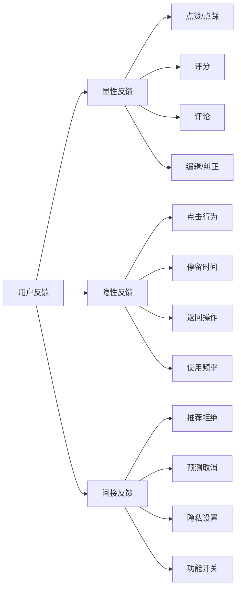

#### 3.5.2 反馈收集界面设计

**设计 1：即时反馈**

```
[AI 建议：...]
─────────────
👍 有帮助
👎 没帮助
✏️ 编辑
─────────────
```

**设计 2：滑动反馈**

```
[推荐内容]

─────────────────────────
不感兴趣 ─────────→ 非常喜欢
0        1  2  3  4  5
─────────────────────────
```

**设计 3：详细反馈（可选）**

```
点击"没帮助"后展开：

为什么没帮助？
□ 不准确
□ 不相关
□ 过于复杂
□ 缺少重要信息
□ 其他：[文本框]

感谢您的反馈！
```

#### 3.5.3 反馈循环设计

```mermaid
sequenceDiagram
    U->>S: 使用 AI 功能
    S->>U: 显示结果
    U->>S: 反馈（显性/隐性）
    S->>AI: 记录反馈
    AI->>AI: 更新模型
    AI->>S: 改进建议
    S->>U: 更好的结果
    U->>S: 满意度提升
```

**实施要点**：

```markdown
# 反馈循环最佳实践

## 1. 及时反馈
- 收集后立即处理
- 用户能看到反馈生效

## 2. 可见影响
- "感谢您的反馈，我们会改进"
- 显示改进后的结果
- 对比前后变化

## 3. 持续优化
- 定期分析反馈模式
- 识别常见问题
- 优先修复高频问题

## 4. 用户教育
- 告知反馈的价值
- 展示反馈如何影响产品
- 感谢用户参与

## 5. 平衡隐私
- 明确数据使用
- 允许选择退出
- 匿名化处理
```

---

### 3.6 错误处理与恢复

#### 3.6.1 错误类型与处理策略

| 错误类型 | 严重程度 | 用户体验 | 处理策略 |
|---------|---------|---------|---------|
| 输入错误 | 低 | 小困扰 | 即时提示、自动修正 |
| 输出错误 | 中 | 失望 | 说明原因、提供修正 |
| 系统错误 | 高 | 阻碍 | 降级、重试、补偿 |
| 安全错误 | 极高 | 严重后果 | 紧急处理、通知、补偿 |

#### 3.6.2 错误消息设计

**错误消息三要素**：

```markdown
## 1. 发生了什么（What）
- 清晰说明错误
- 避免技术术语
- 用户可理解

## 2. 为什么发生（Why）
- 简要解释原因
- 不推卸责任
- 诚实透明

## 3. 如何解决（How）
- 提供解决方案
- 给出行动指引
- 提供帮助入口
```

**示例对比**：

```
❌ 糟糕的错误消息：
"Error 500: Internal Server Error"

✅ 好的错误消息：
"抱歉，服务器暂时出错了。
这可能是网络问题或我们正在维护。
您可以：
• 刷新页面重试
• 检查网络连接
• 稍后再试
如果问题持续，请联系客服。"
```

#### 3.6.3 优雅降级设计

**降级策略框架**：

```mermaid
graph TD
    A[用户请求] --> B{AI 可用？}
    B -->|是| C{性能达标？}
    B -->|否| D[使用缓存]
    C -->|是| E[AI 响应]
    C -->|否| F[简化功能]
    D --> D1[显示缓存结果]
    D --> D2[标记非实时]
    F --> G[规则引擎]
    G --> H[基础功能]
    E --> I[用户满意]
    D1 --> J[用户满意]
    H --> K[可用但有限]
    
    K --> L{用户接受？}
    L -->|是| J
    L -->|否| M[通知问题]
```

**实施示例**：

```markdown
# AI 聊天机器人降级方案

## 级别 1：完整 AI（理想）
- 所有功能正常
- 响应时间 < 2秒
- 使用最新模型

## 级别 2：缓存模式（AI 慢）
- 使用常见问答缓存
- 响应时间 < 1秒
- 标注："这不是实时回答"

## 级别 3：简化 AI（AI 部分故障）
- 使用轻量级模型
- 功能受限
- 提示："当前功能受限"

## 级别 4：规则引擎（AI 不可用）
- 基于关键词匹配
- 预设回复
- 说明："AI 暂时不可用，请尝试以下选项"

## 级别 5：人工接管（完全失败）
- 转接到人工客服
- 记录问题
- 通知技术团队
```

---

## 4. AI 功能优先级规划

### 4.1 MVP 定义（Minimum Viable AI Product）

#### 4.1.1 AI MVP 框架

```mermaid
graph LR
    A[核心用户问题] --> B[AI 必要性评估]
    B --> C{AI 是最佳方案?}
    C -->|否| D[传统方案]
    C -->|是| E[MVP 功能定义]
    E --> F[功能优先级排序]
    F --> G[技术可行性评估]
    G --> H[开发 MVP]
    H --> I[用户测试]
    I --> J[迭代优化]
```

#### 4.1.2 MVP 功能选择矩阵

| 功能维度 | 必备 | 高优先级 | 低优先级 | 不包含 |
|---------|------|---------|---------|--------|
| 用户价值 | 解决核心问题 | 提升体验 | 锦上添花 | 可有可无 |
| 技术难度 | 可实现 | 有挑战但可行 | 困难 | 不可行 |
| 资源消耗 | 低 | 中 | 高 | 极高 |
| 风险程度 | 低 | 中 | 高 | 极高 |

**示例：智能客服 MVP 功能选择**

```markdown
# 智能客服 MVP

## 必备功能
- ✅ 常见问题自动回答（基于知识库）
- ✅ 问题分类与路由
- ✅ 基础自然语言理解（意图识别）
- ✅ 人工接管机制

## 高优先级
- 🔄 对话上下文保持
- 🔄 多轮对话支持
- 🔄 学习用户反馈

## 低优先级
- ⏳ 情感分析
- ⏳ 个性化推荐
- ⏳ 多语言支持

## 不包含
- ❌ 实时语音交互
- ❌ 图像识别
- ❌ 深度推理
```

---

### 4.2 功能矩阵（Feature Matrix）

#### 4.2.1 功能评估矩阵

```
功能名称 | 用户价值 | 技术复杂度 | 开发成本 | 风险 | 优先级
---------|---------|-----------|---------|------|--------
FAQ 自动回答 | 高 | 低 | 低 | 低 | P0
多轮对话 | 高 | 中 | 中 | 中 | P1
情感识别 | 中 | 高 | 高 | 高 | P3
语音交互 | 中 | 高 | 高 | 中 | P2
个性化推荐 | 中 | 中 | 中 | 低 | P2
多语言 | 低 | 高 | 高 | 低 | P3
```

#### 4.2.2 优先级决策框架

```mermaid
quadrantChart
    title 功能优先级象限
    x-axis "低用户价值" --> "高用户价值"
    y-axis "低技术难度" --> "高技术难度"
    "FAQ 自动回答": [0.8, 0.2]
    "多轮对话": [0.9, 0.5]
    "情感识别": [0.5, 0.9]
    "语音交互": [0.6, 0.8]
    "个性化推荐": [0.7, 0.6]
    "多语言": [0.3, 0.9]
```

**象限解读**：

- **第一象限（右上）**：高价值 + 低难度 → 立即实施
- **第二象限（左上）**：低价值 + 低难度 → 考虑做
- **第三象限（左下）**：低价值 + 高难度 → 不做或延后
- **第四象限（右下）**：高价值 + 高难度 → 长期规划

---

### 4.3 价值 vs 复杂度分析

#### 4.3.1 价值评估维度

```markdown
# AI 功能价值评估

## 1. 用户价值
- 解决问题的严重程度
- 用户需求频次
- 用户付费意愿
- 竞争对手对比

## 2. 商业价值
- 直接收入贡献
- 成本节约
- 用户留存提升
- 市场竞争优势

## 3. 战略价值
- 技术积累
- 数据资产
- 品牌提升
- 生态构建
```

#### 4.3.2 复杂度评估维度

```markdown
# AI 功能复杂度评估

## 1. 技术复杂度
- 算法难度
- 数据需求
- 模型训练成本
- 集成难度

## 2. 资源复杂度
- 开发人力
- 时间成本
- 计算资源
- 维护成本

## 3. 风险复杂度
- 技术风险
- 合规风险
- 用户体验风险
- 伦理风险
```

#### 4.3.3 价值-复杂度决策模型

```mermaid
graph TD
    A[功能提议] --> B[评估价值]
    A --> C[评估复杂度]
    B --> D{高价值？}
    C --> E{低复杂度？}
    D -->|是| F
    D -->|否| G
    E -->|是| F
    E -->|否| H
    F --> I[立即实施]
    G --> J{低复杂度？}
    J -->|是| K[考虑做]
    J -->|否| L[不做]
    H --> M{高价值？}
    M -->|是| N[长期规划]
    M -->|否| L
```

---

### 4.4 技术可行性评估

#### 4.4.1 评估框架

```markdown
# AI 技术可行性评估

## 1. 技术成熟度
- 算法成熟度（研究阶段/已验证/已商用）
- 框架支持（主流/小众/无）
- 社区活跃度

## 2. 数据可用性
- 数据量是否充足
- 数据质量是否达标
- 数据标注成本
- 隐私合规性

## 3. 团队能力
- 相关经验
- 技术栈匹配度
- 学习曲线

## 4. 基础设施
- 算力资源
- 存储需求
- 网络带宽
- 云服务成本

## 5. 集成难度
- 与现有系统兼容性
- API 支持
- 性能要求
- 可扩展性
```

#### 4.4.2 可行性评分表

| 评估项 | 权重 | 评分 (1-5) | 加权分 | 备注 |
|-------|------|-----------|-------|------|
| 算法成熟度 | 20% | 4 | 0.8 | 已有成熟方案 |
| 数据可用性 | 25% | 3 | 0.75 | 需要额外收集 |
| 团队能力 | 20% | 3 | 0.6 | 需要培训 |
| 基础设施 | 15% | 5 | 0.75 | 云服务充足 |
| 集成难度 | 20% | 4 | 0.8 | 系统架构支持 |
| **总分** | 100% | - | **3.70** | **可行** |

**评分标准**：
- 4.0-5.0：高度可行，立即实施
- 3.0-3.9：可行，需要规划
- 2.0-2.9：有挑战，需要评估
- 1.0-1.9：不可行，需要重新考虑

---

### 4.5 ROI 计算

#### 4.5.1 AI ROI 计算模型

```
ROI = (收益 - 成本) / 成本 × 100%

## 收益组成
1. 直接收益
   - 新增收入
   - 成本节约（人力、时间）
   
2. 间接收益
   - 用户留存提升
   - 用户满意度提高
   - 品牌价值提升

## 成本组成
1. 一次性成本
   - 开发成本
   - 数据准备
   - 系统集成
   
2. 持续成本
   - 算力成本
   - 维护成本
   - 数据更新
   - 模型重训
```

#### 4.5.2 ROI 计算示例

```markdown
# 智能客服 ROI 计算

## 项目：AI 客服自动化
- 实施周期：6 个月
- 投资规模：100 万元

## 成本分析

### 一次性成本
- 开发团队：60 万元
- 数据准备：10 万元
- 系统集成：10 万元
小计：80 万元

### 持续成本（年度）
- 算力成本：10 万元
- 维护成本：5 万元
- 数据更新：2 万元
小计：17 万元/年

## 收益分析

### 直接收益（年度）
- 人力成本节约：30 客服 × 8 万元 = 240 万元
- 响应时间缩短带来的收入：20 万元
小计：260 万元/年

### 间接收益（年度）
- 用户满意度提升带来的留存：50 万元
- 品牌价值提升：30 万元
小计：80 万元/年

## ROI 计算

第一年：
ROI = (260 + 80 - 80 - 17) / 97 × 100% = 268%

第二年：
ROI = (260 + 80 - 17) / 17 × 100% = 1882%

三年累计：
收益：340 × 3 = 1020 万元
成本：80 + 17 × 3 = 131 万元
ROI = (1020 - 131) / 131 × 100% = 679%
```

---

### 4.6 路线图规划

#### 4.6.1 AI 产品路线图模板

```mermaid
gantt
    title AI 产品开发路线图
    dateFormat  YYYY-MM-DD
    
    section 阶段 0：基础研究
    用户研究           :a1, 2024-01-01, 20d
    技术评估           :a2, after a1, 15d
    可行性分析         :a3, after a2, 10d
    
    section 阶段 1：MVP 开发
    核心功能开发       :b1, 2024-02-15, 60d
    数据准备           :b2, 2024-02-15, 45d
    内部测试           :b3, after b1, 20d
    
    section 阶段 2：Beta 测试
    Beta 发布          :c1, 2024-04-15, 30d
    用户反馈收集       :c2, after c1, 45d
    问题修复           :c3, after c2, 30d
    
    section 阶段 3：正式发布
    正式发布           :d1, 2024-06-15, 10d
    市场推广           :d2, after d1, 60d
    
    section 阶段 4：持续迭代
    功能扩展           :e1, 2024-07-01, 90d
    性能优化           :e2, after e1, 60d
```

#### 4.6.2 路线图规划原则

```markdown
# AI 产品路线图规划原则

## 1. 渐进式演进
- 从简单到复杂
- 从核心到周边
- 从自动化到智能化

## 2. 风险控制
- 早期验证假设
- 快速迭代
- 小步快跑

## 3. 价值导向
- 优先实现高价值功能
- 确保每个版本都有用户价值
- 避免技术驱动

## 4. 数据积累
- 早期就开始收集数据
- 建立反馈机制
- 数据驱动迭代

## 5. 能力建设
- 团队能力逐步提升
- 技术栈逐步完善
- 流程逐步优化
```

---

## 5. 数据策略设计

### 5.1 数据收集策略

#### 5.1.1 主动收集 vs 被动收集

```mermaid
graph LR
    A[数据收集策略] --> B[主动收集]
    A --> C[被动收集]
    
    B --> B1[明确请求用户]
    B --> B2[设计数据采集任务]
    B --> B3[激励机制]
    B --> B4[明确告知目的]
    
    C --> C1[行为追踪]
    C --> C2[日志记录]
    C --> C3[自动标注]
    C --> C4[匿名化处理]
```

**策略对比**：

| 维度 | 主动收集 | 被动收集 |
|------|---------|---------|
| 数据质量 | 高 | 中 |
| 成本 | 高 | 低 |
| 用户感知 | 明显 | 隐形 |
| 合规难度 | 低 | 高 |
| 适用场景 | 核心训练数据 | 持续优化 |

#### 5.1.2 数据收集原则

```markdown
# 数据收集最佳实践

## 1. 最小化原则
- 只收集必要的数据
- 避免过度收集
- 定期清理无用数据

## 2. 透明性原则
- 明确告知数据用途
- 用户知情同意
- 易于访问隐私政策

## 3. 匿名化原则
- 去除个人标识
- 数据脱敏处理
- 聚合分析

## 4. 安全性原则
- 加密存储
- 访问控制
- 审计日志

## 5. 时效性原则
- 定期更新
- 清理过期数据
- 保持数据新鲜度
```

---

### 5.2 数据质量保证

#### 5.2.1 数据质量维度

```mermaid
graph TD
    A[数据质量] --> B[准确性]
    A --> C[完整性]
    A --> D[一致性]
    A --> E[时效性]
    A --> F[代表性]
    
    B --> B1[标签正确]
    B --> B2[无噪声]
    
    C --> C1[无缺失]
    C --> C2[字段完整]
    
    D --> D1[格式统一]
    D --> D2[逻辑一致]
    
    E --> E1[及时更新]
    E --> E2[不过时]
    
    F --> F1[覆盖全场景]
    F --> F2[无偏见]
```

#### 5.2.2 数据质量检查流程

```mermaid
graph LR
    A[原始数据] --> B[数据清洗]
    B --> C[格式验证]
    C --> D[逻辑验证]
    D --> E[标注验证]
    E --> F[质量评分]
    F --> G{质量达标?}
    G -->|是| H[入库]
    G -->|否| I[问题处理]
    I --> J[修复或剔除]
    J --> H
```

**检查清单**：

```markdown
# 数据质量检查清单

## 基础检查
- [ ] 数据完整性（无缺失）
- [ ] 格式正确性（符合规范）
- [ ] 编码一致性（UTF-8）
- [ ] 数据范围合理（无异常值）

## 内容检查
- [ ] 标注准确性
- [ ] 逻辑一致性
- [ ] 无重复数据
- [ ] 无敏感信息

## 统计检查
- [ ] 分布合理
- [ ] 无明显偏差
- [ ] 样本充足
- [ ] 类别平衡

## 时效性检查
- [ ] 数据时间戳有效
- [ ] 未过期
- [ ] 版本正确
```

#### 5.2.3 数据质量指标

```markdown
# 数据质量监控指标

## 1. 准确性指标
- 标注准确率
- 人工抽检合格率
- 与黄金数据集一致性

## 2. 完整性指标
- 数据缺失率
- 字段填充率
- 必填字段完整率

## 3. 一致性指标
- 格式一致性
- 逻辑一致性
- 跨源一致性

## 4. 代表性指标
- 样本覆盖率
- 类别分布
- 偏离度检测

## 5. 时效性指标
- 数据新鲜度
- 更新频率
- 延迟情况
```

---

### 5.3 数据隐私设计（Privacy by Design）

#### 5.3.1 隐私设计原则

```markdown
# 隐私设计七大原则

1. 主动而非被动，预防而非补救
2. 隐私作为默认设置
3. 隐私嵌入设计
4. 全功能性（正和博弈）
5. 端到端安全（全生命周期）
6. 可见性和透明度
7. 尊重用户隐私
```

#### 5.3.2 数据隐私实施框架

```mermaid
graph TD
    A[数据收集] --> B{需要个人信息?}
    B -->|是| C[用户同意]
    B -->|否| D[匿名收集]
    C --> E[最小化收集]
    D --> E
    E --> F[加密存储]
    F --> G[访问控制]
    G --> H{需要使用?}
    H -->|是| I[脱敏处理]
    H -->|否| J[安全删除]
    I --> K[审计日志]
    J --> K
    K --> L[定期审查]
```

#### 5.3.3 隐私保护技术

```markdown
# 隐私保护技术

## 1. 数据脱敏
- 掩码处理（手机号：138****5678）
- 假名化
- 泛化（年龄：25-30）

## 2. 加密技术
- 传输加密（HTTPS/TLS）
- 存储加密（AES-256）
- 字段级加密

## 3. 访问控制
- 最小权限原则
- 基于角色的访问（RBAC）
- 审计追踪

## 4. 匿名化
- k-匿名
- l-多样性
- t-接近性

## 5. 差分隐私
- 添加噪声
- 查询限制
- 结果聚合
```

---

### 5.4 数据标注流程

#### 5.4.1 标注流程设计

```mermaid
graph TD
    A[原始数据] --> B[标注指南]
    B --> C[标注培训]
    C --> D[标注任务分配]
    D --> E[标注执行]
    E --> F[质量检查]
    F --> G{合格?}
    G -->|是| H[验收]
    G -->|否| I[返工]
    I --> D
    H --> J[数据入库]
```

#### 5.4.2 标注质量控制

```markdown
# 标注质量保证体系

## 1. 培训体系
- 标注指南详细说明
- 案例演示
- 练习题库
- 考核认证

## 2. 标注指南
- 明确标注规则
- 边界情况说明
- 示例库
- FAQ

## 3. 质量检查
- 双重标注（同一数据两人标注）
- 交叉验证
- 专家抽检（10-20%）
- 一致性计算（Kappa 值）

## 4. 反馈机制
- 实时反馈
- 错误分析
- 持续培训
- 指南更新

## 5. 激励机制
- 质量与收入挂钩
- 排行榜
- 认证体系
- 长期合作
```

#### 5.4.3 标注工具选择

| 工具 | 优势 | 劣势 | 适用场景 |
|------|------|------|---------|
| Label Studio | 开源、功能全 | 需要自建 | 自建团队 |
| Amazon SageMaker | 云端、易用 | 成本高 | AWS 用户 |
| Labelbox | 专业、高效 | 价格高 | 大规模标注 |
| 自研工具 | 完全定制 | 成本高 | 特殊需求 |

---

### 5.5 数据更新机制

#### 5.5.1 数据生命周期管理

```mermaid
stateDiagram-v2
    [*] --> 数据收集
    数据收集 --> 数据清洗
    数据清洗 --> 数据标注
    数据标注 --> 数据验证
    数据验证 --> 数据训练
    数据训练 --> 模型部署
    模型部署 --> 数据监控
    数据监控 --> 数据评估
    数据评估 --> 数据更新: 需要更新
    数据评估 --> 模型部署: 性能达标
    数据更新 --> 数据清洗
```

#### 5.5.2 更新策略

```markdown
# 数据更新策略

## 1. 增量更新
- 新数据添加到现有数据集
- 定期合并（每周/每月）
- 适用于：数据量大、分布稳定

## 2. 定期重训
- 固定周期重新训练（月度/季度）
- 比较模型性能
- 适用于：快速变化的场景

## 3. 持续学习
- 在线学习，实时更新
- 累积新样本
- 适用于：实时性强

## 4. 主动学习
- 主动标注不确定样本
- 高效提升性能
- 适用于：标注成本高

## 5. 淘汰机制
- 剔除过期数据
- 清理低质量数据
- 保持数据新鲜度
```

---

### 5.6 数据治理框架

#### 5.6.1 数据治理组织架构

```mermaid
graph TD
    A[数据治理委员会] --> B[数据架构组]
    A --> C[数据质量组]
    A --> D[数据安全组]
    A --> E[数据合规组]
    
    B --> B1[数据模型设计]
    B --> B2[数据标准制定]
    
    C --> C1[质量监控]
    C --> C2[问题处理]
    
    D --> D1[访问控制]
    D --> D2[加密策略]
    
    E --> E1[合规审查]
    E --> E2[审计追踪]
```

#### 5.6.2 数据治理实施清单

```markdown
# 数据治理实施清单

## 组织层面
- [ ] 建立数据治理委员会
- [ ] 明确数据责任人
- [ ] 制定数据管理制度
- [ ] 建立数据文化

## 流程层面
- [ ] 数据生命周期管理
- [ ] 数据质量监控流程
- [ ] 数据安全审查流程
- [ ] 数据访问审批流程

## 技术层面
- [ ] 数据目录建设
- [ ] 元数据管理
- [ ] 数据血缘追踪
- [ ] 数据质量监控工具

## 合规层面
- [ ] 隐私影响评估
- [ ] 数据分类分级
- [ ] 合规检查清单
- [ ] 审计报告机制
```

---

## 6. 模型选择与集成

### 6.1 自研 vs 购买 vs 开源决策框架

#### 6.1.1 决策矩阵

```mermaid
graph TD
    A[AI 功能需求] --> B{核心业务?}
    B -->|是| C{有差异化需求?}
    B -->|否| D{成熟方案可用?}
    C -->|是| E[自研]
    C -->|否| F[购买/开源]
    D -->|是| F
    D -->|否| E
    
    E --> E1[长期竞争优势]
    E --> E2[完全掌控]
    E --> E3[高成本]
    
    F --> F1[快速上线]
    F --> F2[成本可控]
    F --> F3[依赖第三方]
```

#### 6.1.2 决策评分表

| 评估维度 | 权重 | 自研 | 购买 | 开源 |
|---------|------|------|------|------|
| 成本 | 25% | 2分 | 5分 | 4分 |
| 时间 | 20% | 2分 | 5分 | 3分 |
| 定制化 | 20% | 5分 | 2分 | 4分 |
| 数据隐私 | 15% | 5分 | 2分 | 5分 |
| 技术能力 | 10% | 需评估 | 低需 | 中需 |
| 依赖风险 | 10% | 低 | 高 | 中 |
| **总分** | 100% | **3.6** | **3.4** | **4.0** |

**评分说明**：
- 5分：最佳
- 1分：最差
- 开源在本案例得分最高，作为首选

---

### 6.2 模型性能评估标准

#### 6.2.1 评估指标体系

```mermaid
graph TD
    A[模型评估] --> B[技术指标]
    A --> C[业务指标]
    A --> D[用户体验指标]
    
    B --> B1[准确率]
    B --> B2[精确率]
    B --> B3[召回率]
    B --> B4[F1 分数]
    
    C --> C1[转化率]
    C --> C2[留存率]
    C --> C3[成本节约]
    
    D --> D1[用户满意度]
    D --> D2[响应时间]
    D --> D3[使用频率]
```

#### 6.2.2 技术指标详解

```markdown
# AI 模型技术指标

## 分类任务

### 准确率（Accuracy）
- 定义：预测正确的比例
- 公式：(TP + TN) / (TP + TN + FP + FN)
- 适用：类别平衡场景

### 精确率（Precision）
- 定义：预测为正例中真正正例的比例
- 公式：TP / (TP + FP)
- 适用：重视假阳性场景

### 召回率（Recall）
- 定义：真正例中被预测为正例的比例
- 公式：TP / (TP + FN)
- 适用：重视假阴性场景

### F1 分数
- 定义：精确率和召回率的调和平均
- 公式：2 × (Precision × Recall) / (Precision + Recall)
- 适用：综合评估

## 回归任务

### 均方误差（MSE）
- 公式：Σ(y_pred - y_actual)² / n
- 适用：大误差惩罚

### 均方根误差（RMSE）
- 公式：√MSE
- 适用：与原量纲一致

### 平均绝对误差（MAE）
- 公式：Σ|y_pred - y_actual| / n
- 适用：稳定评估

### R² 分数
- 公式：1 - (残差平方和 / 总平方和)
- 适用：解释性

## 排序任务

### NDCG@K
- 归一化折损累计增益
- 适用于：搜索、推荐

### MAP
- 平均精度均值
- 适用于：信息检索
```

#### 6.2.3 业务指标映射

```markdown
# 技术指标到业务指标的映射

| AI 功能 | 技术指标 | 业务指标 | 目标值 |
|---------|---------|---------|--------|
| 智能客服 | 准确率 | 问题解决率 | >85% |
| 推荐系统 | 召回率 | 点击率 | >5% |
| 文本分类 | F1 分数 | 人工分类减少 | >60% |
| 图像识别 | 准确率 | 拦截正确率 | >95% |
| 风控模型 | 精确率 | 欺诈拦截率 | >90% |
| 销售预测 | RMSE | 预测准确度 | ±10% |
```

---

### 6.3 模型集成架构

#### 6.3.1 集成模式

```mermaid
graph LR
    A[用户请求] --> B{集成模式}
    B --> C[单模型]
    B --> D[模型集成]
    B --> E[级联模型]
    
    D --> D1[投票集成]
    D --> D2[平均集成]
    D --> D3[加权集成]
    
    E --> E1[粗筛模型]
    E --> E2[精排模型]
    E --> E3[验证模型]
    
    C --> F[返回结果]
    D --> F
    E --> F
```

#### 6.3.2 架构设计

```markdown
# AI 模型集成架构

## 1. 单模型架构
**适用场景**：
- 需求简单
- 性能要求不高
- 快速上线

**架构**：
```
用户请求 → 模型推理 → 返回结果
```

## 2. 并行集成架构
**适用场景**：
- 提升稳定性
- 多模型互补
- 提高准确性

**架构**：
```
用户请求 → ├─ 模型A ─┐
           ├─ 模型B ─┼→ 投票/平均 → 结果
           └─ 模型C ─┘
```

## 3. 级联架构
**适用场景**：
- 节省算力
- 分层筛选
- 复杂任务

**架构**：
```
用户请求 → 快速模型 → 置信度低?
                          ↓ 是
                       精确模型 → 返回结果
                          ↓ 否
                       返回快速结果
```

## 4. 微服务架构
**适用场景**：
- 大规模系统
- 多团队协作
- 独立扩展

**架构**：
```
用户请求 → API网关 → 调度服务 → 模型服务池
                                    ├─ 模型A服务
                                    ├─ 模型B服务
                                    └─ 模型C服务
```
```

#### 6.3.3 模型服务化

```markdown
# 模型服务化最佳实践

## 1. API 设计
- RESTful API 或 gRPC
- 标准化输入输出
- 版本管理

## 2. 性能优化
- 批量推理
- 结果缓存
- 连接池
- 异步处理

## 3. 可扩展性
- 水平扩展
- 负载均衡
- 自动伸缩

## 4. 监控告警
- 性能监控
- 错误追踪
- 资源使用
- 业务指标

## 5. 安全性
- 认证授权
- 限流熔断
- 数据加密
- 审计日志
```

---

### 6.4 A/B 测试设计

#### 6.4.1 A/B 测试流程

```mermaid
graph LR
    A[提出假设] --> B[设计实验]
    B --> C[流量分配]
    C --> D[运行实验]
    D --> E[数据收集]
    E --> F[效果分析]
    F --> G{结果显著?}
    G -->|是| H[全量上线]
    G -->|否| I[迭代优化]
    I --> A
```

#### 6.4.2 A/B 测试设计要素

```markdown
# A/B 测试设计要素

## 1. 假设
- 明确的假设陈述
- "如果...那么..."
- 可量化

示例：
"如果使用新的推荐算法，那么用户点击率会提升 10%"

## 2. 指标
- 核心指标：点击率、转化率
- 辅助指标：停留时间、满意度
- 护栏指标：性能、错误率

## 3. 流量分配
- 分组：A 组（对照组）、B 组（实验组）
- 比例：50:50 或 70:30
- 方法：随机分配

## 4. 样本量
- 计算所需样本量
- 考虑显著性水平（通常 0.05）
- 考虑统计功效（通常 0.8）

## 5. 实验周期
- 最少一周（覆盖周期性）
- 避免节假日
- 稳定环境
```

#### 6.4.3 A/B 测试分析

```markdown
# A/B 测试分析方法

## 1. 统计显著性检验
- 使用卡方检验（比例）
- 使用 t 检验（均值）
- p 值 < 0.05 认为显著

## 2. 效应量
- Cohen's d
- 实际业务意义
- 不只是统计显著

## 3. 置信区间
- 95% 置信区间
- 范围估计
- 不确定性可视化

## 4. 细分分析
- 按用户群体
- 按使用场景
- 按时间段

## 5. 坚持原则
- 不提前停止
- 不中途改版
- 不数据窥探
```

---

### 6.5 模型版本管理

#### 6.5.1 版本管理策略

```mermaid
graph TD
    A[模型训练] --> B[版本号]
    B --> C{发布类型}
    C -->|主版本| D[v1.0 → v2.0]
    C -->|次版本| E[v1.0 → v1.1]
    C -->|补丁版本| F[v1.0.0 → v1.0.1]
    
    D --> D1[重大变更]
    D --> D2[不兼容]
    
    E --> E1[功能新增]
    E --> E2[兼容升级]
    
    F --> F1[Bug 修复]
    F --> F2[小改动]
```

#### 6.5.2 版本管理实践

```markdown
# 模型版本管理实践

## 1. 版本命名
- 语义化版本：主版本.次版本.补丁
- 示例：v2.1.3
  - 2：重大变更
  - 1：功能新增
  - 3：Bug 修复

## 2. 版本存储
- 模型文件：model_v2.1.3.pkl
- 配置文件：config_v2.1.3.yaml
- 代码仓库：标签 v2.1.3
- 注册表：Model Registry

## 3. 版本追踪
- 训练参数
- 数据版本
- 代码版本
- 评估指标

## 4. 回滚机制
- 快速回滚到上一版本
- 灰度发布
- 金丝雀发布

## 5. 版本生命周期
- 开发版（Dev）
- 测试版（Beta）
- 正式版（Stable）
- 历史版（Archived）
```

---

### 6.6 模型监控与更新

#### 6.6.1 监控维度

```mermaid
graph TD
    A[模型监控] --> B[性能监控]
    A --> C[数据监控]
    A --> D[业务监控]
    A --> E[系统监控]
    
    B --> B1[准确率变化]
    B --> B2[置信度分布]
    B --> B3[错误分析]
    
    C --> C1[数据漂移]
    C --> C2[概念漂移]
    C --> C3[分布变化]
    
    D --> D1[用户反馈]
    D --> D2[业务指标]
    D --> D3[ROI]
    
    E --> E1[响应时间]
    E --> E2[资源使用]
    E --> E3[错误率]
```

#### 6.6.2 监控告警

```markdown
# 模型监控告警配置

## 1. 告警级别

### 紧急（P0）
- 模型准确率下降 >10%
- 服务完全不可用
- 严重数据泄露风险
- 响应：立即处理，1小时内

### 重要（P1）
- 模型准确率下降 5-10%
- 响应时间 >5秒
- 部分功能不可用
- 响应：当天处理，8小时内

### 一般（P2）
- 模型准确率下降 2-5%
- 响应时间 3-5秒
- 轻微性能下降
- 响应：本周处理，24小时内

### 提示（P3）
- 小幅性能变化
- 数据分布微调
- 优化建议
- 响应：下次迭代

## 2. 告警渠道
- 紧急：电话、短信
- 重要：邮件、IM
- 一般：工单系统
- 提示：周报、日报

## 3. 告警内容
- 问题描述
- 影响范围
- 当前状态
- 建议措施
```

#### 6.6.3 模型更新策略

```markdown
# 模型更新策略

## 1. 定期更新
- 周期性重训（月度/季度）
- 定期评估
- 滚动更新

## 2. 触发更新
- 性能下降
- 新数据积累
- 算法改进
- 业务需求变化

## 3. 更新流程
```
开发环境测试 → 预生产验证 → 灰度发布 → 全量更新
```

## 4. 更新评估
- A/B 测试
- 性能对比
- 业务指标
- 用户反馈

## 5. 回滚预案
- 快速回滚机制
- 版本保留策略
- 故障恢复流程
```

---

## 7. 用户信任设计

### 7.1 透明度设计（Transparency Design）

#### 7.1.1 透明度层次

```mermaid
graph TD
    A[透明度设计] --> B[能力透明]
    A --> C[过程透明]
    A --> D[数据透明]
    A --> E[限制透明]
    
    B --> B1[AI 能做什么]
    B --> B2[准确率如何]
    
    C --> C1[决策过程]
    C --> C2[影响因素]
    
    D --> D1[数据来源]
    D --> D2[数据使用]
    
    E --> E1[局限性]
    E --> E2[错误可能]
```

#### 7.1.2 透明度实施

```markdown
# 透明度设计实施

## 1. 产品层面透明

### 能力说明
- AI 功能介绍
- 适用场景
- 不适用场景

### 性能说明
- 准确率范围
- 响应时间
- 可靠性评估

## 2. 交互层面透明

### 输出说明
- 置信度显示
- 不确定性提示
- 建议来源

### 过程说明
- 处理进度
- 使用的方法
- 消耗的资源

## 3. 数据层面透明

### 收集说明
- 收集哪些数据
- 为什么收集
- 如何使用

### 控制选项
- 查看数据
- 删除数据
- 退出机制
```

---

### 7.2 可控性设计（Controllability Design）

#### 7.2.1 用户控制层级

```mermaid
graph TD
    A[用户控制] --> B[开关控制]
    A --> C[参数调节]
    A --> D[输入引导]
    A --> E[输出控制]
    
    B --> B1[功能开关]
    B --> B2[数据控制]
    
    C --> C1[敏感度调节]
    C --> C2[精度速度权衡]
    
    D --> D1[输入格式]
    D --> D2[上下文提供]
    
    E --> E1[输出格式]
    E --> E2[内容过滤]
```

#### 7.2.2 控制界面设计

```markdown
# 用户控制界面设计

## 1. AI 设置面板

```
AI 助手设置
├── 功能开关
│   ☑ 启用智能建议
│   ☑ 启用自动完成
│   ☐ 启用语音识别
│   ☐ 启用情感分析
│
├── 行为调节
│   创新度：[●───────] 保守 → 激进
│   速度精度：[●───────] 快速 → 准确
│   输出长度：[●───────] 简洁 → 详细
│
├── 数据控制
│   ☑ 允许使用我的数据改进
│   ☑ 本地处理优先
│   🗑️ 删除历史记录
│   📥 导出我的数据
│
└── 高级设置
    ☑ 显示详细推理过程
    ☑ 开发者模式
```

## 2. 实时控制

### 对话中控制
- "更简洁一点"
- "换个说法"
- "不要太创意"

### 生成中控制
- 停止生成
- 调整方向
- 修改参数

## 3. 事后控制
- 编辑结果
- 重新生成
- 撤销操作
```

---

### 7.3 确认机制（Confirmation Mechanisms）

#### 7.3.1 确认触发条件

```mermaid
graph TD
    A[AI 操作] --> B{高风险操作?}
    B -->|是| C[强制确认]
    B -->|否| D{重要操作?}
    D -->|是| E[确认提醒]
    D -->|否| F{有学习价值?}
    F -->|是| G[事后确认]
    F -->|否| H[直接执行]
    
    C --> C1[输入密码]
    C --> C2[多因素认证]
    
    E --> E1[弹窗确认]
    E --> E2[二次确认]
    
    G --> G1[告知操作]
    G --> G2[提供撤销]
```

#### 7.3.2 确认机制设计

```markdown
# 确认机制设计

## 1. 风险等级定义

### 极高风险（必须确认）
- 删除重要数据
- 发送邮件/消息
- 支付转账
- 修改系统设置

### 高风险（建议确认）
- 大量操作
- 不可逆操作
- 影响他人的操作

### 中风险（可选确认）
- 个性化设置
- 数据导出
- 功能开启

### 低风险（无需确认）
- 内容生成
- 信息查询
- 常规操作

## 2. 确认方式

### 明确确认
- "确认要删除吗？"
- [确认] [取消]

### 模糊确认
- "操作已完成"
- [撤销]

### 事后确认
- "我帮您做了 X"
- "如果不对，请告诉我"
```

---

### 7.4 撤销与修正功能

#### 7.4.1 撤销机制

```mermaid
stateDiagram-v2
    [*] --> 操作前
    操作前 --> 执行AI操作
    执行AI操作 --> 操作结果
    操作结果 --> 用户确认
    用户确认 --> 已确认: 满意
    用户确认 --> 执行撤销: 不满意
    执行撤销 --> 操作前
    已确认 --> [*]
```

#### 7.4.2 修正功能设计

```markdown
# 修正功能设计

## 1. 即时修正
- 编辑 AI 输出
- 修改关键词
- 调整参数
- 重新生成

## 2. 延迟修正
- 提供修正入口
- 批量修正
- 历史修正

## 3. 学习修正
- 记录用户修正
- 更新模型偏好
- 个性化优化

## 4. 反馈循环
- 修正原因分析
- 错误模式识别
- 持续改进
```

---

### 7.5 信任修复策略

#### 7.5.1 信任危机应对

```mermaid
graph TD
    A[信任危机事件] --> B[立即响应]
    B --> C[诚实沟通]
    C --> D[采取行动]
    D --> E[提供补偿]
    E --> F[持续跟进]
    F --> G[预防措施]
    
    B --> B1[紧急处理]
    B --> B2[暂停相关功能]
    
    C --> C1[说明问题]
    C --> C2[承担责任]
    C --> C3[道歉]
    
    D --> D1[修复问题]
    D --> D2[加强审核]
    
    E --> E1[用户补偿]
    E --> E2[功能优化]
    
    F --> F1[进度更新]
    F --> F2[透明改进]
    
    G --> G1[流程改进]
    G --> G2[技术加固]
```

#### 7.5.2 信任修复案例

```markdown
# 信任修复案例模板

## 事件描述
- 发生了什么
- 影响范围
- 严重程度

## 响应步骤

### 1. 立即响应（0-1小时）
- 暂停受影响功能
- 评估影响范围
- 准备对外声明

### 2. 诚实沟通（1-24小时）
- 发布事件公告
- 说明问题原因
- 承担责任
- 真诚道歉

### 3. 采取行动（24-72小时）
- 修复技术问题
- 加强人工审核
- 启动备用方案

### 4. 提供补偿（72小时-1周）
- 受影响用户补偿
- 功能免费延期
- 专属客服支持

### 5. 持续跟进（1周-1月）
- 定期更新改进进展
- 透明化修复过程
- 邀请外部审计

### 6. 预防措施（长期）
- 完善流程
- 加强测试
- 提升安全
- 建立机制

## 经验教训
- 问题根因
- 改进措施
- 预防机制
```

---

### 7.6 用户教育设计

#### 7.6.1 教育策略

```mermaid
graph TD
    A[用户教育] --> B[引导式]
    A --> C[情境式]
    A --> D[互动式]
    A --> E[社区式]
    
    B --> B1[首次使用引导]
    B --> B2[功能介绍]
    
    C --> C1[使用场景教育]
    C --> C2[最佳实践]
    
    D --> D1[游戏化学习]
    D --> D2[互动教程]
    
    E --> E1[社区分享]
    E --> E2[用户故事]
```

#### 7.6.2 教育内容设计

```markdown
# 用户教育内容设计

## 1. 入门教育

### 快速开始
- 5分钟上手
- 核心功能
- 基础操作

### 常见问题
- AI 能做什么
- 如何提好问题
- 错误处理

## 2. 进阶教育

### 高级技巧
- 提示工程
- 参数调优
- 工作流设计

### 最佳实践
- 使用场景
- 效率提升
- 创意应用

## 3. 持续教育

### 新功能介绍
- 功能更新
- 使用技巧
- 案例分享

### 社区交流
- 用户故事
- 技巧分享
- 问题讨论

## 4. 教育形式

### 文档
- 使用手册
- FAQ
- 最佳实践

### 视频
- 教程视频
- 案例演示
- 技巧分享

### 互动
- 在线教程
- 游戏化学习
- 互动演示
```

---

## 8. 性能与体验优化

### 8.1 响应时间优化

#### 8.1.1 性能目标

```markdown
# 响应时间目标

## 用户体验层级

### 即时响应（< 100ms）
- 操作反馈
- 界面动画
- 实时输入

### 快速响应（100-300ms）
- 简单查询
- 内容加载
- 页面切换

### 可接受（300-1000ms）
- 复杂查询
- 数据处理
- 模型推理

### 延迟可接受（1-3s）
- 大型任务
- 批量处理
- 深度推理

### 需要等待（> 3s）
- 显示进度
- 可取消
- 提供预估
```

#### 8.1.2 优化策略

```markdown
# 响应时间优化策略

## 1. 缓存策略
- 热点数据缓存
- 结果缓存
- 模型推理缓存

## 2. 模型优化
- 模型量化
- 模型蒸馏
- 模型压缩
- 边缘部署

## 3. 架构优化
- 异步处理
- 批量推理
- 预加载
- CDN 加速

## 4. 体验优化
- 渐进式加载
- 骨架屏
- 流式输出
- 预估时间
```

---

### 8.2 离线功能设计

#### 8.2.1 离线场景分析

```mermaid
graph TD
    A[离线场景] --> B[完全离线]
    A --> C[间歇离线]
    A --> D[低带宽]
    
    B --> B1[无网络]
    B --> B2[本地计算]
    
    C --> C1[网络不稳定]
    C --> C2[同步机制]
    
    D --> D1[网络慢]
    D --> D2[数据压缩]
```

#### 8.2.2 离线功能实现

```markdown
# 离线功能设计

## 1. 本地模型部署
- 轻量级模型
- 边缘计算
- 本地推理

## 2. 数据同步
- 离线队列
- 自动同步
- 冲突解决

## 3. 渐进降级
- 完整功能（在线）
- 核心功能（弱网）
- 基础功能（离线）

## 4. 用户体验
- 状态提示
- 缓存策略
- 恢复提示
```

---

### 8.3 错误处理策略

#### 8.3.1 错误分类

```markdown
# 错误分类与处理

## 1. 临时性错误
- 网络波动
- 服务过载
- 超时
处理：重试、降级、缓存

## 2. 永久性错误
- 资源不存在
- 权限不足
- 格式错误
处理：提示、引导、纠正

## 3. 业务错误
- 参数错误
- 逻辑错误
- 约束违反
处理：验证、提示、修正

## 4. 系统错误
- 服务异常
- 数据损坏
- 配置错误
处理：日志、告警、修复
```

---

### 8.4 降级方案

#### 8.4.1 降级层级

```mermaid
graph TD
    A[正常服务] --> B{性能下降?}
    B -->|轻微| C[缓存模式]
    B -->|严重| D[简化模式]
    B -->|极端| E[基础模式]
    C --> F[恢复后提升]
    D --> F
    E --> F
```

#### 8.4.2 降级实施

```markdown
# 降级方案

## 1. 自动降级
- 性能监控触发
- 阈值自动降级
- 负载自适应

## 2. 降级策略
- 减少功能
- 降低精度
- 增加缓存
- 简化流程

## 3. 用户通知
- 降级提示
- 预计恢复时间
- 功能状态说明

## 4. 恢复机制
- 自动恢复
- 手动切换
- 状态监控
```

---

### 8.5 AI 特定 UX 指标

#### 8.5.1 指标体系

```mermaid
graph TD
    A[AI UX 指标] --> B[准确性指标]
    A --> C[效率指标]
    A --> D[满意度指标]
    A --> E[信任指标]
    
    B --> B1[任务完成率]
    B --> B2[错误率]
    
    C --> C1[时间节约]
    C --> C2[操作减少]
    
    D --> D1[满意度]
    D --> D2[推荐意愿]
    
    E --> E1[信任度]
    E --> E2[接受度]
```

#### 8.5.2 指标测量

```markdown
# AI UX 指标测量

## 1. 准确性测量
- AI 输出正确率
- 用户修正率
- 人工审核通过率

## 2. 效率测量
- 任务完成时间
- 操作次数
- 流程简化度

## 3. 满意度测量
- 用户评分
- NPS
- 使用频率

## 4. 信任测量
- AI 建议接受率
- 功能使用率
- 反馈质量
```

---

### 8.6 性能监控

#### 8.6.1 监控指标

```markdown
# AI 性能监控指标

## 1. 系统性能
- 响应时间（P50, P95, P99）
- 吞吐量（QPS）
- 错误率
- 资源使用（CPU, 内存, GPU）

## 2. 模型性能
- 准确率
- 置信度分布
- 推理时间
- 模型版本

## 3. 业务性能
- 转化率
- 留存率
- 使用频率
- 满意度

## 4. 用户体验
- 页面加载时间
- 交互响应
- 错误率
- 退出率
```

#### 8.6.2 监控工具

```markdown
# 监控工具栈

## 1. 基础监控
- Prometheus + Grafana
- ELK Stack
- DataDog

## 2. APM
- New Relic
- AppDynamics
- Jaeger

## 3. 用户体验监控
- Google Analytics
- Mixpanel
- Hotjar

## 4. 专用 AI 监控
- Arize
- Weights & Biases
- MLflow
```

---

## 9. 评估与迭代

### 9.1 产品成功指标（KPIs）

#### 9.1.1 AI 产品 KPI 框架

```mermaid
graph TD
    A[AI 产品 KPI] --> B[用户指标]
    A --> C[业务指标]
    A --> D[技术指标]
    A --> E[成本指标]
    
    B --> B1[DAU/MAU]
    B --> B2[留存率]
    B --> B3[满意度]
    
    C --> C1[收入]
    C --> C2[转化率]
    C --> C3[效率提升]
    
    D --> D1[准确率]
    D --> D2[响应时间]
    D --> D3[可用性]
    
    E --> E1[算力成本]
    E --> E2[人力成本]
    E --> E3[ROI]
```

#### 9.1.2 KPI 设定示例

```markdown
# AI 客服产品 KPI

## 用户指标
- DAU：日活用户数
  - 目标：1000 → 5000（6个月）
  
- 留存率：
  - 次日留存 > 60%
  - 7日留存 > 40%
  - 30日留存 > 20%
  
- 满意度（CSAT）：
  - 目标：> 4.5/5

## 业务指标
- 问题解决率：> 85%
- 人工客服减少：> 60%
- 响应时间：< 10秒
- 成本节约：200万/年

## 技术指标
- 准确率：> 90%
- 置信度 > 80% 比例：> 70%
- 服务可用性：> 99.9%
- 响应时间 P95：< 3秒

## 成本指标
- 单次对话成本：< 0.1元
- ROI：> 300%
- 人力减少：30人
```

---

### 9.2 用户满意度测量

#### 9.2.1 测量方法

```mermaid
graph LR
    A[用户满意度] --> B[主动测量]
    A --> C[被动测量]
    A --> D[间接测量]
    
    B --> B1[问卷调查]
    B --> B2[用户访谈]
    B --> B3[焦点小组]
    
    C --> C1[评分反馈]
    C --> C2[评论分析]
    C --> C3[投诉分析]
    
    D --> D1[使用行为]
    D --> D2[推荐情况]
    D --> D3[续费率]
```

#### 9.2.2 满意度指标

```markdown
# 用户满意度指标

## 1. CSAT（Customer Satisfaction）
- 问题：您对这个服务满意吗？
- 评分：1-5分
- 用途：即时满意度

## 2. NPS（Net Promoter Score）
- 问题：您会推荐我们吗？
- 评分：0-10分
- 计算：推荐者 (%) - 贬损者 (%)
- 用途：忠诚度

## 3. CES（Customer Effort Score）
- 问题：使用我们的服务有多容易？
- 评分：1-5分
- 用途：易用性

## 4. 自定义指标
- AI 建议接受率
- 继续使用意愿
- 功能满意度
```

---

### 9.3 模型性能监控

#### 9.3.1 性能监控框架

```mermaid
graph TD
    A[模型性能监控] --> B[实时监控]
    A --> C[定期评估]
    A --> D[异常检测]
    
    B --> B1[在线指标]
    B --> B2[性能跟踪]
    
    C --> C1[离线评估]
    C --> C2[A/B 测试]
    
    D --> D1[漂移检测]
    D --> D2[异常告警]
```

#### 9.3.2 监控维度

```markdown
# 模型性能监控

## 1. 准确性监控
- 在线准确率
- 置信度校准
- 错误分析

## 2. 分布监控
- 输入分布漂移
- 输出分布变化
- 数据质量监控

## 3. 性能监控
- 响应时间
- 吞吐量
- 资源使用

## 4. 业务监控
- 转化率
- 用户反馈
- 使用频率
```

---

### 9.4 A/B 测试框架

#### 9.4.1 测试类型

```markdown
# A/B 测试类型

## 1. 功能测试
- 新功能 vs 旧功能
- AI 功能 vs 人工
- 不同算法对比

## 2. 体验测试
- UI 设计
- 交互方式
- 提示文案

## 3. 参数测试
- 模型参数
- 阈值设定
- 权重配置

## 4. 分层测试
- 用户分层
- 场景分层
- 设备分层
```

#### 9.4.2 测试流程

```mermaid
graph TD
    A[提出假设] --> B[设计实验]
    B --> C[开发实现]
    C --> D[内部测试]
    D --> E[灰度发布]
    E --> F[全量测试]
    F --> G[数据分析]
    G --> H{结果显著?}
    H -->|是| I[全量发布]
    H -->|否| J[迭代优化]
```

---

### 9.5 用户反馈循环

#### 9.5.1 反馈循环设计

```mermaid
sequenceDiagram
    participant U as 用户
    participant P as 产品
    participant A as AI
    participant D as 数据
    
    U->>P: 使用 AI 功能
    P->>A: 请求处理
    A-->>P: 返回结果
    P->>U: 展示结果
    U->>P: 反馈（显性/隐性）
    P->>D: 记录反馈
    D->>A: 更新模型
    A-->>P: 改进建议
    P->>U: 更好的体验
```

#### 9.5.2 反馈机制

```markdown
# 用户反馈机制

## 1. 显性反馈
- 点赞/点踩
- 评分
- 评论
- 纠正

## 2. 隐性反馈
- 点击行为
- 停留时间
- 采纳率
- 拒绝率

## 3. 反馈分析
- 模式识别
- 问题分类
- 优先级排序

## 4. 反馈应用
- 模型优化
- 功能改进
- 策略调整
```

---

### 9.6 持续改进流程

#### 9.6.1 改进循环

```mermaid
graph LR
    A[发现问题] --> B[分析根因]
    B --> C[设计方案]
    C --> D[实施改进]
    D --> E[验证效果]
    E --> F{有效?}
    F -->|是| G[标准化]
    F -->|否| A
    G --> H[持续监控]
```

#### 9.6.2 改进框架

```markdown
# 持续改进框架

## 1. 数据驱动
- 收集指标
- 分析数据
- 发现机会

## 2. 快速迭代
- 小步快跑
- 快速试验
- 快速学习

## 3. 用户中心
- 用户反馈
- 用户测试
- 用户体验

## 4. 技术迭代
- 模型更新
- 算法优化
- 架构改进

## 5. 文化建设
- 实验文化
- 失败容忍
- 持续学习
```

---

## 10. 案例分析与实践

### 10.1 成功案例

#### 10.1.1 ChatGPT

```markdown
# ChatGPT 成功案例分析

## 产品特点
- 对话式 AI
- 多任务能力
- 持续学习

## 成功因素

### 1. 用户体验
- 自然对话界面
- 上下文保持
- 多轮对话

### 2. 能力展示
- 清晰的能力边界
- 诚实的不确定性
- 可接受的错误

### 3. 快速迭代
- 持续改进
- 用户反馈驱动
- 快速版本更新

### 4. 生态建设
- API 开放
- 插件系统
- 开发者社区

## 启示
1. 降低使用门槛
2. 透明沟通能力
3. 持续收集反馈
4. 快速迭代优化
```

#### 10.1.2 Midjourney

```markdown
# Midjourney 成功案例分析

## 产品特点
- 图像生成 AI
- Discord 交互
- 社区驱动

## 成功因素

### 1. 创新交互
- 命令行风格
- Discord 社区
- 实时生成

### 2. 社区建设
- 用户分享
- 技巧交流
- 灵感启发

### 3. 艺术价值
- 高质量输出
- 风格多样
- 创意支持

### 4. 持续优化
- 模型升级
- 功能扩展
- 性能提升

## 启示
1. 创新交互方式
2. 建设社区生态
3. 聚焦艺术价值
4. 持续模型优化
```

#### 10.1.3 GitHub Copilot

```markdown
# GitHub Copilot 成功案例分析

## 产品特点
- 代码辅助 AI
- IDE 集成
- 上下文感知

## 成功因素

### 1. 场景精准
- 开发者工作流
- 实时代码建议
- 减少重复

### 2. 集成体验
- 无缝集成 IDE
- 自然的使用方式
- 不打断工作

### 3. 风险控制
- 明确警告
- 需要审查
- 责任明确

### 4. 数据优势
- GitHub 代码库
- 大量训练数据
- 持续学习

## 启示
1. 精准场景切入
2. 无缝集成体验
3. 明确风险提示
4. 利用数据优势
```

---

### 10.2 失败案例分析

#### 10.2.1 案例 1：过度承诺

```markdown
# 失败案例：过度承诺

## 背景
某 AI 产品宣传"100% 准确"

## 问题
- AI 实际准确率只有 80%
- 用户期望与实际差距过大
- 信任迅速丧失

## 教训
1. 诚实设定期望
2. 透明展示能力
3. 管理用户预期
```

#### 10.2.2 案例 2：隐私泄露

```markdown
# 失败案例：隐私泄露

## 背景
某 AI 聊天机器人泄露用户对话

## 问题
- 未加密存储用户数据
- 可被其他用户访问
- 法律责任和声誉损失

## 教训
1. 隐私设计优先
2. 数据加密存储
3. 严格访问控制
```

#### 10.2.3 案例 3：偏见问题

```markdown
# 失败案例：偏见问题

## 背景
某招聘 AI 歧视女性应聘者

## 问题
- 训练数据存在偏见
- 模型放大偏见
- 公平性问题

## 教训
1. 审查训练数据
2. 公平性测试
3. 多样性保障
```

---

### 10.3 行业最佳实践

#### 10.3.1 跨行业总结

```markdown
# AI 产品设计最佳实践

## 1. 用户中心
- 从用户问题出发
- 明确价值主张
- 持续用户研究

## 2. 透明度
- 说明 AI 能力
- 展示不确定性
- 解释决策过程

## 3. 可控性
- 给予用户控制
- 提供撤销选项
- 尊重用户选择

## 4. 可靠性
- 渐进增强
- 优雅降级
- 错误处理

## 5. 持续改进
- 数据驱动
- 快速迭代
- 用户反馈
```

---

### 10.4 设计模板与工具

#### 10.4.1 设计模板

```markdown
# AI 产品设计模板

## 1. 需求文档模板
```markdown
# PRD：[产品名称]

## 背景
- 用户问题
- 市场机会

## 目标
- 业务目标
- 用户目标

## 功能
- 核心功能
- AI 功能
- MVP 范围

## 指标
- 成功指标
- 评估方式

## 风险
- 技术风险
- 业务风险
- 缓解措施
```

## 2. 用户研究模板
```markdown
# 用户研究报告

## 方法
- 研究方法
- 样本描述

## 发现
- 用户需求
- 痛点
- 期望

## 洞察
- 关键洞察
- 设计启示
```

## 3. 评估报告模板
```markdown
# AI 功能评估报告

## 概述
- 功能描述
- 评估时间

## 技术指标
- 准确率
- 响应时间

## 业务指标
- 转化率
- 用户反馈

## 结论
- 整体评估
- 改进建议
```
```

#### 10.4.2 推荐工具

```markdown
# AI 产品设计工具推荐

## 用户研究
- Figma：原型设计
- Miro：思维导图
- Typeform：问卷调查
- Notion：文档管理

## 数据分析
- Google Analytics：用户行为
- Mixpanel：事件分析
- Tableau：数据可视化

## AI 开发
- Hugging Face：模型平台
- Weights & Biases：实验跟踪
- MLflow：模型管理

## A/B 测试
- Optimizely：A/B 测试平台
- VWO：转化率优化
- Split：开源 A/B 测试

## 监控告警
- Prometheus：监控
- Grafana：可视化
- PagerDuty：告警
```

---

### 10.5 实施检查清单

#### 10.5.1 产品设计检查清单

```markdown
# AI 产品设计检查清单

## 用户研究
- [ ] 完成用户访谈
- [ ] 定义用户画像
- [ ] 分析用户旅程
- [ ] 识别核心需求

## 需求分析
- [ ] 明确产品目标
- [ ] 定义成功指标
- [ ] 评估技术可行性
- [ ] 分析 ROI

## 设计
- [ ] 设计交互流程
- [ ] 制作原型
- [ ] 用户测试
- [ ] 迭代优化

## AI 功能
- [ ] 定义 AI 边界
- [ ] 设计降级方案
- [ ] 规划监控指标
- [ ] 准备 A/B 测试

## 数据策略
- [ ] 确定数据需求
- [ ] 设计标注流程
- [ ] 制定隐私策略
- [ ] 建立质量标准

## 开发
- [ ] 技术选型
- [ ] 架构设计
- [ ] 开发实施
- [ ] 测试验证

## 上线
- [ ] 灰度发布
- [ ] 监控告警
- [ ] 用户反馈
- [ ] 持续优化
```

#### 10.5.2 质量检查清单

```markdown
# AI 产品质量检查清单

## 用户体验
- [ ] 界面友好
- [ ] 响应及时
- [ ] 错误提示清晰
- [ ] 提供帮助

## AI 能力
- [ ] 准确率达标
- [ ] 置信度合理
- [ ] 失败优雅
- [ ] 透明度高

## 安全性
- [ ] 数据加密
- [ ] 访问控制
- [ ] 审计日志
- [ ] 合规审查

## 性能
- [ ] 响应时间达标
- [ ] 可用性高
- [ ] 资源合理
- [ ] 可扩展

## 可维护性
- [ ] 代码质量
- [ ] 文档完善
- [ ] 监控完备
- [ ] 告警有效
```

---

## 附录

### A. 术语表

```markdown
# AI 产品设计术语表

## 基础概念
- **AI（Artificial Intelligence）**：人工智能
- **ML（Machine Learning）**：机器学习
- **DL（Deep Learning）**：深度学习
- **NLP（Natural Language Processing）**：自然语言处理

## 模型指标
- **准确率（Accuracy）**：预测正确的比例
- **精确率（Precision）**：预测为正例中真正正例的比例
- **召回率（Recall）**：真正例中被预测为正例的比例
- **F1 分数**：精确率和召回率的调和平均

## 产品指标
- **DAU**：日活跃用户数
- **MAU**：月活跃用户数
- **NPS**：净推荐值
- **CSAT**：客户满意度
- **ROI**：投资回报率

## 开发概念
- **MVP**：最小可行产品
- **A/B 测试**：对比实验
- **灰度发布**：逐步发布
- **CI/CD**：持续集成/持续部署
```

### B. 参考资源

```markdown
# 参考资源

## 书籍
1. 《Designing Machine Learning Systems》- Chip Huyen
2. 《AI Product Management》- Cynthia G. Mason
3. 《Designing for AI》- Cathy Pearl

## 文章
1. Google's People + AI Guidebook
2. Microsoft's AI Design Guidelines
3. IBM's AI Design Principles

## 工具
1. Hugging Face：https://huggingface.co
2. Weights & Biases：https://wandb.ai
3. MLflow：https://mlflow.org

## 社区
1. Towards Data Science
2. Medium AI/ML
3. Product Hunt AI
```

---

**文档版本**：v1.0  
**最后更新**：2026-03-24  
**维护者**：产品设计团队

---

## 总结

本文档提供了 AI 产品设计的完整指南，涵盖了从用户研究到产品迭代的全部环节。核心要点：

1. **以用户为中心**：AI 技术是为用户服务的，不要为了 AI 而 AI
2. **透明度优先**：让用户理解 AI 如何工作，建立信任
3. **渐进增强**：从基础功能开始，逐步添加 AI 能力
4. **失败优雅**：预设失败场景，确保用户体验不中断
5. **持续改进**：通过反馈循环不断优化产品

记住：好的 AI 产品不是技术展示，而是用户体验的优化工具。