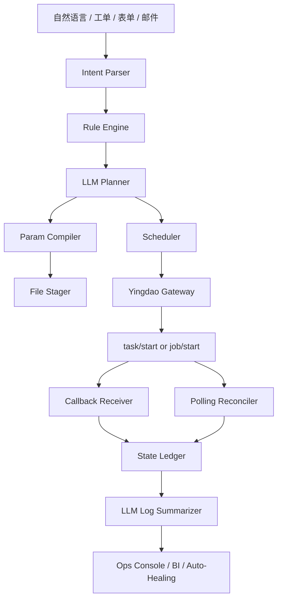

# AI + 影刀深度集成实战
> 写作基线：影刀开放 API 官方文档（2026-03-24 核验）+ 仓库内 AI + RPA 架构沉淀。
> 目标：让 AI 不只是“生成脚本”，而是成为影刀企业自动化平台的计划器、参数编译器、调度器、观察者和优化器。

## 1. AI 在企业 RPA 中的正确位置
最常见的错误做法，是让大模型直接输出“点击哪里、输入什么”的脚本片段。对企业场景来说，这样既难治理，也难审计。更稳妥的模式是：**AI 负责做决策与结构化输出，影刀负责做受控执行**。
- AI 负责理解需求、判断风险、选择任务或应用、生成参数、解释结果。
- 影刀负责真正的 UI 自动化执行、队列消费、任务编排、日志回传和运行截图。
- 企业平台负责规则约束、审批、幂等、回调、轮询、审计、监控与补偿。

## 2. AI 职责矩阵
| 阶段 | AI 负责什么 | 与影刀接口的关系 | 失败时的兜底 |
| --- | --- | --- | --- |
| 需求入口 | 把自然语言、工单、邮件、表单转换为结构化 AutomationIntent | 不直接调用影刀，只生成计划与置信度 | 低置信度走人工审批 |
| 计划编排 | 决定走 task 还是 job、选择应用/任务、估算参数大小 | 关联 `task/start`、`job/start`、`file/upload` | 无匹配模板时回退到人工设计 |
| 参数编译 | 把业务对象映射成 str/int/float/bool/file 参数 | 依赖应用参数结构查询与文件上传 | 参数不完整时退回补资料 |
| 资源调度 | 根据机器人状态、队列长度、优先级、SLA 做调度 | 依赖机器人查询、任务/应用列表、队列接口 | 资源不足时排队或延期 |
| 结果理解 | 读取回调、运行结果、日志并生成业务结论 | 依赖 query、log、callback 页面定义 | 无法判定根因时转人工 |
| 持续优化 | 汇总成功率、耗时、错误模式，优化 Prompt 与路由策略 | 读取任务明细、日志与业务 KPI | 策略更新走灰度发布 |

## 3. 目标架构

架构关键点有三个：
- 规则先行：任何涉及审批、金额、删改、对外发送的动作，必须先过规则引擎。
- 结构化输出：Planner 的输出是 JSON 契约，不是自由文本。
- 双通道收敛：回调与轮询统一收敛到状态账本，再由 AI 做解释和下一步决策。

## 4. 规则优先的调度策略
- 如果场景需要预编排、存在多个应用节点、或需要控制台任务模板，则优先 `task/start`。
- 如果场景只是“指定机器人/组执行单一应用”，优先 `job/start`。
- 如果参数文本体积大、附件多、或需要把上下文做成可审计对象，先 `file/upload` 再下发 file 参数。
- 如果目标机器人组没有空闲资源，则根据 SLA 与优先级选择：排队、改派、降级或延迟。
- 如果业务属于高风险域（财务付款、账号删除、合同盖章），AI 只生成计划，不直接执行。

## 5. Prompt 与结构化契约
### 5.1 推荐的 Planner 输出 Schema
```json
{
  "intent_id": "uuid",
  "tenant": "finance-cn",
  "scenario": "invoice_reconciliation",
  "risk_level": "medium",
  "preferred_mode": "task",
  "target_asset": {
    "schedule_uuid": "...",
    "robot_uuid": "...",
    "robot_group_uuid": "..."
  },
  "inputs": [
    {"name": "invoice_batch", "type": "file", "source": "object://batch-20260324.csv"},
    {"name": "notify_email", "type": "str", "value": "finance@example.com"}
  ],
  "sla": {
    "max_queue_seconds": 600,
    "max_run_seconds": 3600,
    "must_callback": true
  },
  "approval": {
    "required": false,
    "reason": "金额未超过阈值"
  },
  "explanation": [
    "该场景依赖任务模板中的 4 个应用节点，因此选择 task/start",
    "批量发票号超过 8000 字符，需先走 file/upload",
    "当前机器人组 idle 比例 0.62，满足立即执行条件"
  ]
}
```
### 5.2 设计原则
- 不要让模型直接输出影刀 API 请求体，而是先输出“业务计划对象”，再由参数编译器做最后一跳转换。
- 所有可执行字段都要可枚举，例如 `preferred_mode`、`risk_level`、`approval.required`。
- 解释字段不是装饰，而是给运维台、审批台和事故复盘用的。

## 6. 核心实现模式
### 6.1 计划器：把业务需求变成可执行计划
```python
from dataclasses import dataclass
from typing import Any
import uuid

@dataclass
class AutomationIntent:
    tenant: str
    scenario: str
    business_key: str
    payload: dict[str, Any]
    risk_level: str

def build_plan(intent: AutomationIntent, robot_snapshot: dict, app_catalog: dict) -> dict:
    # 1. 规则先行，识别是否必须人工审批
    if intent.risk_level in {"high", "critical"}:
        return {
            "mode": "manual_review",
            "reason": "risk gate",
            "approval_required": True,
        }

    # 2. 基于模板目录判断走 task 还是 job
    if intent.scenario in app_catalog.get("task_templates", {}):
        asset = app_catalog["task_templates"][intent.scenario]
        mode = "task"
    else:
        asset = app_catalog["job_apps"][intent.scenario]
        mode = "job"

    # 3. 机器人评分：空闲、最近失败率、分组负载、地域匹配
    scored = sorted(
        robot_snapshot[asset["robot_group"]],
        key=lambda item: (
            item["status"] != "idle",
            item["recent_error_rate"],
            item["queue_depth"],
            -item["cpu_headroom"],
        ),
    )
    selected = scored[0]

    return {
        "mode": mode,
        "asset": asset,
        "selected_robot": selected,
        "idempotent_uuid": str(uuid.uuid4()),
        "explanation": [
            f"mode={mode}",
            f"robot={selected['robotClientUuid']}",
            "selected by rule-first scoring",
        ],
    }
```
### 6.2 参数编译器：把业务对象变成影刀参数
```python
import csv
import io
import json
from pathlib import Path

def compile_params(intent_payload: dict, max_inline_chars: int = 8000) -> tuple[list[dict], bytes | None]:
    """将业务对象编译成影刀参数；当内容过大时，返回 file 参数和待上传字节流。"""
    inline = json.dumps(intent_payload, ensure_ascii=False)
    if len(inline) <= max_inline_chars:
        return [
            {"name": "payload_json", "value": inline, "type": "str"},
        ], None

    buffer = io.StringIO()
    writer = csv.writer(buffer)
    writer.writerow(["field", "value"])
    for key, value in intent_payload.items():
        writer.writerow([key, json.dumps(value, ensure_ascii=False)])
    file_bytes = buffer.getvalue().encode("utf-8")
    return [
        {"name": "payload_file", "value": "__TO_BE_REPLACED_BY_FILE_KEY__", "type": "file"},
    ], file_bytes
```
### 6.3 执行网关：统一访问影刀开放 API
```python
import time
import requests

class YingdaoGateway:
    def __init__(self, token_provider, base_url="https://api.yingdao.com"):
        self.token_provider = token_provider
        self.base_url = base_url.rstrip("/")
        self.session = requests.Session()

    def _headers(self) -> dict:
        token = self.token_provider.get_token()
        return {
            "Authorization": f"Bearer {token}",
            "Content-Type": "application/json",
        }

    def upload_file(self, filename: str, content: bytes) -> str:
        token = self.token_provider.get_token()
        url = f"{self.base_url}/oapi/dispatch/v2/file/upload"
        headers = {"Authorization": f"Bearer {token}"}
        files = {"file": (filename, content)}
        resp = self.session.post(url, headers=headers, files=files, timeout=60)
        resp.raise_for_status()
        data = resp.json()
        return data["data"]

    def start_job(self, body: dict) -> dict:
        url = f"{self.base_url}/oapi/dispatch/v2/job/start"
        resp = self.session.post(url, headers=self._headers(), json=body, timeout=60)
        resp.raise_for_status()
        return resp.json()

    def query_job(self, job_uuid: str) -> dict:
        url = f"{self.base_url}/oapi/dispatch/v2/job/query"
        resp = self.session.post(url, headers=self._headers(), json={"jobUuid": job_uuid}, timeout=30)
        resp.raise_for_status()
        return resp.json()

TERMINAL_JOB = {"finish", "stopped", "error", "skipped", "cancel"}

def wait_job(gateway: YingdaoGateway, job_uuid: str, initial_interval: int = 30):
    interval = initial_interval
    while True:
        data = gateway.query_job(job_uuid)["data"]
        if data["status"] in TERMINAL_JOB:
            return data
        time.sleep(interval)
        interval = min(interval + 30, 300)
```
### 6.4 状态融合器：回调与轮询并行收敛
```python
def merge_callback_and_poll(ledger_row: dict, callback_payload: dict | None, poll_payload: dict | None) -> dict:
    """把回调与轮询统一归并到状态账本。"""
    source = callback_payload or poll_payload or {}
    if not source:
        return ledger_row

    status = source.get("status") or source.get("data", {}).get("status")
    ledger_row["current_status"] = status
    ledger_row["is_terminal"] = status in {"finish", "stopped", "error", "skipped", "cancel"}
    ledger_row["last_source"] = "callback" if callback_payload else "poll"
    ledger_row["last_payload"] = source
    return ledger_row
```

## 7. 面向影刀特性的 AI 增强点
| 优化主题 | AI 负责什么 | 与影刀 API 的结合点 | 典型收益 |
| --- | --- | --- | --- |
| 任务/应用选择 | 根据场景复杂度选择 task 或 job | task/start、job/start | 减少错误接口使用与模板设计成本 |
| 参数旁路 | 检测参数体积，自动切换 file 参数 | file/upload、应用参数结构查询 | 降低超长参数失败率 |
| 机器人选路 | 根据状态、失败率、饱和度选机器人 | client/list、client/query、client/group/list | 降低等待时长与异常率 |
| 日志理解 | 将运行日志总结成业务语言 | job/log/search、job/log/query | 提高运维效率，缩短 MTTR |
| 异常分类 | 把错误分为参数类、资源类、平台类、业务规则类 | status code、FAQ、运行结果接口 | 减少误重试与人工排查时间 |
| 调度优化 | 根据历史表现调整优先级与并发 | job/list、task/list、latest list | 提升吞吐与 SLA 达成率 |
### 7.1 利用文件上传解决长上下文问题
影刀官方文档反复提示参数总量建议不超过 8000 字符。对 AI 场景来说，这是个典型约束：模型生成的上下文很长、订单列表很长、诊断日志也很长。企业做法不应是“把模型输出截断”，而应是：
- 先把结构化上下文写成 CSV / JSON / TXT。
- 调用文件上传接口拿到 file key。
- 在应用参数中只传 file key。
- 应用运行完成后，把 file key、输入摘要、输出摘要与业务主键一起存档。
### 7.2 利用机器人状态做 AI 选路
机器人不是黑盒资源。官方枚举说明给出了 `idle / allocated / running / offline` 等状态。AI 调度器至少应把以下因素纳入评分：
- 当前状态是否为 idle。
- 最近 1 小时的失败率。
- 当前队列深度与排队等待时长。
- 所在业务域是否与任务匹配，例如财务机器人不要承接营销任务。
- 机器人的网络连通性、CPU/内存余量、登录态健康度。
### 7.3 利用日志做 AI 异常分类
AI 不应只看 `status=error`，还要看运行日志、截图 URL、requestId 与 FAQ。推荐把失败分成四层：
- 参数层：字段名错、类型错、必填漏传、日期格式错。
- 资源层：机器人离线、应用 owner 已迁移、分组无空闲资源。
- 平台层：401、429、500、回调不通、Token 失效。
- 业务层：上游数据不完整、审批未通过、目标系统登录失败、页面结构变化。

## 8. 高级工作流模式
### 模式 A：AI 生成参数 -> 影刀执行 -> AI 解读结果
最通用的闭环。适合工单处理、订单审核、内容发布等场景。关键是让 AI 负责生成结构化参数，而非生成 UI 脚本。
### 模式 B：AI 拆批 -> 队列入列 -> 影刀按容量消费
适合批量订单、批量发票、批量账号开通。AI 负责切片，队列负责削峰，影刀负责消费。
### 模式 C：AI 观察日志 -> 自动选择补偿策略
适合偶发失败率高的流程。AI 根据日志与状态选择“重试 / 重派 / 转人工 / 暂停模板”。
### 模式 D：AI 生成知识摘要 -> 写回 BI 与工单系统
让自动化不仅执行，还把过程和结果转成可读知识，供运营与管理使用。
### 模式 E：AI 调度多任务模板
当单个场景跨多个任务模板时，由 AI 先编排阶段顺序，再逐一调用 task/start，并在账本里维护父子关系。

## 9. 人工审批与风险门控
- 规则先于模型：所有组织级禁用动作、审批门槛、黑名单系统必须由规则引擎先判定。
- 结构化输出强约束：LLM 只允许输出定义好的 JSON Schema，不允许自由文本直接驱动执行。
- 高风险动作显式审批：涉及转账、删号、发布、对外发送的动作必须经过人工确认。
- 可解释性：每次计划都要保留“为什么选择 task/job、为什么选这台机器人、为什么提这个优先级”的理由。
- 版本化：Prompt、策略、模板和应用版本都必须可回滚。
建议把审批门槛做成统一策略，例如：
- 涉及金额、合同、账户删除、权限开通、对外发布的动作，默认 `approval.required = true`。
- 当 AI 的计划置信度低于阈值时，不允许直接执行。
- 当模型发现需要使用非常规机器人、跨业务域资产或未知应用模板时，强制升级。

## 10. 评估体系
| 维度 | 指标 | 建议阈值 | 说明 |
| --- | --- | --- | --- |
| 计划准确率 | task/job 选择正确率 | >= 95% | AI 选错运行模式会直接引发失败 |
| 参数正确率 | 参数名/类型/必填项正确率 | >= 99% | 上线前必须用回放数据集校验 |
| 自动化成功率 | 终态成功比例 | 场景相关 | 应与人工基线一起评估 |
| 误自动化率 | 本应人工审批却被自动执行的比例 | 接近 0 | 高风险场景最重要的安全指标 |
| 回调闭环率 | 回调成功收敛的比例 | >= 99% | 越高越能减少轮询压力 |
| MTTR | 从失败到形成可执行结论的时间 | 持续下降 | 评估日志摘要与根因分类能力 |
### 10.1 建议的数据集
- 历史成功样本：至少覆盖每个场景 50~100 个成功执行实例。
- 历史失败样本：按参数错误、资源错误、平台错误、业务错误分层采集。
- 高风险边界样本：金额超阈值、缺少关键字段、附件过大、机器人离线、长时间排队。
### 10.2 灰度策略
- 先灰度 Planner，不灰度 Executor。即先让 AI 出计划，再由人工点确认执行。
- 再灰度参数编译器，只在低风险模板上自动执行。
- 最后灰度异常自愈，只允许处理“平台层可恢复错误”。

## 11. 典型失败案例与修复策略
| 失败模式 | 根因 | 修复策略 |
| --- | --- | --- |
| AI 选错运行模式 | Planner 把复杂场景当成 job 直接执行 | 在模板目录中增加“必须 task 化”的强约束，并对场景做 whitelist |
| 参数超长 | 大文本直接塞到 JSON 中导致失败 | 参数编译器先估算长度，自动走 file/upload 旁路 |
| 无限轮询 | 没有把终态集合配置化 | 把枚举页写成常量表，轮询器只认终态集合 |
| 回调误判失败 | 业务处理异常返回 5xx，平台持续补偿 | 回调先 2xx ack，再把业务处理丢到内部队列 |
| 重复执行 | 网络超时后业务重试，没有使用幂等键 | 把业务主键与幂等键绑定，结果账本做唯一约束 |
| 机器人错误选路 | AI 总是选到热点机器人 | 把 idle 比例、排队深度、近期失败率纳入评分函数 |

## 12. 生产化清单
- [ ] 是否为每个业务请求生成并持久化幂等键？
- [ ] 是否为每个 start 请求同时记录 requestId、jobUuid/taskUuid、业务主键？
- [ ] 是否已经完成回调连通性测试与补偿演练？
- [ ] 是否把长参数自动旁路到文件上传？
- [ ] 是否按端点做限流预算而不是只做全局 QPS？
- [ ] 是否把 AI 计划输出收敛到固定 Schema？
- [ ] 是否对高风险动作做人工审批？
- [ ] 是否构建了失败分类、值班 Runbook 和可视化大盘？

## 13. 结语
AI + 影刀的高级形态不是“让模型代替影刀”，而是“让模型增强影刀”：模型负责认知、判断、编排与解释，影刀负责可靠执行，企业平台负责约束、审计和恢复。三者缺一不可。
