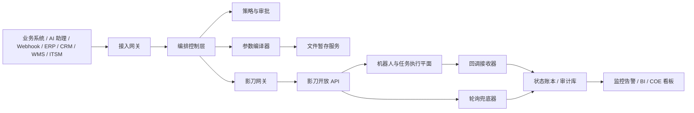

# 企业级影刀 RPA 架构设计
> 本文基于影刀“开放 API”公开文档（2026-03-24 核验）与仓库内既有 AI+RPA 架构沉淀，输出一套适合企业生产环境的参考架构。
> 本文默认读者是企业架构师、RPA 平台 owner、自动化开发负责人、运维/SRE 和数据安全负责人。

## 1. 设计目标
- 让影刀从“单点脚本工具”升级为“企业级自动化执行平面”。
- 让业务系统、AI 服务、审批系统、观测系统与影刀之间建立可治理、可审计、可恢复的契约。
- 在不牺牲安全与合规的前提下，提高自动化吞吐、降低人工介入、支持跨部门复制。
- 把官方 API 的事实约束（限流、状态机、回调、文件旁路、队列模型）提前内化成平台能力，而不是留到线上故障时补丁式处理。

## 2. 影刀能力到企业架构的映射
| 能力域 | 官方模块/页面 | 企业架构中的角色 | 建议落点 |
| --- | --- | --- | --- |
| 认证与授权 | 鉴权 | Token Broker / Secret Manager | 集中管理 accessKeyId/accessKeySecret，统一换发 accessToken |
| 账号资产 | RPA企业账号 | Identity Provisioning | 与 HR / IAM 同步机器人执行账号生命周期 |
| 异步解耦 | 工作队列 | Queue Ingress / Work Dispatcher | 把业务对象标准化为队列项，削峰填谷 |
| 复杂编排 | 任务运行 + 任务 | Orchestration Layer | 预编排任务、批量调度、审计与对账 |
| 简单执行 | JOB运行 | Execution Gateway | 单机器人/分组直接启动应用 |
| 可观测性 | 运行日志 | Telemetry Pipeline | 日志、回调、轮询、告警与追踪 |
| 资源治理 | 机器人相关 | Robot Fleet Manager | 机器人容量、分组、空闲探测、分配策略 |
| 应用资产 | 应用相关 | Application Catalog | 版本治理、参数结构、运行记录、owner 转移 |
| 大参数传输 | 文件 | File Staging Service | 把长文本与大文件转为 file 型参数 |
| 运行审计 | 任务 | Audit / Ledger | 执行记录、明细、追溯、SLA 和成本核算 |
| 运行规范 | 通用说明 | Platform Policy | 限流、枚举、状态机、FAQ、返回格式 |

## 3. 总体架构视图

这张图强调一个原则：影刀不直接暴露给所有业务系统，而是由企业自己的“影刀网关 + 编排控制层”统一接入。这样才能把 Token、限流、幂等、回调、审计和环境差异收敛到一个可治理平面。

## 4. 分层设计
### 4.1 渠道接入层
ERP、CRM、WMS、财务系统、HRIS、ITSM、邮件、Webhook、AI 助理等入口统一落在这一层。目标是把“外部业务事件”标准化成内部自动化请求。
- 做输入校验、租户识别、鉴权、幂等键提取
- 把不同系统的事件映射成统一 AutomationRequest
- 对高价值场景增加人工审批或四眼复核
### 4.2 编排控制层
负责任务计划、策略判断、优先级分配、路由到 `job/*` 还是 `task/*`、以及回调/轮询协调。
- 显式区分“轻量单应用执行”和“复杂多应用编排”
- 统一生成 idempotentUuid、requestId 关联键、业务追踪号
- 根据限流预算和机器人容量做排队与延期
### 4.3 参数与文件层
对接业务对象，生成影刀应用需要的入参；当参数过大时，通过文件服务先上传再回填 file 参数。
- 支持 str/int/float/bool/file 参数类型映射
- 对长文本、批量订单号、附件清单自动走 file 旁路
- 保留参数版本与脱敏快照，便于审计
### 4.4 影刀接入层
与影刀开放 API 的唯一对接点，负责 Token 缓存、重试、速率控制、统一日志和错误翻译。
- 封装官方域名与专有云域名差异
- 对 401/429/500 做分层重试和熔断
- 把 requestId、jobUuid、taskUuid 纳入标准返回
### 4.5 执行与资源层
影刀客户端、机器人分组、任务模板、队列与应用构成真正的执行平面。
- 按机器人组、优先级、执行范围做资源选择
- 把应用和任务拆成可治理的资产目录
- 对队列、日志、截图、回调做持久化归档
### 4.6 观测与治理层
汇总审计、指标、日志、异常、成本、SLA 和业务结果，支撑 COE / 运维 / 安全部门。
- 构建流程成功率、等待时长、平均运行时长、异常率、回调成功率等指标
- 建立失败分类、根因标签与补偿工单
- 按租户、业务域、机器人组、应用版本输出多维报表

## 5. 控制平面与数据平面
### 5.1 控制平面
- 负责任务接收、审批、策略判断、速率控制、参数生成、环境选择、审计与变更管理。
- 关键组件包括：API Gateway、Policy Engine、Approval Service、Automation Orchestrator、Token Broker、Yingdao Gateway、Callback Receiver、Polling Reconciler、State Ledger。
### 5.2 数据平面
- 负责真正的机器人执行、应用运行、任务编排、队列消费、日志产出和截图生成。
- 影刀客户端、机器人分组、应用、任务模板、工作队列、文件服务都属于数据平面。
- 数据平面只关心“执行什么”，控制平面决定“是否执行、何时执行、由谁执行、怎么恢复”。

## 6. 部署拓扑
### 6.1 公有云标准拓扑
适合大多数 SaaS 集成场景。企业系统通过 API Gateway 触发编排器，再调用公有云影刀开放 API；机器人运行在企业办公网或云主机，回调统一回到企业 DMZ。
优点：
- 落地快，维护成本低
- 适合电商、运营、财务共享中心等通用自动化
注意点：
- 需要显式处理公网回调入口、白名单、出口审计
### 6.2 专有云内网拓扑
适合数据隔离要求高、不能把请求指向公有云域名的企业。核心差异是所有 API、回调、文件域名都切到专有云地址。
优点：
- 更适合制造、金融、政企、医疗等合规场景
- 可以把回调、日志、文件完全留在内网
注意点：
- 环境差异更大，必须把域名与证书配置外部化，避免写死 `api.yingdao.com`
### 6.3 混合云拓扑
适合总部统一运营、区域公司分散执行。控制平面在中心云，机器人和部分业务系统在区域网，通过边缘网关与控制平面同步状态。
优点：
- 易于统一治理、分区域弹性扩展
- 适合跨法人、跨事业部、多区域仓配运营
注意点：
- 需要更强的网络、缓存、断点续传和离线补偿设计

## 7. 状态模型与编排语义
| 对象 | 关键状态 | 终态/非终态 | 架构解释 |
| --- | --- | --- | --- |
| 任务(task) | waiting / running / finish / stopping / stopped / error | finish、stopped、error 为终态 | 终态是停止轮询与进入对账的唯一判断依据 |
| 应用(job) | created / waiting / running / finish / stopping / stopped / error / skipped / cancel | finish、stopped、error、skipped、cancel 为终态 | 适合驱动告警、补偿和人工复核 |
| 机器人(client) | connected / idle / allocated / running / offline | idle 可直接调度；offline 不可分配 | 调度器应优先使用 idle，其次允许排队 |
| 队列项(queue item) | queued / processing / processed / exception / on hold / expired | processed、exception、expired 通常视作结果态 | 决定业务对象的重试、搁置与死信转移 |
架构上最容易忽略的一点是：**终态集合不是可选信息，而是所有轮询器、告警器、补偿器和人工工作台的基础契约**。如果系统没有把终态集合做成配置，后续必然出现无限轮询、重复告警、重复重试或重复记账。

## 8. 关键运行链路
### 8.1 轻量直连模式：job/start
适合“指定某台机器人或机器人组执行某个应用”的场景，例如内容发布、批量下载、单步骤系统录入。核心链路是：业务事件 -> 编排器 -> 参数编译 -> `job/start` -> 回调/轮询 -> 状态账本。
### 8.2 编排模式：task/start
适合“任务模板已在控制台预编排好，可能包含多个应用和机器人关系”的场景，例如订单履约、复杂审批流、跨系统对账。核心链路是：业务事件 -> 选择 scheduleUuid -> 编排器生成 `scheduleRelaParams` -> `task/start` -> `task/query` / 回调 -> 任务与 job 明细对账。
### 8.3 大参数旁路模式
当业务需要传递长文本、附件清单、批量订单号、复杂上下文时，先上传文件，再把 `file` 类型参数传给应用。这样既能规避参数长度限制，也能让输入对象可审计、可复放。
### 8.4 回调 + 轮询双轨模式
回调应作为主链路，轮询作为兜底。设计时应把它们视为同一条“结果一致性通道”的两个输入，而不是两套彼此独立的逻辑。推荐做法是：
- 所有 start 请求都先写入状态账本，状态为 `submitted`。
- 回调成功后把状态账本更新为终态并打上 `callback_success`。
- 轮询任务只扫描“未终态且未过期”的对象。
- 一旦回调或轮询任意一方观察到终态，另一方立即停止。
- 对于超过 24 小时仍未完成的对象，强制升级为人工工单。

## 9. 可靠性设计
| 主题 | 必须设计的机制 | 建议实现 |
| --- | --- | --- |
| 幂等 | startJob/startTask 请求生成幂等键，写入业务表 | 按业务主键 + 场景 + 时间窗生成幂等键；请求与回调都用同一键对账 |
| 超时 | 等待超时、运行超时、回调补偿超时 | 等待超时交给调度器管理，运行超时交给应用级保护，补偿超时交给运维工单 |
| 回调 | 回调先 ack 再异步处理 | 收到 2xx 即视为平台侧交付完成，业务处理失败应内部补偿而不是让平台无限重试 |
| 轮询 | 仅作为回调兜底，不作为主链路 | 按状态与运行时长动态放大轮询间隔 |
| 限流 | 按端点做配额与桶 | 例如日志接口 5 次/秒、job/query 30 次/秒，放入网关预算表 |
| 重试 | 只对可重试错误重试 | 401 刷新 Token；429 指数退避；500 限次重试；参数错误不重试 |
| 补偿 | 任务与应用层分开补偿 | job 失败优先应用级重试；task 失败优先分析具体 job，再决定整任务重放 |
| 容量 | 机器人池容量模型 | 用 idle 比例、平均执行时长、排队时长、组内并发作为调度输入 |
| 审计 | 执行请求、回调、轮询、人工干预都要留痕 | 保留 requestId、taskUuid、jobUuid、operator、审批号 |
### 9.1 为什么必须显式设计幂等
官方文档已经为 `job/start` 与 `task/start` 提供了幂等字段，但很多企业只在接口层“传一个 uuid”就结束了。真正可靠的做法是：
- 业务层生成幂等键，而不是把随机 uuid 当幂等。
- 幂等键与业务主键、租户、场景、提交批次绑定。
- 影刀返回 `jobUuid/taskUuid` 后，把这两个字段与幂等键一同写入台账。
- 回调与轮询回来的结果，先按幂等键合并，再按 `jobUuid/taskUuid` 校验。
### 9.2 为什么必须做状态账本
没有状态账本，系统就无法回答：这个对象是否提交过？对应的 task/job 是什么？现在处于什么状态？回调是否到达？轮询是否还应该继续？是否已经超过 SLA？因此建议使用一张“自动化执行账本”表，至少包含：业务主键、租户、场景、idempotentUuid、taskUuid、jobUuid、currentStatus、isTerminal、requestId、submitTime、lastCallbackTime、lastPollTime、expireAt、retryCount、operator、approvalId。

## 10. 安全与合规
| 控制项 | 落地要求 | 建议做法 |
| --- | --- | --- |
| 密钥管理 | AK/SK 不得写死在脚本或前端 | 集中保存在 Secret Manager；由编排器按租户换取 Token |
| Token 生命周期 | 2 小时有效期，刷新逻辑标准化 | 集中 Token Broker，避免每个微服务各自缓存 |
| 回调入口 | 仅暴露必要地址 | 接入 WAF、IP 白名单、API 网关、异步消息队列 |
| 参数脱敏 | 日志和审计中隐藏敏感字段 | 对身份证号、手机号、银行卡、访问令牌做分级脱敏 |
| 最小权限 | 机器人与应用分组按业务域拆分 | 财务、HR、IT 运维不要共用同一组机器人账号 |
| 文件治理 | 上传的 file 参数必须有保留期与清理策略 | 按业务域和敏感等级设置对象存储生命周期 |
| 审计 | API 调用、人工审批、手工终止都记录 | 形成不可篡改审计台账 |
| 专有云差异 | 域名、证书、出口、防火墙策略参数化 | 不要在代码里假定只有公有云地址 |
### 10.1 回调安全
- 回调入口建议放在企业 API Gateway 之后，不要直接暴露到业务应用进程。
- 官方“参考案例下载”页提供了签名验签样例下载，企业应把回调签名与时间戳校验纳入网关或回调适配层。
- 对公网场景，回调入口要有速率限制、重放保护、IP 白名单与审计日志。
### 10.2 敏感场景分域
- 财务、HR、IT 运维不要共享同一机器人组、同一应用所有者和同一回调地址。
- 不同业务域应拆分审批、审计、看板和 on-call 值班。

## 11. 观测、SLO 与运营
| 指标域 | 核心指标 | 用途 |
| --- | --- | --- |
| 吞吐 | 每分钟启动 job 数、每分钟启动 task 数、队列入列/出列速率 | 容量规划、峰值压测 |
| 时延 | 排队等待时长、应用平均运行时长、P95/P99 回调到达时延 | SLA 管理 |
| 成功率 | 应用成功率、任务成功率、回调成功率、补偿成功率 | 稳定性与质量 |
| 资源 | 机器人 idle 比例、分组饱和度、离线率、分配失败率 | 资源调度优化 |
| 质量 | 参数错误率、人工介入率、重试率、重复执行率 | 自动化质量改进 |
| 价值 | 节省工时、替代人工次数、异常拦截率、资金/订单风险避免金额 | ROI 评估 |
### 11.1 生产环境必备大盘
- 编排健康大盘：start 成功率、task/job 终态分布、错误码分布、回调成功率。
- 资源大盘：机器人空闲率、离线率、分组排队时长、分组饱和度。
- 业务大盘：自动化节省工时、异常拦截量、待人工处理积压量、资金/订单影响。
### 11.2 Runbook 机制
- `401` 激增：优先检查 AK/SK 是否变更、管理员账号是否被删、Token Broker 是否缓存了错误配置。
- `429` 激增：按端点查预算是否超限，必要时拆分批次、加大等待、减少日志接口扫描频率。
- 回调积压：检查出口、白名单、证书、2xx ack 逻辑，以及是否误把业务异常返回成 5xx。
- 机器人长期 offline：检查客户端状态、远程桌面、渲染器、账号登录态、白名单与主机资源。

## 12. 组织治理模型
- 建议建立 COE（Center of Excellence，卓越中心）或至少建立自动化平台 owner 角色。
- 平台 owner 负责接口准入、任务模板治理、机器人池规划、审批规范、变更流程和事故复盘。
- 业务团队负责定义场景价值、提供规则、验收结果、承担业务级补偿责任。
- 安全与合规团队负责密钥、回调入口、审计与数据边界。
- SRE/运维负责容量、告警、事故响应和环境差异治理。

## 13. 实施路线图
| 阶段 | 目标 | 交付物 |
| --- | --- | --- |
| Phase 0 | 接入验证 | 域名与鉴权验证、端点白名单、限流预算、回调连通性测试 |
| Phase 1 | 最小闭环 | Token Broker、Yingdao Gateway、回调接收器、轮询兜底器 |
| Phase 2 | 资产治理 | 应用目录、任务模板库、机器人分组规范、参数字典 |
| Phase 3 | 企业可运营 | 统一审计、指标大盘、告警、值班 Runbook、变更流程 |
| Phase 4 | AI 增强 | AI 调度、参数生成、日志摘要、异常根因分类 |
| Phase 5 | 规模复制 | 多业务域模板、跨区域部署、COE 治理与成本优化 |

## 14. 反模式清单
- 把所有业务场景都强行做成 `job/start`，导致复杂流程无法审计、无法编排。
- 没有状态账本，回调和轮询各写各的，最终出现重复完成、重复补偿。
- 把业务大参数直接塞进 JSON 体，直到线上遇到阈值才补做文件旁路。
- 把机器人组当作“无限资源”，不做空闲率和排队时长治理。
- 把影刀返回值直接暴露给上游系统，不做领域翻译与错误分层。
- 生产环境只依赖回调或只依赖轮询，缺少另一条兜底通道。
- 把域名写死在代码里，不做公有云/专有云/兼容域名差异配置。
- 把 AK/SK 放在脚本仓库、机器人环境变量或共享文档中流转。

## 15. 结语
企业级影刀方案的核心，不是“把 API 调通”，而是把影刀变成一个受控的执行平面：前面有业务与 AI 编排，后面有状态账本、审计、SLO、补偿和治理。只有这样，影刀才能真正承担企业自动化主链路，而不是停留在单个脚本或单个机器人层面。
