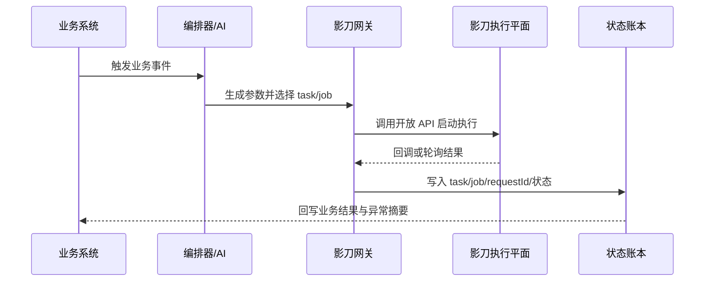

# 影刀企业级实战案例
> 本文面向“企业真正要落地什么”的问题，给出 5 个可直接转成项目立项书和实施方案的案例。所有案例都基于影刀开放 API 官方能力约束（2026-03-24 核验）。
> 每个案例都遵循同一原则：**业务对象先队列化或事件化，执行再标准化，最后把结果写回业务系统与 BI**。

## 1. 案例一：财务对账与发票回传自动化
把每日对账、差异标记、发票回传与异常通知从人工批处理改造成“队列化 + 编排化 + AI 摘要化”的闭环。

### 业务系统范围
- ERP
- 财务共享平台
- 银行回单下载站点
- 电子发票平台
- BI

### 主要使用的影刀能力
- 工作队列
- 任务运行
- 运行日志
- 文件
- 任务

### 标准运行链路
1. ERP 生成待对账批次，按账单号写入工作队列。
2. AI 按账单金额、交易类型和敏感等级，把批次拆成适合的执行包。
3. 参数编译器把订单/账单清单转成 CSV，并通过文件上传得到 file key。
4. 编排器选择财务对账任务模板，调用 `task/start`。
5. 影刀任务依次完成银行回单下载、ERP 对账、差异比对、发票平台回写。
6. 回调接收器落账本；若回调未到，轮询 `task/query` 与任务明细接口兜底。
7. AI 汇总差异原因，输出给财务共享平台和 BI。
8. 对终态为 error 的批次自动生成复核工单。

### AI 增强点
- 对账差异归因：金额偏差、税率偏差、回单缺失、发票状态异常。
- 批量发票号与附件清单自动走 file 参数，避免超长。
- 对异常批次自动生成财务可读摘要，而不是只留技术日志。

### 推荐 API 链路
- `file/upload`
- `task/start`
- `task/query`
- `task/process/detail`
- `job/log/search`

### 参考时序

### KPI 与收益
| 指标 | 目标/收益 |
| --- | --- |
| 日处理批次 | 从 1 次人工夜批扩展到全天候滚动处理 |
| 平均处理时长 | 从 3~4 小时降到 20~40 分钟 |
| 人工复核比例 | 仅保留高风险或异常批次 |
| 审计完备度 | 每个批次可追溯到 task/job/requestId |

### 风险与补偿策略
- 风险：银行站点页面变化。
  补偿建议：为“银行站点页面变化”建立专门的失败标签、人工复核工单与回放样例。
- 风险：附件过大。
  补偿建议：为“附件过大”建立专门的失败标签、人工复核工单与回放样例。
- 风险：财务月结高峰排队。
  补偿建议：为“财务月结高峰排队”建立专门的失败标签、人工复核工单与回放样例。
- 风险：回调接收失败。
  补偿建议：为“回调接收失败”建立专门的失败标签、人工复核工单与回放样例。

### 推荐推进路径
1. 先做单法人公司试点
2. 再扩展到多账套
3. 最后叠加异常归因与月结高峰弹性策略

### 落地细节建议
- 所有案例都应把 `requestId`、`idempotentUuid`、`taskUuid/jobUuid` 与业务主键绑定。
- 所有高风险变更都应具备审批、审计和回滚流程。
- 批量场景优先“队列化 + 文件旁路”，不要直接在单次请求里塞入超长参数。
- 异常结果不要只留下技术日志，还要生成业务侧可理解的摘要、责任归属和下一步动作。

## 2. 案例二：电商订单履约与售后异常处理
围绕订单抓单、库存校验、面单打印、异常退款和售后回传构建高吞吐自动化中心。

### 业务系统范围
- 电商平台后台
- OMS
- WMS
- ERP
- 客服工单系统

### 主要使用的影刀能力
- 工作队列
- JOB运行
- 应用相关
- 机器人相关
- 运行日志

### 标准运行链路
1. OMS 把待处理订单写入工作队列，并附带 SLA、店铺、仓库等属性。
2. AI 根据店铺、渠道、仓库饱和度决定路由到哪个机器人组。
3. 对简单履约动作使用 `job/start` 直连执行；对跨多个应用节点的售后场景使用 `task/start`。
4. 影刀执行库存校验、面单生成、平台回写、异常截图和客服备注同步。
5. 当日志出现库存不足、地址格式异常、平台限流等错误时，AI 自动分类并切换补偿策略。
6. 终态结果同步回 OMS / 客服系统。

### AI 增强点
- 自动判断走 job 还是 task。
- 根据历史失败率决定是否避开某一机器人组。
- 把运行日志翻译成客服可理解的话术与售后标签。

### 推荐 API 链路
- `job/start`
- `job/query`
- `job/list`
- `job/log/search`
- `client/list`
- `client/group/list`

### 参考时序

### KPI 与收益
| 指标 | 目标/收益 |
| --- | --- |
| 订单吞吐 | 高峰期按机器人组水平扩展 |
| 异常命中率 | 库存、地址、平台限制在执行前尽量前置识别 |
| 平均等待时间 | 根据分组饱和度动态调度 |
| 客服工单转人工率 | 从全量人工下降到异常子集人工 |

### 风险与补偿策略
- 风险：平台页面频繁变化。
  补偿建议：为“平台页面频繁变化”建立专门的失败标签、人工复核工单与回放样例。
- 风险：多店铺登录态失效。
  补偿建议：为“多店铺登录态失效”建立专门的失败标签、人工复核工单与回放样例。
- 风险：高峰队列挤压。
  补偿建议：为“高峰队列挤压”建立专门的失败标签、人工复核工单与回放样例。
- 风险：售后策略频繁调整。
  补偿建议：为“售后策略频繁调整”建立专门的失败标签、人工复核工单与回放样例。

### 推荐推进路径
1. 先在单渠道试点
2. 再扩展到多店铺、多仓
3. 最后纳入退款与售后工单联动

### 落地细节建议
- 所有案例都应把 `requestId`、`idempotentUuid`、`taskUuid/jobUuid` 与业务主键绑定。
- 所有高风险变更都应具备审批、审计和回滚流程。
- 批量场景优先“队列化 + 文件旁路”，不要直接在单次请求里塞入超长参数。
- 异常结果不要只留下技术日志，还要生成业务侧可理解的摘要、责任归属和下一步动作。

## 3. 案例三：HR 入离调转与账号生命周期自动化
把入职开户、权限分配、培训通知、离职回收、调岗变更统一到一个合规自动化流水线。

### 业务系统范围
- HRIS
- IAM
- OA
- 邮件系统
- 培训平台
- 设备台账

### 主要使用的影刀能力
- RPA企业账号
- 任务运行
- 任务
- 运行日志
- 通用说明

### 标准运行链路
1. HRIS 推送入职/离职/调岗事件到编排器。
2. AI 对事件做风险评级：是否涉及高权限、是否跨部门、是否缺少审批。
3. 低风险入职使用任务模板自动开户、发送邮件、登记设备、同步培训任务。
4. 离职场景通过任务模板完成账号回收、权限剥离、资产回收通知。
5. 调岗场景根据组织规则做旧权限回收 + 新权限开通。
6. 执行结果写回 HRIS 与 IAM；异常项自动生成人工复核单。

### AI 增强点
- 识别审批是否齐备。
- 把部门、岗位、地域映射成权限模板。
- 对失败日志做“缺审批 / 缺主数据 / 系统故障 / 账号冲突”四类归因。

### 推荐 API 链路
- `rpa/user/v1/list`
- `rpa/user/v1/create`
- `rpa/user/v1/modify`
- `rpa/user/v1/delete`
- `task/start`
- `task/query`

### 参考时序

### KPI 与收益
| 指标 | 目标/收益 |
| --- | --- |
| 开户时效 | T+1 人工转为分钟级自动化 |
| 离职风险 | 权限回收闭环率显著提高 |
| 审计质量 | 每次变更均可追溯到审批与任务记录 |
| 人工工作量 | HR/IT 联合处理量显著下降 |

### 风险与补偿策略
- 风险：主数据缺失。
  补偿建议：为“主数据缺失”建立专门的失败标签、人工复核工单与回放样例。
- 风险：审批链断裂。
  补偿建议：为“审批链断裂”建立专门的失败标签、人工复核工单与回放样例。
- 风险：高权限动作误自动化。
  补偿建议：为“高权限动作误自动化”建立专门的失败标签、人工复核工单与回放样例。
- 风险：跨部门规则变化。
  补偿建议：为“跨部门规则变化”建立专门的失败标签、人工复核工单与回放样例。

### 推荐推进路径
1. 先做低权限岗位
2. 再扩展到敏感岗位但保留审批
3. 最后接入全量权限模板治理

### 落地细节建议
- 所有案例都应把 `requestId`、`idempotentUuid`、`taskUuid/jobUuid` 与业务主键绑定。
- 所有高风险变更都应具备审批、审计和回滚流程。
- 批量场景优先“队列化 + 文件旁路”，不要直接在单次请求里塞入超长参数。
- 异常结果不要只留下技术日志，还要生成业务侧可理解的摘要、责任归属和下一步动作。

## 4. 案例四：IT 服务台工单与运维账号开通/回收
让 ITSM 工单、服务器运维、账号开通、批量补丁操作与告警联动形成标准化执行平面。

### 业务系统范围
- ITSM
- AD/LDAP
- 堡垒机
- 监控告警平台
- CMDB
- 邮件/IM

### 主要使用的影刀能力
- JOB运行
- 机器人相关
- 运行日志
- 文件
- 任务

### 标准运行链路
1. ITSM 产生标准化工单，如开通 VPN、创建共享目录、修改系统白名单。
2. AI 解析工单意图，识别是否属于高危动作。
3. 低危动作直接走 `job/start`，高危动作需要审批后走 `task/start`。
4. 需要批量机器清单时先上传文件，再把 file key 作为参数传给运维应用。
5. 影刀执行桌面软件、Web 控制台、堡垒机或旧系统的自动化操作。
6. 日志接口抓取执行明细，AI 生成工单回执、异常摘要与下一步建议。

### AI 增强点
- 根据工单类型、目标系统、风险级别决定审批与路由。
- 把日志总结成运维可操作建议，例如“账号已存在，建议改为重置密码流程”。
- 对重复失败工单建议禁用模板或触发根因复盘。

### 推荐 API 链路
- `job/start`
- `job/query`
- `client/query`
- `client/list`
- `file/upload`
- `task/newest/list`

### 参考时序

### KPI 与收益
| 指标 | 目标/收益 |
| --- | --- |
| 工单响应时间 | 常见标准工单压缩到分钟级 |
| 人工运维比例 | 仅保留高危和疑难工单人工处理 |
| 审计可追溯 | 工单号、任务号、操作者、审批单全链路关联 |
| 失败修复时长 | AI 摘要 + 日志搜索显著缩短排障时间 |

### 风险与补偿策略
- 风险：高危动作误执行。
  补偿建议：为“高危动作误执行”建立专门的失败标签、人工复核工单与回放样例。
- 风险：堡垒机策略变化。
  补偿建议：为“堡垒机策略变化”建立专门的失败标签、人工复核工单与回放样例。
- 风险：多环境差异。
  补偿建议：为“多环境差异”建立专门的失败标签、人工复核工单与回放样例。
- 风险：回调通道失败。
  补偿建议：为“回调通道失败”建立专门的失败标签、人工复核工单与回放样例。

### 推荐推进路径
1. 先选低危标准工单
2. 再扩展到批量运维任务
3. 最后接入高危动作审批闭环

### 落地细节建议
- 所有案例都应把 `requestId`、`idempotentUuid`、`taskUuid/jobUuid` 与业务主键绑定。
- 所有高风险变更都应具备审批、审计和回滚流程。
- 批量场景优先“队列化 + 文件旁路”，不要直接在单次请求里塞入超长参数。
- 异常结果不要只留下技术日志，还要生成业务侧可理解的摘要、责任归属和下一步动作。

## 5. 案例五：供应链补货、采购协同与仓配异常治理
把补货建议、采购下单、供应商回传、仓配异常处理和管理报表自动打通。

### 业务系统范围
- SRM
- ERP
- WMS
- 物流平台
- 供应商门户
- BI

### 主要使用的影刀能力
- 工作队列
- 任务运行
- 应用相关
- 运行日志
- 文件

### 标准运行链路
1. BI 或预测模型产出补货建议，写入队列。
2. AI 判断每条建议是直接补货、需人工审批还是等待更多数据。
3. 需要批量采购明细时，先转成文件上传。
4. 任务模板自动登录 SRM/ERP/物流平台，创建采购单、回写交期、同步仓库与运输状态。
5. 当供应商门户返回异常或物流节点超时，AI 自动生成跟催摘要并回写任务。
6. 所有执行结果沉淀到 BI，用于下一轮补货策略优化。

### AI 增强点
- 对补货建议做优先级排序。
- 对供应商回传日志做异常归因与催办摘要。
- 把运行数据反哺预测模型，优化安全库存和执行频率。

### 推荐 API 链路
- `queue/enqueue`
- `task/start`
- `task/query`
- `app/open/query/list`
- `job/log/search`
- `file/upload`

### 参考时序

### KPI 与收益
| 指标 | 目标/收益 |
| --- | --- |
| 补货决策时效 | 从人工日报提升到滚动建议 |
| 采购执行及时率 | 减少漏单、延误与跨系统回写滞后 |
| 异常跟催效率 | AI 自动生成催办摘要与责任归属 |
| 库存周转 | 通过自动闭环减少缺货与积压 |

### 风险与补偿策略
- 风险：预测偏差。
  补偿建议：为“预测偏差”建立专门的失败标签、人工复核工单与回放样例。
- 风险：供应商门户稳定性。
  补偿建议：为“供应商门户稳定性”建立专门的失败标签、人工复核工单与回放样例。
- 风险：跨系统主数据不一致。
  补偿建议：为“跨系统主数据不一致”建立专门的失败标签、人工复核工单与回放样例。
- 风险：物流状态延迟。
  补偿建议：为“物流状态延迟”建立专门的失败标签、人工复核工单与回放样例。

### 推荐推进路径
1. 先在单品类/单仓试点
2. 再扩展到多供应商
3. 最终接入采购预测与经营分析闭环

### 落地细节建议
- 所有案例都应把 `requestId`、`idempotentUuid`、`taskUuid/jobUuid` 与业务主键绑定。
- 所有高风险变更都应具备审批、审计和回滚流程。
- 批量场景优先“队列化 + 文件旁路”，不要直接在单次请求里塞入超长参数。
- 异常结果不要只留下技术日志，还要生成业务侧可理解的摘要、责任归属和下一步动作。

## 6. 跨案例共性模式
- 对象事件化：订单、发票、工单、采购建议、HR 事件都先变成统一事件对象。
- 调度抽象统一：简单场景走 job，复杂场景走 task。
- 输入对象文件化：长列表、附件和大上下文走 file/upload。
- 结果账本化：所有执行对象进入统一状态账本。
- 异常知识化：日志与截图被 AI 总结成业务可读结论。
- 运营指标化：成功率、等待时长、异常率、节省工时、审计完整率持续衡量。

## 7. 选择哪个案例先做
| 优先级判断维度 | 建议先做的案例类型 |
| --- | --- |
| 规则清晰、价值稳定、人工量大 | 财务对账、电商履约、HR 开户 |
| 高峰明显、需要削峰填谷 | 电商履约、供应链补货 |
| 合规强、审计要求高 | HR 生命周期、IT 服务台、财务对账 |
| 页面变化快、异常多、需要 AI 摘要 | 电商履约、IT 服务台、供应链异常治理 |

真正的企业方案不是一次性上线所有案例，而是先选“高频、规则清晰、价值能量化”的一两个场景打样，形成统一的接入网关、账本、回调和指标体系，再复制到更多业务域。
